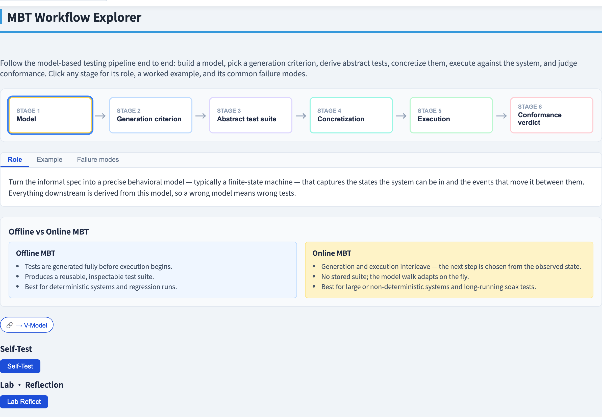
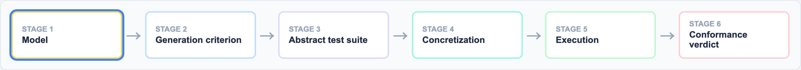

# The Model-Based Testing Workflow
### Test design as *model derivation*

Software Testing Visualization series #46 · Model-Based Testing
Companion tool: `/section-mbt` ([MBTWorkflowExplorer](../../src/components/MBTWorkflowExplorer.js))

<!-- Opens the Model-Based Testing series. The lecture frames MBT as a pipeline, so every later L lecture is "a deeper look at one stage". -->

---

## Why this lecture exists

- State-transition testing (#22) hinted at it: a *model* can be the test basis.
- **Model-based testing (MBT)** makes that systematic — build an abstract model, then *generate* tests from it automatically.
- Test design stops being ad-hoc and becomes **model derivation**.
- This lecture is the map: the six-stage MBT pipeline that the rest of this series details.

---

## The six-stage pipeline

```
 Model ─▶ Criterion ─▶ Abstract ─▶ Concretize ─▶ Execute ─▶ Verdict
                       tests
```

| Stage | What it produces |
| --- | --- |
| **Model** | a precise behavioural model (usually an FSM) |
| **Criterion** | a coverage goal → a set of test obligations |
| **Abstract tests** | model-level event sequences satisfying the criterion |
| **Concretize** | concrete API calls + real input values |
| **Execute** | run the concrete tests against the real system |
| **Verdict** | compare observed behaviour vs the model's prediction |

---

## Stage 1 — the model

The model is a **precise, abstract** description of intended behaviour — typically a finite-state machine.

- It is the **single source of truth**: every later stage reads from it.
- A wrong model produces wrong tests — *garbage in, garbage out.*
- It must be abstract enough to be tractable, detailed enough to expose the defects you care about.

---

## Stages 2–3 — criterion and abstract tests

**Criterion** — how thoroughly to exercise the model: all-states, all-transitions, transition-pairs, round-trips. The criterion expands into a concrete set of **test obligations**.

**Abstract tests** — walk the model to discharge every obligation. The result is a set of **event sequences** at the model's vocabulary:

```
 abstract test:  validCard · push · timeout
```

No real values yet — just the *shape* of the test.

---

## Stages 4–5 — concretize and execute

**Concretize** — map each abstract event onto a concrete action and real data:

```
 validCard  ──▶  reader.swipe("EMP-4417")
 push       ──▶  door.push()
 timeout    ──▶  clock.advance(5000)
```

This is where the model's vocabulary meets the real system under test (SUT).

**Execute** — run the concrete test against the SUT, recording the observed state / output at every step.

---

## Stage 6 — the verdict

Compare what the SUT *did* against what the model *predicted*:

- **Match** → the test **passes** — the SUT conforms to the model.
- **Divergence** → the test **fails** — and the failing step localizes the fault.

A failure means the model and the system **disagree**. The bug is in one of the two — either the SUT is wrong, or the model no longer reflects reality.

---

## Offline vs online MBT

Two ways to run the pipeline:

| | Offline MBT | Online MBT |
| --- | --- | --- |
| Generation | whole suite up front | next step chosen on the fly |
| Output | a reusable, inspectable suite | no stored suite — adapts live |
| Best for | deterministic systems, regression | non-deterministic / long-running systems |

Offline gives you artifacts; online handles unpredictability.

---

## Tool demonstration

In `/section-mbt`, open the **MBT Workflow Explorer**:

1. Click through the six stages — each with its role, example and failure modes.
2. At *Model*, see how an informal spec becomes an FSM.
3. At *Concretize*, see abstract events map to real API calls.
4. At *Verdict*, compare predicted vs observed traces.

---

## Tool — the MBT workflow



Six stages from informal spec to verdict, each with its own role.

---

## Tool — the workflow pipeline



Model, generate, concretize, execute, verdict — click a stage for detail.

---


## Summary

- **Model-based testing** generates tests from an explicit model — test design becomes model derivation.
- Six stages: **model → criterion → abstract tests → concretize → execute → verdict**.
- The **model** is the single source of truth; a **verdict** failure means model and system disagree.
- **Offline** MBT produces a reusable suite; **online** MBT adapts to non-determinism.

**In-class exercise:** sketch an FSM for a turnstile in 3 states. Pick a criterion. What is one abstract test, and how would you concretize it?

---

## Further reading

- Course specification — model-based testing chapter ([Specification.zh-TW.md](../Specification.zh-TW.md))
- Utting & Legeard, *Practical Model-Based Testing* (2007)
- Tool source: [MBTWorkflowExplorer.js](../../src/components/MBTWorkflowExplorer.js)
- Next: **#47 FSM Test Generation** — the criterion and abstract-test stages in depth
