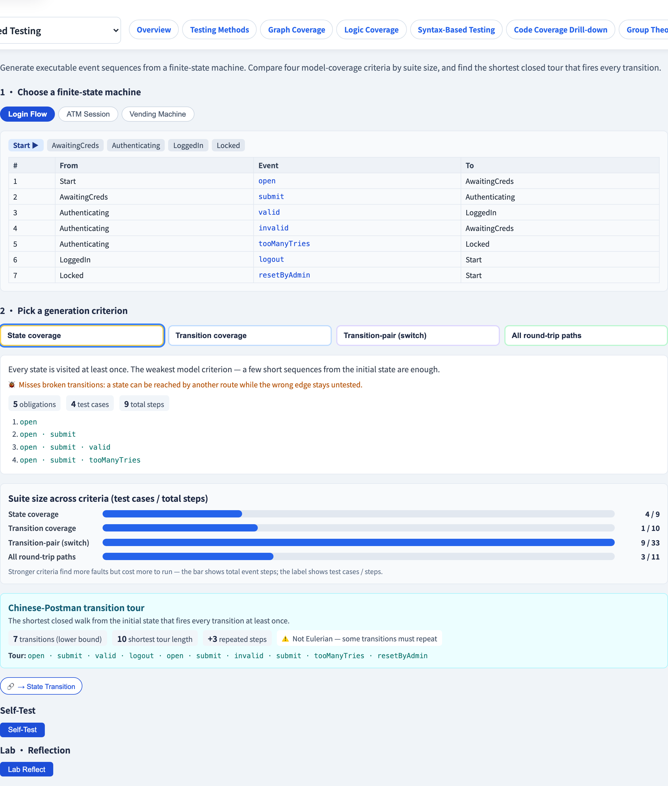

# FSM Test Generation
### From a state machine to executable test sequences

Software Testing Visualization series #47 · Model-Based Testing
Companion tool: `/section-mbt` ([FSMTestGenerationExplorer](../../src/components/FSMTestGenerationExplorer.js))

<!-- State-transition testing (#22) COUNTED coverage; this lecture GENERATES the sequences, and compares criteria by suite size. -->

---

## Why this lecture exists

- State-transition testing (#22) told us *which* obligations exist — but only *counted* coverage.
- MBT's criterion + abstract-test stages (#46) need to actually **generate the event sequences.**
- Different criteria generate **very different suite sizes** for the same machine.
- This lecture is the generation step: criterion in, executable sequences out.

---

## Four model-coverage criteria

For one FSM, four criteria of increasing strength:

| Criterion | Obligation |
| --- | --- |
| **State coverage** | visit every state at least once |
| **Transition coverage** | fire every transition at least once |
| **Transition-pair** | exercise every pair of adjacent transitions |
| **All round-trip paths** | traverse every simple cycle once |

Each generates a set of **test sequences** — event paths from the initial state.

---

## State vs transition coverage

- **State coverage** is weakest: a few short sequences reach every state. But a *broken transition* into a state can be missed if the state is reachable another way.
- **Transition coverage** forces every `(state, event)` edge to fire — it **subsumes** state coverage and is the practical baseline.

> A missing or misrouted transition slips past state coverage; transition coverage catches it.

---

## Transition-pair (switch) coverage

Transition coverage fires each edge alone — but a transition can land in the **wrong state**, and that only shows when the *next* transition behaves oddly.

**Transition-pair** coverage exercises every pair of adjacent transitions: each incoming edge of a state followed by each outgoing edge.

- A state with *i* incoming and *o* outgoing transitions contributes *i × o* obligations.
- This is why transition-pair suites grow much faster than transition suites.

---

## The Chinese-Postman transition tour

A neat result: what is the **shortest single closed walk** that fires *every* transition at least once?

- If the FSM is **Eulerian** (every state has equal in- and out-degree) → an Euler circuit fires each transition **exactly once** — the tour length equals the transition count.
- If not → some transitions must be **repeated**; the Chinese-Postman algorithm finds the minimum-overhead tour.

The tour is the most economical transition-coverage test.

---

## Suite size: the real trade-off

For the same machine, the four criteria produce suites of very different size:

```
 state   ▏▏
 transition  ▏▏▏▏
 transition-pair  ▏▏▏▏▏▏▏▏▏▏
 round-trip  ▏▏▏▏▏▏▏▏▏▏▏▏▏▏▏▏
```

Stronger criteria find more faults but cost more to run. Choosing a criterion *is* choosing a point on the cost / fault-detection curve.

---

## Tool demonstration

In `/section-mbt`, open the **FSM Test Generation Explorer**:

1. Pick a preset FSM (login flow, ATM, vending machine).
2. Switch criteria — read the generated test sequences and the suite size.
3. Compare transition vs transition-pair suite sizes.
4. Run the Chinese-Postman tour and read the repeated-step overhead.

---

## Tool — generating tests from an FSM



Pick a criterion; the suite of event sequences is derived automatically.

---

## Tool — the source FSM


States and transitions — the model every generated sequence walks.

---


## Summary

- FSM test generation turns a state machine into **executable event sequences**.
- Four criteria: **state ⊂ transition ⊂ transition-pair ⊂ round-trip** — increasing strength and size.
- **Transition coverage** is the baseline; **transition-pair** catches wrong-target faults at *i × o* cost.
- The **Chinese-Postman tour** is the shortest closed walk firing every transition.

**In-class exercise:** an FSM has a state with 2 incoming and 3 outgoing transitions. How many transition-pair obligations does that state alone contribute?

---

## Further reading

- Course specification — model-based testing chapter ([Specification.zh-TW.md](../Specification.zh-TW.md))
- Chow, *Testing Software Design Modeled by Finite-State Machines* (1978)
- Tool source: [FSMTestGenerationExplorer.js](../../src/components/FSMTestGenerationExplorer.js)
- Related: **#22 State Transition Testing** · **#48 The W-Method**
