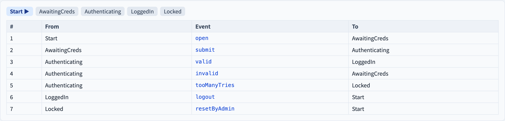

# FSM 測試生成
### 從一台狀態機到可執行的測試序列

軟體測試視覺化系列 #47 · 模型驅動測試
搭配工具：`/section-mbt`（[FSMTestGenerationExplorer](../../src/components/FSMTestGenerationExplorer.js)）

<!-- 狀態遷移測試（#22）「數」覆蓋；這一講「生成」序列，並以套件大小比較準則。 -->

---

## 為什麼有這一講

- 狀態遷移測試（#22）告訴我們*有哪些*義務 —— 但只「數」覆蓋。
- MBT 的準則 ＋ 抽象測試階段（#46）需要真的**生成那些事件序列**。
- 對同一台機器，不同準則生成的**套件大小差異極大**。
- 這一講就是生成步驟：準則進、可執行序列出。

---

## 四種模型覆蓋準則

對一台 FSM，四個強度遞增的準則：

| 準則 | 義務 |
| --- | --- |
| **狀態覆蓋** | 每個狀態至少到訪一次 |
| **轉移覆蓋** | 每條轉移至少觸發一次 |
| **轉移對** | 操練每一對相鄰轉移 |
| **所有來回路徑** | 走訪每個簡單迴圈一次 |

每個準則生成一組**測試序列** —— 從初始狀態出發的事件路徑。

---

## 狀態覆蓋 vs 轉移覆蓋

- **狀態覆蓋**最弱：幾條短序列就能到達每個狀態。但若某狀態能由另一條路抵達，通往它的*損壞轉移*就可能被漏掉。
- **轉移覆蓋**強迫每個 `(狀態, 事件)` 邊都觸發 —— 它**涵蓋**狀態覆蓋，是實務基準。

> 遺失或走錯的轉移會溜過狀態覆蓋；轉移覆蓋抓得到它。

---

## 轉移對（switch）覆蓋

轉移覆蓋讓每條邊單獨觸發 —— 但一條轉移可能落到**錯誤的狀態**，而那只在*下一條*轉移行為怪異時才顯現。

**轉移對**覆蓋操練每一對相鄰轉移：某狀態的每條進入邊接著每條離開邊。

- 一個有 *i* 條進入、*o* 條離開轉移的狀態，貢獻 *i × o* 個義務。
- 這就是為什麼轉移對套件成長得比轉移套件快得多。

---

## 中國郵差轉移巡迴

一個漂亮的結果：能讓*每條*轉移至少觸發一次的**最短單一封閉路徑**是什麼？

- 若 FSM 是**歐拉圖**（每個狀態的入度等於出度）→ 一條歐拉迴路讓每條轉移**恰好觸發一次** —— 巡迴長度等於轉移數。
- 若不是 → 某些轉移必須**重複**；中國郵差演算法找出開銷最小的巡迴。

那條巡迴是最經濟的轉移覆蓋測試。

---

## 套件大小：真正的取捨

對同一台機器，四個準則產生的套件大小差異很大：

```
 狀態   ▏▏
 轉移  ▏▏▏▏
 轉移對  ▏▏▏▏▏▏▏▏▏▏
 來回  ▏▏▏▏▏▏▏▏▏▏▏▏▏▏▏▏
```

較強的準則抓到更多缺陷，但執行成本也更高。選一個準則，*就是*在成本／抓錯能力曲線上選一個點。

---

## 工具演示

在 `/section-mbt` 開啟 **FSM 測試生成探索器**：

1. 挑一台預設 FSM（登入流程、ATM、自動販賣機）。
2. 切換準則 —— 讀生成的測試序列與套件大小。
3. 對比轉移與轉移對的套件大小。
4. 跑中國郵差巡迴，讀重複步數的開銷。

---

## 工具 —— 從 FSM 生成測試


挑一個準則；事件序列套件即自動推導出來。

---

## 工具 —— 來源 FSM



狀態與轉移 —— 每條生成序列所走的模型。

---


## 小結

- FSM 測試生成把一台狀態機變成**可執行的事件序列**。
- 四個準則：**狀態 ⊂ 轉移 ⊂ 轉移對 ⊂ 來回** —— 強度與大小遞增。
- **轉移覆蓋**是基準；**轉移對**以 *i × o* 的成本抓出目標錯誤的缺陷。
- **中國郵差巡迴**是觸發每條轉移的最短封閉路徑。

**課堂練習：** 一台 FSM 有一個狀態有 2 條進入、3 條離開轉移。光是這個狀態貢獻幾個轉移對義務？

---

## 延伸閱讀

- 課程規格 —— 模型驅動測試章節（[Specification.zh-TW.md](../Specification.zh-TW.md)）
- Chow, *Testing Software Design Modeled by Finite-State Machines*（1978）
- 工具原始碼：[FSMTestGenerationExplorer.js](../../src/components/FSMTestGenerationExplorer.js)
- 相關：**#22 狀態遷移測試** · **#48 W 方法**
