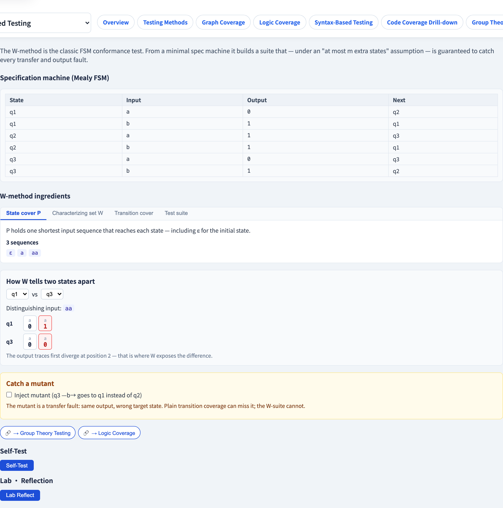
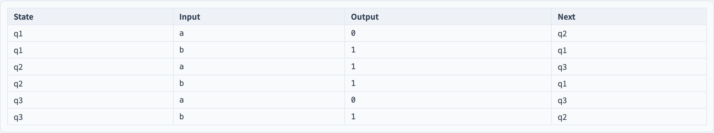

# W 方法
### 一個帶*保證*的一致性測試

軟體測試視覺化系列 #48 · 模型驅動測試
搭配工具：`/section-mbt`（[WMethodConformanceExplorer](../../src/components/WMethodConformanceExplorer.js)）

<!-- FSM 系列的理論巔峰。招牌是「保證」這個詞 —— 在一個明說的假設下，W 方法不漏掉任何東西。 -->

---

## 為什麼有這一講

- FSM 測試生成（#47）給了我們*覆蓋*準則 —— 沒有保證的啟發法。
- **W 方法**（Chow, 1978）不一樣：在一個明說的假設下，它**可證明地抓出每個轉移與輸出錯誤**。
- 它回答*一致性*：實作符合規格 FSM 嗎？
- 一個背後有證明的測試方法，值得精確地理解。

---

## 一致性問題

你有一個**規格 FSM** 與一個**實作**。實作**一致（conform）**嗎 —— 行為完全如規格 FSM 所說？

兩種錯誤會破壞一致性：

- **輸出錯誤** —— 一條轉移發出錯誤的輸出。
- **轉移錯誤** —— 一條轉移走到錯誤的目標狀態。

輸出錯誤容易看見。**轉移錯誤很狡猾** —— 輸出相同、狀態錯誤 —— 而 W 方法正是為抓它而建。

---

## 元件一 —— 狀態涵蓋集 P

**狀態涵蓋集** `P` 是一組輸入序列，合起來能從起始狀態**抵達每一個狀態**。

- 它包含空序列 ε（抵達初始狀態）。
- `|P|` ≈ 狀態數。

`P` 回答：*「我能到每個狀態嗎？」* —— 但抵達一個狀態，不等於*辨識*它。

---

## 元件二 —— 特徵集 W

**特徵集** `W` 是巧妙的部分。它是一組輸入序列，能**把任兩個狀態區分開**：

> 對任兩個狀態，`W` 中*某條*序列會從各自產生不同的輸出。

`W` 是一個**狀態辨識器**：從一個未知狀態跑一條 `W` 序列、讀輸出，你就知道你*當時在哪個*狀態。轉移錯誤 —— 落到錯誤狀態 —— 正是這樣被揭露的。

---

## 測試集

把元件組合起來。轉移涵蓋集是 `P ∪ P·X`（P，加上 P 後接一個輸入）。完整的 W 測試集為：

$$
T = (P \cup P{\cdot}X) \cdot X^{\le m} \cdot W
$$

- `(P ∪ P·X)` —— 驅動進入並走過每一條轉移。
- `· W` —— 在每個之後，跑一條特徵序列來**辨識你落入的狀態**。
- `X^{≤m}` —— 額外狀態的容許量（下一張）。

接上 `W`，就把每個落入的狀態變成可觀察的輸出軌跡。

---

## 保證 —— 以及它的代價

> **在「實作最多多 *m* 個額外狀態」的假設下**，W 測試集抓出**每一個**轉移與輸出錯誤。

- 那個假設就是代價。保證是有條件的。
- 較大的 `m` → 較強的保證 → 較大的測試集：它多項式成長，大致與 `n²` 和 `|X|^(m+1)` 成正比。
- 違反假設（實作有*更多*隱藏狀態），一個錯誤就可能溜過去。

一個真實的保證 —— 但要讀那行小字。

---

## 工具演示

在 `/section-mbt` 開啟 **W 方法一致性探索器**：

1. 讀規格 FSM；看 `P`、`W`、轉移涵蓋集與測試集被計算出來。
2. 用*區分*面板 —— 看一條 `W` 序列把兩個看似相同的狀態分開。
3. 注入一個轉移錯誤突變體，看哪一條套件測試抓到它。
4. 提高 `m`，看測試集大小成長。

---

## 工具 —— W 方法測試集

轉移涵蓋集 P、特徵集 W，以及一致性測試集 P·W。

---

## 工具 —— 規格 FSM

一條 W 序列把套件必須區分的兩個相似狀態分開。

---

## 小結

- **W 方法**是一致性測試：實作符合規格 FSM 嗎？
- **狀態涵蓋集 P** 抵達每個狀態；**特徵集 W** 把任兩個狀態區分開。
- 測試集 **(P ∪ P·X)·X^≤m·W** 接上 `W` 以辨識落入的狀態 —— 揭露轉移錯誤。
- 在**「最多多 *m* 個額外狀態」**的假設下，它抓出*每一個*轉移／輸出錯誤 —— 一個有條件的保證。

**課堂練習：** 為什麼需要特徵集 `W` —— 為什麼觸發每一條轉移還不夠？

---

## 延伸閱讀

- 課程規格 —— FSM 一致性章節（[Specification.zh-TW.md](../Specification.zh-TW.md)）
- Chow, *Testing Software Design Modeled by Finite-State Machines*（1978）
- 工具原始碼：[WMethodConformanceExplorer.js](../../src/components/WMethodConformanceExplorer.js)
- 相關：**#47 FSM 測試生成** · **#49 EFSM 守衛轉移**
