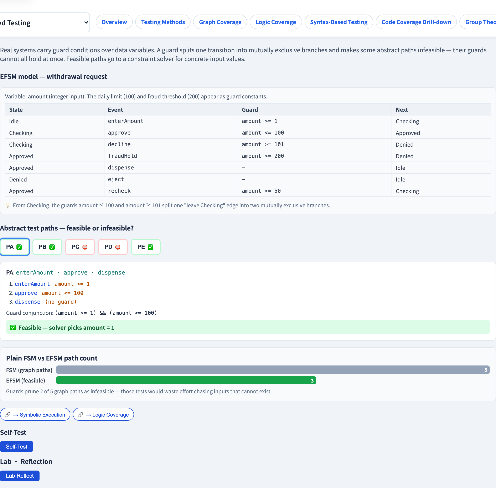
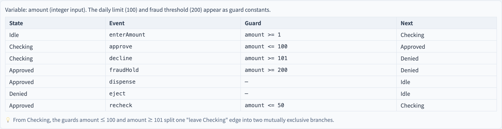

# EFSM 與守衛轉移
### 當一條轉移取決於*資料*，而不只是事件

軟體測試視覺化系列 #49 · 模型驅動測試
搭配工具：`/section-mbt`（[EFSMGuardedTransitionExplorer](../../src/components/EFSMGuardedTransitionExplorer.js)）

<!-- 從黑盒 FSM 模型通往白盒推理的橋。守衛使某些抽象路徑變得不可行 —— 而那需要約束求解器。 -->

---

## 為什麼有這一講

- 一台純 FSM（#47–#48）只憑**事件**就觸發一條轉移。
- 真實系統用**資料條件**守衛轉移：*提款*只在 `amount ≤ balance` 時觸發。
- 一台**擴充狀態機（EFSM）**替轉移加上資料變數與**守衛條件**。
- 守衛改變了局面：某些抽象路徑變得**不可能** —— 而偵測這件事需要一個約束求解器。

---

## 什麼是守衛

一條**守衛轉移**只在它的**守衛** —— 一個對資料變數的布林條件 —— 為真時觸發：

```
 Checking ──[ amount <= 100 ]── approve ──▶ Approved
 Checking ──[ amount >= 101 ]── decline ──▶ Denied
```

一條圖的邊，以資料為條件。守衛**分裂**了一條轉移：同一個來源狀態，依資料不同而走向不同分支。

---

## 可行 vs 不可行路徑

一條穿過 EFSM 的路徑會收集沿途的守衛。這條路徑是：

- **可行的** —— 若*某組*資料變數的賦值能同時滿足**所有**守衛。
- **不可行的** —— 若合取的守衛**互相矛盾**：沒有任何輸入能驅動這條路徑。

```
 路徑守衛：  amount ≥ 1  ∧  amount ≤ 100  ∧  amount ≥ 200
                            └── 不可滿足 ──┘
```

一條不可行的路徑是一個*死測試* —— 替它生成測試是浪費心力。

---

## 純 FSM vs EFSM 路徑數

純 FSM 把每條圖路徑都當成可測。EFSM 不然：

```
 圖路徑（FSM 視角）：   5
 可行路徑（EFSM）：     3   ← 2 條被矛盾的守衛剪掉
```

守衛在你還沒替每條浪費一個測試之前，就**剪掉**不可能的路徑。EFSM 的可行路徑數、而非原始圖路徑數，才是真正的測試預算。

---

## 約束求解 —— 具體輸入

對一條**可行**路徑，你仍需要真實的輸入*值*。合取的守衛構成一個約束系統；求解器找出一組滿足的賦值：

```
 amount ≥ 1  ∧  amount ≤ 100   ──求解──▶   amount = 50
```

這和符號執行（#10）是同一個約束求解的觀念：路徑條件 → 求解器 → 一個具體見證。EFSM 正是黑盒建模與白盒路徑推理相會之處。

---

## 多花的建模換到什麼

EFSM 比純 FSM 更花成本 —— 你必須寫守衛與資料變數。換回的是：

- **不可行路徑被剪掉** —— 沒有浪費的測試。
- **可行路徑附帶具體輸入** —— 生成的，而非手挑的。
- 模型抓得到純 FSM 無法表達的**資料相依**缺陷。

當行為真的取決於資料時，多花的建模就值回票價。

---

## 工具演示

在 `/section-mbt` 開啟 **EFSM 守衛轉移探索器**：

1. 讀 EFSM —— 轉移及其守衛。
2. 對每條抽象路徑，看它的守衛合取與可行／不可行的判定。
3. 對一條可行路徑，看求解器的具體輸入值。
4. 對比純 FSM 路徑數與 EFSM 可行數。

---

## 工具 —— 守衛轉移



每條路徑帶一個守衛合取 —— 求解器同意才可行。

---

## 工具 —— EFSM



帶守衛的轉移 —— 許多語法路徑其實不可行。

---


## 小結

- 一台 **EFSM** 替純 FSM 的轉移加上資料變數與**守衛條件**。
- 守衛**分裂**一條轉移；一條路徑只有在合取的守衛可滿足時才**可行**。
- 守衛**剪掉不可行路徑** —— 可行數才是真正的測試預算。
- **約束求解器**把一條可行路徑的守衛變成具體輸入值。

**課堂練習：** 一條路徑收集到 `x > 0`、`x < 50`、`x > 100`。可行嗎？若一條路徑可行，求解器給你的、是路徑覆蓋本身給不了的什麼？

---

## 延伸閱讀

- 課程規格 —— 模型驅動測試章節（[Specification.zh-TW.md](../Specification.zh-TW.md)）
- Utting & Legeard, *Practical Model-Based Testing* —— 擴充狀態機
- 工具原始碼：[EFSMGuardedTransitionExplorer.js](../../src/components/EFSMGuardedTransitionExplorer.js)
- 相關：**#10 符號執行** · **#5 邏輯覆蓋**（子句綁定）· **#48 W 方法**
