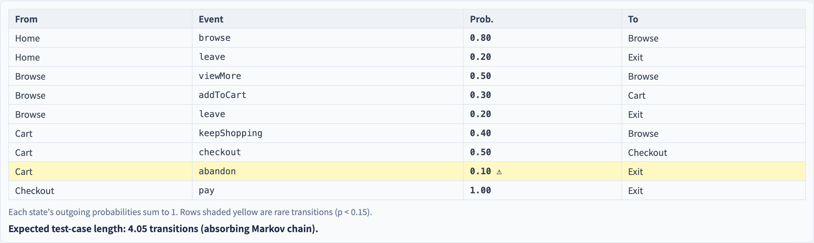

# Usage-Model Statistical Testing
### Test the system the way it is actually *used*

Software Testing Visualization series #50 · Model-Based Testing
Companion tool: `/section-mbt` ([UsageModelStatisticalExplorer](../../src/components/UsageModelStatisticalExplorer.js))

<!-- The non-functional, statistical branch of MBT. The key idea: not all paths are equally important — weight by usage. -->

---

## Why this lecture exists

- FSM coverage criteria (#47) treat every transition as **equally important.**
- But users do not: 80% of sessions might walk the same handful of paths.
- A test suite that ignores this spends effort on paths almost no one takes.
- A **usage model** attaches **real-usage probabilities** to the model — so testing follows actual use.

---

## The usage model: a Markov chain

A usage model is an FSM where each transition carries a **probability**:

```
 Home ──0.8──▶ Browse
 Home ──0.2──▶ Exit
```

- The outgoing probabilities of each state **sum to 1**.
- Together they form a **Markov chain** — a state's next move depends only on the current state.
- The probabilities are the **operational profile**: the system's real usage distribution.

---

## Generating tests: weighted random walks

A test case is a **probability-weighted random walk** from the start state to a terminal state:

```
 Home → Browse → Browse → Cart → Checkout → Exit
```

- At each state, the next transition is chosen *by its probability*.
- Run many walks → a suite that **mirrors real usage** — common paths get tested often, rare ones rarely.
- Testing effort now tracks where users actually go.

---

## Expected test-case length

Because it is a Markov chain, you can *compute* the expected length of a generated test — the absorbing-chain expected number of steps:

$$
E[s] = 1 + \sum_{s'} p(s \to s') \cdot E[s']
$$

Solve this linear system over the states and you have the expected number of transitions per test — before generating a single one.

---

## Reliability estimation

Run *N* usage-weighted tests; a test fails if it hits a defect. The pass rate **estimates reliability** — *as experienced by real users*, because the tests were sampled from the operational profile.

- Report it with a confidence interval (e.g. Wald): the estimate gets tighter as *N* grows.
- A bug on a **common** path tanks the reliability estimate; a bug on a **rare** path barely moves it — which is exactly how users would experience it.

---

## The rare-path warning

There is a catch. A path with very low probability is **under-sampled** — statistical testing rarely walks it.

- That is fine if the path is also low-risk.
- It is **dangerous** if the rare path is **high-risk** (a rarely-used but critical payment branch).
- Pair statistical testing with **risk-based testing** (#31): usage weighting *and* risk weighting, so rare-but-critical paths still get tested.

---

## Tool demonstration

In `/section-mbt`, open the **Usage-Model Statistical Explorer**:

1. Read the usage model — transitions with probabilities summing to 1 per state.
2. See the computed expected test-case length.
3. Run N tests — read the usage-weighted reliability estimate ± its interval.
4. Note the rare-path warning on low-probability transitions.

---

## Tool — statistical usage testing


Tests drawn by usage probability; reliability estimated with an interval.

---

## Tool — the usage model



Transition probabilities sum to 1 per state — rare paths are flagged.

---


## Summary

- A **usage model** is a Markov chain whose transition probabilities are the **operational profile**.
- Tests are **probability-weighted random walks** — the suite mirrors real usage.
- The Markov chain gives the **expected test length** analytically and a **usage-weighted reliability** estimate.
- Beware **rare-but-high-risk** paths — combine with risk-based testing (#31).

**In-class exercise:** if `Home→Browse` has p = 0.9 and `Home→Exit` p = 0.1, what fraction of generated tests start by browsing? Which path is under-tested?

---

## Further reading

- Course specification — statistical testing chapter ([Specification.zh-TW.md](../Specification.zh-TW.md))
- Whittaker & Poore, *Markov Analysis of Software Specifications* (1993)
- Tool source: [UsageModelStatisticalExplorer.js](../../src/components/UsageModelStatisticalExplorer.js)
- Related: **#31 Risk-Based Testing** · **#29 Property-Based Testing**
