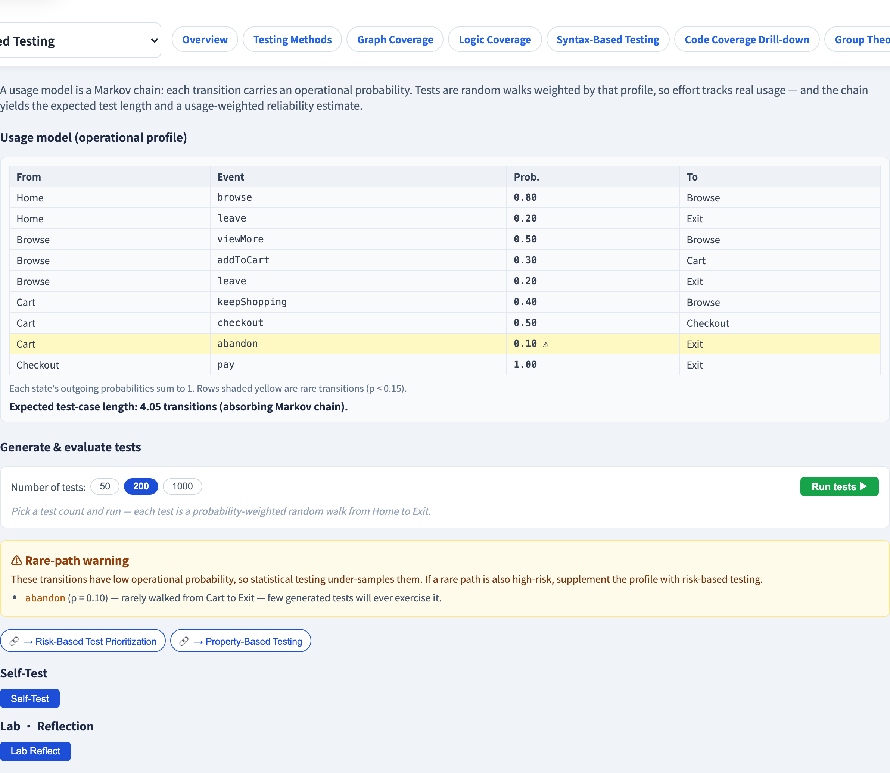

# 使用模型統計測試
### 依系統*實際被使用的方式*來測試

軟體測試視覺化系列 #50 · 模型驅動測試
搭配工具：`/section-mbt`（[UsageModelStatisticalExplorer](../../src/components/UsageModelStatisticalExplorer.js)）

<!-- MBT 的非功能、統計分支。關鍵觀念：不是每條路徑都同等重要 —— 依使用加權。 -->

---

## 為什麼有這一講

- FSM 覆蓋準則（#47）把每條轉移都當成**同等重要**。
- 但使用者不是：80% 的 session 可能走同樣那幾條路徑。
- 一個忽略這點的測試套件，把心力花在幾乎沒人走的路徑上。
- 一個**使用模型**替模型附上**真實使用機率** —— 使測試跟隨實際使用。

---

## 使用模型：一條馬可夫鏈

使用模型是一台 FSM，每條轉移帶一個**機率**：

```
 Home ──0.8──▶ Browse
 Home ──0.2──▶ Exit
```

- 每個狀態的離開機率**總和為 1**。
- 它們合起來構成一條**馬可夫鏈** —— 一個狀態的下一步只取決於當前狀態。
- 這些機率就是 **operational profile**：系統的真實使用分佈。

---

## 生成測試：加權隨機漫步

一個測試案例就是從起始狀態到終止狀態的一次**依機率加權的隨機漫步**：

```
 Home → Browse → Browse → Cart → Checkout → Exit
```

- 在每個狀態，下一條轉移*依其機率*被選中。
- 跑許多次漫步 → 一個**映照真實使用**的套件 —— 常見路徑常被測、罕見路徑少被測。
- 測試心力現在跟隨使用者實際去的地方。

---

## 預期測試案例長度

因為它是一條馬可夫鏈，你可以*計算*一個生成測試的預期長度 —— 吸收型鏈的預期步數：

$$
E[s] = 1 + \sum_{s'} p(s \to s') \cdot E[s']
$$

對各狀態解這個線性系統，你就得到每個測試的預期轉移數 —— 在生成任何一個之前。

---

## 可靠度估計

跑 *N* 個依使用加權的測試；一個測試碰到缺陷就失敗。通過率**估計可靠度** —— *如真實使用者所經歷的*，因為這些測試是從 operational profile 取樣的。

- 以信賴區間回報它（如 Wald）：估計隨 *N* 增大而變緊。
- **常見**路徑上的 bug 讓可靠度估計大跌；**罕見**路徑上的 bug 幾乎不動它 —— 這正是使用者會經歷的方式。

---

## 罕見路徑警示

有一個陷阱。一條機率極低的路徑會被**取樣不足** —— 統計測試很少走它。

- 若那條路徑同時也低風險，沒問題。
- 若那條罕見路徑是**高風險**的（一條鮮少使用但關鍵的付款分支），就**危險**了。
- 把統計測試與**風險導向測試**（#31）搭配：使用加權*與*風險加權，使罕見但關鍵的路徑仍被測到。

---

## 工具演示

在 `/section-mbt` 開啟**使用模型統計探索器**：

1. 讀使用模型 —— 轉移及其機率（每個狀態總和為 1）。
2. 看計算出的預期測試案例長度。
3. 跑 N 個測試 —— 讀依使用加權的可靠度估計 ± 其區間。
4. 注意低機率轉移上的罕見路徑警示。

---

## 工具 —— 統計式使用測試



依使用機率抽測試；可靠度連同區間一併估計。

---

## 工具 —— 使用模型


每個狀態的轉移機率總和為 1 —— 罕見路徑會被標示。

---


## 小結

- 一個**使用模型**是一條馬可夫鏈，其轉移機率就是 **operational profile**。
- 測試是**依機率加權的隨機漫步** —— 套件映照真實使用。
- 馬可夫鏈以解析方式給出**預期測試長度**與一個**依使用加權的可靠度**估計。
- 當心**罕見但高風險**的路徑 —— 與風險導向測試（#31）結合。

**課堂練習：** 若 `Home→Browse` 的 p = 0.9、`Home→Exit` 的 p = 0.1，多少比例的生成測試以瀏覽開頭？哪一條路徑被測得不足？

---

## 延伸閱讀

- 課程規格 —— 統計測試章節（[Specification.zh-TW.md](../Specification.zh-TW.md)）
- Whittaker & Poore, *Markov Analysis of Software Specifications*（1993）
- 工具原始碼：[UsageModelStatisticalExplorer.js](../../src/components/UsageModelStatisticalExplorer.js)
- 相關：**#31 風險導向測試** · **#29 性質導向測試**
