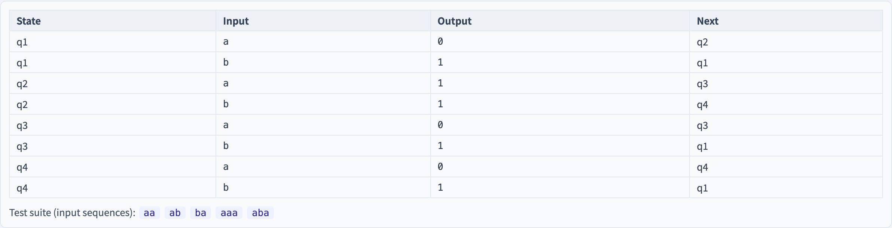

# Model Mutation
### How good is a suite generated *from a model*?

Software Testing Visualization series #51 · Model-Based Testing
Companion tool: `/section-mbt` ([ModelMutationExplorer](../../src/components/ModelMutationExplorer.js))

<!-- Closes the Model-Based Testing series by turning the lens back on it: mutation testing (#33) applied to the MODEL, to audit the generated suite. -->

---

## Why this lecture exists

- MBT generates a test suite *from* a model (#46–#50). But is that suite **adequate**?
- Code-level mutation (#33) audits a suite by mutating the **code**.
- **Model mutation** audits an MBT suite by mutating the **model** — and checking the suite still catches the changes.
- It measures test adequacy at the **model abstraction level.**

---

## The idea: mutate the model, not the code

Apply mutation testing (#33) one level up:

1. Take the spec model (an FSM) and an MBT-generated suite.
2. Make small faulty copies of the **model** — **model-mutants.**
3. Run the suite against each model-mutant.
4. A model-mutant is **killed** if some test's output differs from the original model's.

> Code mutation asks "would my suite catch a code bug?" Model mutation asks "would it catch a *modelling* error?"

---

## Model mutation operators

A model-mutant changes one element of the FSM:

| Operator | Example |
| --- | --- |
| **Delete transition** | remove an edge |
| **Change target** | a transition goes to a different state |
| **Change output** | a transition emits a different output |
| **Change guard** | (EFSM) alter a guard condition |

Each models a plausible **specification / modelling mistake** — the kind of error MBT itself could introduce.

---

## Killed, survived, equivalent

Same three outcomes as code mutation (#33):

- **Killed** — a test's trace diverges from the original model → the suite *would* catch this modelling error.
- **Survived** — every test still passes → a gap: the suite misses this kind of model error.
- **Equivalent** — the mutated model is behaviourally identical to the original → unkillable, excluded.

$$
\text{Model mutation score} = \frac{\text{killed}}{\text{total} - \text{equivalent}}
$$

---

## A surviving model-mutant — two readings

When a model-mutant survives, ask the #M6-style question:

- **Suite gap** — the MBT suite is too weak; it never exercises the mutated transition. *Fixable* — strengthen the criterion (#47).
- **Equivalent model-mutant** — the change produced an identical model (e.g. retargeting to a behaviourally-equivalent state). *Unkillable by definition.*

Telling the two apart needs human judgement — exactly as with code-level equivalent mutants (#32).

---

## Model-level vs code-level mutation

| | Code mutation (#33) | Model mutation |
| --- | --- | --- |
| What is mutated | source code | the FSM / model |
| What it audits | a hand-written suite | an MBT-generated suite |
| A killed mutant proves | the suite catches a code fault | the suite distinguishes model behaviours |

> A high model-mutation score means the suite covers the *model* well — **not** that it covers the *code* well. The model is an abstraction; it omits detail. Model adequacy and code adequacy are different questions.

---

## Tool demonstration

In `/section-mbt`, open the **Model Mutation Explorer**:

1. Read the base FSM and the MBT-generated test suite.
2. Apply model mutation operators — see each model-mutant killed or survived.
3. For a survivor, read whether it is a suite gap or an equivalent mutant.
4. Read the model mutation score, raw and adjusted for equivalents.

---

## Tool — mutating the model

Operators mutate transitions, targets, outputs and guards of the FSM.

---

## Tool — the base FSM

Each model-mutant is one small edit — killed or survived by the suite.

---

## Summary

- **Model mutation** applies mutation testing to the **model**, auditing an MBT-generated suite.
- Operators mutate transitions, targets, outputs, guards — plausible *modelling* mistakes.
- Outcomes: **killed / survived / equivalent**; score = killed / (total − equivalent).
- A high model-mutation score proves **model** adequacy — not **code** adequacy. They are different questions.

**In-class exercise:** does a 100% model-mutation score guarantee a high code-level mutation score? Why or why not?

---

## Further reading

- Course specification — model-based testing chapter ([Specification.zh-TW.md](../Specification.zh-TW.md))
- Belli et al., *Model-Based Mutation Testing* — surveys
- Tool source: [ModelMutationExplorer.js](../../src/components/ModelMutationExplorer.js)
- Related: **#32 Equivalent Mutants** · **#33 Mutation Score** · **#8 Specification Mutation**
