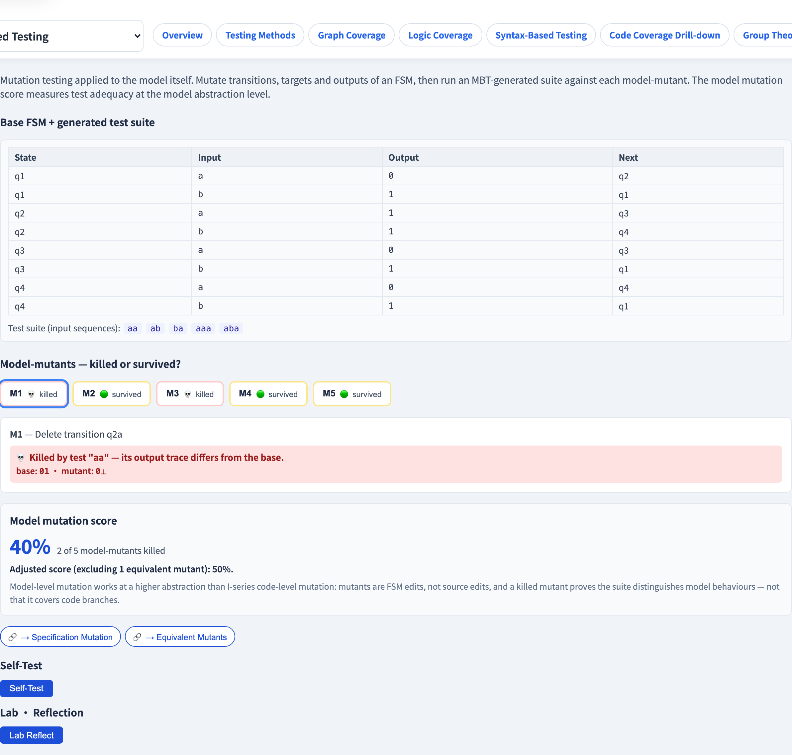

# 模型突變
### 一個*從模型生成*的套件，到底有多好？

軟體測試視覺化系列 #51 · 模型驅動測試
搭配工具：`/section-mbt`（[ModelMutationExplorer](../../src/components/ModelMutationExplorer.js)）

<!-- 把鏡頭轉回 MBT 自身，收尾模型驅動測試系列：把突變測試（#33）套到「模型」上，稽核生成的套件。 -->

---

## 為什麼有這一講

- MBT *從*一個模型生成測試套件（#46–#50）。但那個套件**充分嗎**？
- 程式碼層級突變（#33）藉由突變**程式碼**來稽核一個套件。
- **模型突變**藉由突變**模型**來稽核一個 MBT 套件 —— 並檢查套件是否仍抓得到那些改動。
- 它度量的是**模型抽象層級**上的測試充分性。

---

## 觀念：突變模型，而非程式碼

把突變測試（#33）套用到上一層：

1. 取規格模型（一台 FSM）與一個 MBT 生成的套件。
2. 做出**模型**的小有錯副本 —— **model-mutant（模型突變體）**。
3. 對每個模型突變體跑套件。
4. 若某個測試的輸出與原始模型不同，該模型突變體就被**殺死**。

> 程式碼突變問「我的套件會抓到一個程式碼 bug 嗎？」模型突變問「它會抓到一個*建模*錯誤嗎？」

---

## 模型突變算子

一個模型突變體改變 FSM 的一個元素：

| 算子 | 例子 |
| --- | --- |
| **刪除轉移** | 移除一條邊 |
| **改變目標** | 一條轉移走到不同的狀態 |
| **改變輸出** | 一條轉移發出不同的輸出 |
| **改變守衛** | （EFSM）變更一個守衛條件 |

每一種都模擬一個合理的**規格／建模失誤** —— 正是 MBT 本身可能引入的那種錯誤。

---

## 殺死、存活、等價

和程式碼突變（#33）相同的三種結果：

- **殺死** —— 某測試的軌跡與原始模型分歧 → 套件*會*抓到這個建模錯誤。
- **存活** —— 每個測試仍通過 → 一個缺口：套件漏掉這種模型錯誤。
- **等價** —— 突變後的模型行為與原始相同 → 殺不死，排除。

$$
\text{模型突變分數} = \frac{\text{殺死}}{\text{總數} - \text{等價}}
$$

---

## 一個存活的模型突變體 —— 兩種讀法

當一個模型突變體存活，問 #M6 式的問題：

- **套件缺口** —— MBT 套件太弱；它從未操練到被突變的轉移。*可修* —— 強化準則（#47）。
- **等價模型突變體** —— 改動產生了一個相同的模型（如改指向一個行為等價的狀態）。*依定義殺不死。*

分辨這兩者需要人為判斷 —— 正如程式碼層級的等價突變體（#32）。

---

## 模型層級 vs 程式碼層級突變

| | 程式碼突變（#33） | 模型突變 |
| --- | --- | --- |
| 突變什麼 | 原始碼 | FSM／模型 |
| 它稽核什麼 | 一個手寫的套件 | 一個 MBT 生成的套件 |
| 一個被殺死的突變體證明 | 套件抓到一個程式碼錯誤 | 套件能區分模型行為 |

> 高的模型突變分數代表套件對*模型*覆蓋得好 —— **不**代表它對*程式碼*覆蓋得好。模型是一種抽象；它省略了細節。模型充分性與程式碼充分性是不同的問題。

---

## 工具演示

在 `/section-mbt` 開啟**模型突變探索器**：

1. 讀基準 FSM 與 MBT 生成的測試套件。
2. 套用模型突變算子 —— 看每個模型突變體被殺死或存活。
3. 對一個存活者，讀它是套件缺口還是等價突變體。
4. 讀模型突變分數，原始的與排除等價後調整的。

---

## 工具 —— 突變模型

算子突變 FSM 的轉移、目標、輸出與守衛。

---

## 工具 —— 基準 FSM

每個模型突變體是一處小改動 —— 由套件殺死或存活。

---

## 小結

- **模型突變**把突變測試套用到**模型**上，稽核一個 MBT 生成的套件。
- 算子突變轉移、目標、輸出、守衛 —— 合理的*建模*失誤。
- 結果：**殺死／存活／等價**；分數 ＝ 殺死 / (總數 − 等價)。
- 高的模型突變分數證明**模型**充分 —— 而非**程式碼**充分。它們是不同的問題。

**課堂練習：** 100% 的模型突變分數，能保證程式碼層級的突變分數也高嗎？為什麼？

---

## 延伸閱讀

- 課程規格 —— 模型驅動測試章節（[Specification.zh-TW.md](../Specification.zh-TW.md)）
- Belli 等人, *Model-Based Mutation Testing* —— 綜述
- 工具原始碼：[ModelMutationExplorer.js](../../src/components/ModelMutationExplorer.js)
- 相關：**#32 等價突變體** · **#33 突變分數** · **#8 規格突變**
