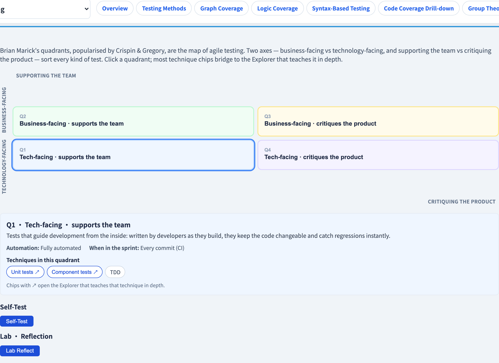
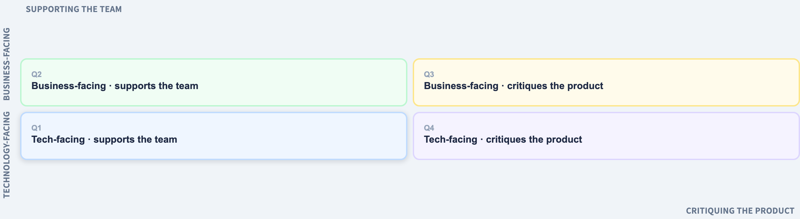

# The Agile Testing Quadrants
### The map of *what to test, who tests it, and when*

Software Testing Visualization series #52 · Agile Testing
Companion tool: `/section-agile` ([AgileQuadrantsExplorer](../../src/components/AgileQuadrantsExplorer.js))

<!-- Opens the Agile Testing series. The quadrants are a MAP, not a process — every other agile lecture is a location on this map. -->

---

## Why this lecture exists

- Agile testing is not one technique — it is *all* of them, woven through delivery.
- Beginners ask: "if there's no separate test phase, who tests what, and when?"
- The **Agile Testing Quadrants** (Brian Marick; Crispin & Gregory) answer that with one 2×2 map.
- Every technique in this whole course has a home on this map.

---

## The two axes

The quadrants are formed by two independent questions:

- **Business-facing ↔ Technology-facing** — is the test written in the language of the *user*, or of the *code*?
- **Supporting the team ↔ Critiquing the product** — does the test *guide development* as you build, or *evaluate* the finished product?

Two axes → four quadrants. Crucially, the numbering (Q1–Q4) is **not an order** — it is just labels.

---

## The four quadrants

```
 business-facing │   Q2            │   Q3            │
                 │ functional,     │ exploratory,    │
                 │ BDD, examples   │ usability, UAT  │
                 ├─────────────────┼─────────────────┤
 tech-facing     │   Q1            │   Q4            │
                 │ unit, component,│ performance,    │
                 │ TDD             │ security, *-ility│
                 │ support team    │ critique product│
```

- **Q1** — tech-facing, supports the team: unit / component tests, TDD.
- **Q2** — business-facing, supports the team: functional tests, BDD, examples.
- **Q3** — business-facing, critiques the product: exploratory, usability, UAT.
- **Q4** — tech-facing, critiques the product: performance, security, the *-ilities*.

---

## "Supporting the team" vs "critiquing the product"

This axis is the subtle one:

- **Supporting the team** (Q1, Q2) — tests written *before or during* development that **guide** it. They tell you what to build and catch regressions instantly. Mostly automated.
- **Critiquing the product** (Q3, Q4) — tests run *on the finished product* that **evaluate** it. They ask "is this actually good?" Q3 is human-centred; Q4 is tool-driven.

> Q1–Q2 *prevent* defects; Q3–Q4 *find* what prevention missed.

---

## The quadrants as a hub

Almost every technique in this course lives in a quadrant:

| Quadrant | Techniques (and their lectures) |
| --- | --- |
| Q1 | unit testing, TDD, code coverage (#18) |
| Q2 | BDD/Gherkin (#38), example mapping (#55), decision tables |
| Q3 | exploratory testing (#26), E2E journeys (#40), UAT |
| Q4 | performance & load (#42), chaos (#43), security |

The quadrants do not *replace* those techniques — they **organize** them. A team uses the map to spot which quadrant it neglects.

---

## Automation across the quadrants

- **Q1** — fully automated; runs on every commit (the pyramid base, #17).
- **Q2** — automated *and* manual; examples agreed up front, then automated.
- **Q3** — manual and human-centred; exploration cannot be scripted.
- **Q4** — tool-driven; needs specialised tooling, not hand-written assertions.

A common failure: a team that automates Q1–Q2 well but **neglects Q3** ships software that is *correct* but unpleasant to use.

---

## Tool demonstration

In `/section-agile`, open the **Agile Testing Quadrants Explorer**:

1. Click each quadrant — read its role, automation level and sprint timing.
2. Follow a technique chip's bridge to the explorer that teaches it in depth.
3. Do the "place a test in a quadrant" exercise.
4. Ask: which quadrant does your team invest in least?

---

## Tool — the four quadrants



Business/tech-facing × supports-team/critiques-product — the map of agile testing.

---

## Tool — the quadrant grid



Each quadrant carries technique chips that bridge to the explorer teaching them.

---


## Summary

- The **Agile Testing Quadrants** map all of agile testing on two axes: **business ↔ technology-facing** and **supporting the team ↔ critiquing the product**.
- **Q1** unit/TDD · **Q2** BDD/examples · **Q3** exploratory/UAT · **Q4** performance/security.
- Q1–Q2 **support** development (prevent defects); Q3–Q4 **critique** the product (find what slipped).
- The quadrants **organize** the techniques — they are a map, not a method.

**In-class exercise:** classify these into quadrants — a load test, a unit test, an exploratory session, a Gherkin scenario.

---

## Further reading

- Course specification — agile testing chapter ([Specification.zh-TW.md](../Specification.zh-TW.md))
- Crispin & Gregory, *Agile Testing* (2009) — the testing quadrants
- Tool source: [AgileQuadrantsExplorer.js](../../src/components/AgileQuadrantsExplorer.js)
- Next: **#53 Sprint Testing Cadence** — the quadrants woven through a sprint
