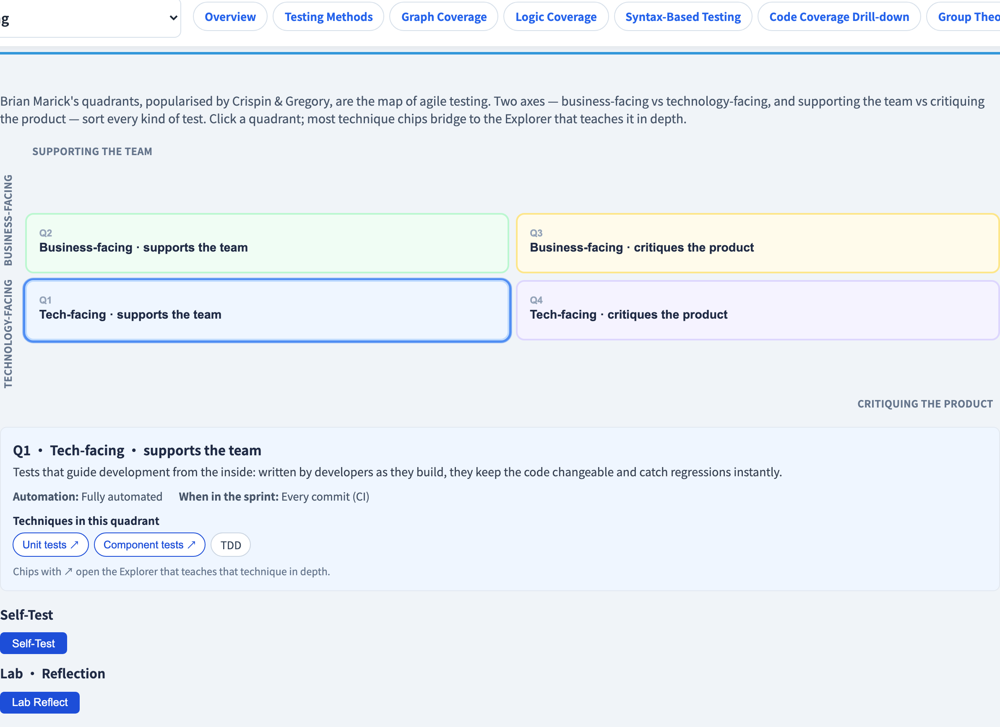
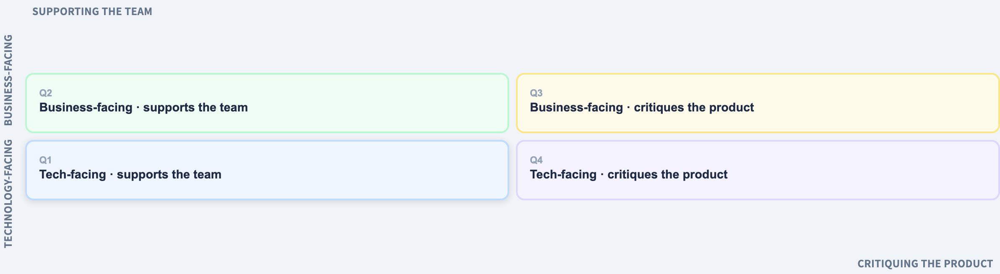

# 敏捷測試象限
### *測什麼、誰測、何時測*的地圖

軟體測試視覺化系列 #52 · 敏捷測試
搭配工具：`/section-agile`（[AgileQuadrantsExplorer](../../src/components/AgileQuadrantsExplorer.js)）

<!-- 開啟敏捷測試系列。象限是一張地圖，不是流程 —— 其他每一講敏捷課都是這張地圖上的一個位置。 -->

---

## 為什麼有這一講

- 敏捷測試不是單一技術 —— 它是*所有*技術，織進交付之中。
- 初學者會問：「若沒有獨立的測試階段，誰測什麼、何時測？」
- **敏捷測試象限**（Brian Marick；Crispin & Gregory）用一張 2×2 地圖回答這個問題。
- 整門課的每一個技術，在這張地圖上都有一個家。

---

## 兩條軸

象限由兩個獨立的問題構成：

- **面向業務 ↔ 面向技術** —— 測試是用*使用者*的語言寫的，還是用*程式碼*的語言？
- **支援團隊 ↔ 批判產品** —— 測試是在你建構時*引導開發*，還是*評價*成品？

兩條軸 → 四個象限。關鍵：編號（Q1–Q4）**不是順序** —— 它們只是標籤。

---

## 四個象限

```
 面向業務 │   Q2            │   Q3            │
          │ 功能測試、      │ 探索式、        │
          │ BDD、範例       │ 可用性、UAT     │
          ├─────────────────┼─────────────────┤
 面向技術 │   Q1            │   Q4            │
          │ 單元、元件、    │ 效能、安全、    │
          │ TDD             │ 各種 *-ility    │
          │ 支援團隊        │ 批判產品        │
```

- **Q1** —— 面向技術、支援團隊：單元／元件測試、TDD。
- **Q2** —— 面向業務、支援團隊：功能測試、BDD、範例。
- **Q3** —— 面向業務、批判產品：探索式、可用性、UAT。
- **Q4** —— 面向技術、批判產品：效能、安全、各種 *-ility*。

---

## 「支援團隊」vs「批判產品」

這條軸是細膩的那一條：

- **支援團隊**（Q1、Q2）—— 在開發*之前或之中*寫、用來**引導**開發的測試。它們告訴你該建什麼、並即刻抓回歸。大多自動化。
- **批判產品**（Q3、Q4）—— 在成品上跑、用來**評價**它的測試。它們問「這真的好嗎？」Q3 以人為本；Q4 由工具驅動。

> Q1–Q2 *預防*缺陷；Q3–Q4 *找出*預防漏掉的東西。

---

## 象限作為樞紐

這門課幾乎每個技術都住在某個象限：

| 象限 | 技術（與其講次） |
| --- | --- |
| Q1 | 單元測試、TDD、程式碼覆蓋（#18） |
| Q2 | BDD/Gherkin（#38）、範例映射（#55）、決策表 |
| Q3 | 探索式測試（#26）、E2E 旅程（#40）、UAT |
| Q4 | 效能與負載（#42）、混沌（#43）、安全 |

象限不*取代*那些技術 —— 它**組織**它們。團隊用這張地圖看出自己忽略了哪個象限。

---

## 各象限的自動化

- **Q1** —— 全自動；每次提交都跑（金字塔底座，#17）。
- **Q2** —— 自動*與*人工；範例事先談妥，然後自動化。
- **Q3** —— 人工、以人為本；探索無法被腳本化。
- **Q4** —— 工具驅動；需要專門工具，而非手寫斷言。

一個常見的失敗：一個把 Q1–Q2 自動化得很好、卻**忽略 Q3** 的團隊，出貨的軟體*正確*卻不好用。

---

## 工具演示

在 `/section-agile` 開啟**敏捷測試象限探索器**：

1. 點每個象限 —— 讀它的角色、自動化程度與在 sprint 中的時機。
2. 沿一個技術 chip 的橋接，前往深入教它的探索器。
3. 做「把測試放進象限」的練習。
4. 自問：你的團隊最少投資哪個象限？

---

## 工具 —— 四個象限



面向業務／技術 × 支援團隊／批判產品 —— 敏捷測試的地圖。

---

## 工具 —— 象限格



每個象限帶著技術 chip，橋接到深入教它們的探索器。

---


## 小結

- **敏捷測試象限**用兩條軸把整個敏捷測試畫成地圖：**面向業務 ↔ 面向技術** 與 **支援團隊 ↔ 批判產品**。
- **Q1** 單元/TDD · **Q2** BDD/範例 · **Q3** 探索式/UAT · **Q4** 效能/安全。
- Q1–Q2 **支援**開發（預防缺陷）；Q3–Q4 **批判**產品（找出溜掉的）。
- 象限**組織**這些技術 —— 它是地圖，不是方法。

**課堂練習：** 把這些分進象限 —— 一個負載測試、一個單元測試、一場探索式 session、一個 Gherkin scenario。

---

## 延伸閱讀

- 課程規格 —— 敏捷測試章節（[Specification.zh-TW.md](../Specification.zh-TW.md)）
- Crispin & Gregory, *Agile Testing*（2009）—— 測試象限
- 工具原始碼：[AgileQuadrantsExplorer.js](../../src/components/AgileQuadrantsExplorer.js)
- 下一講：**#53 衝刺測試節奏** —— 把象限織進一個 sprint
