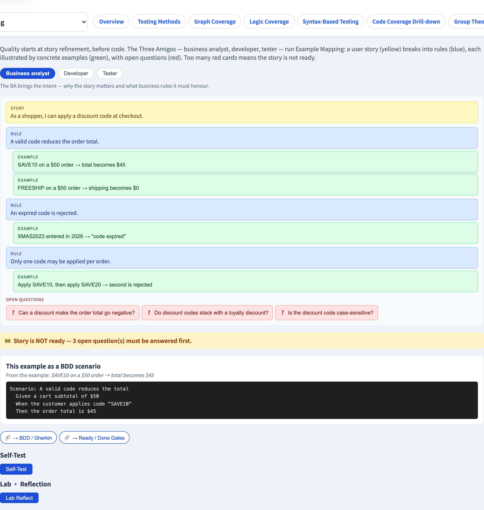
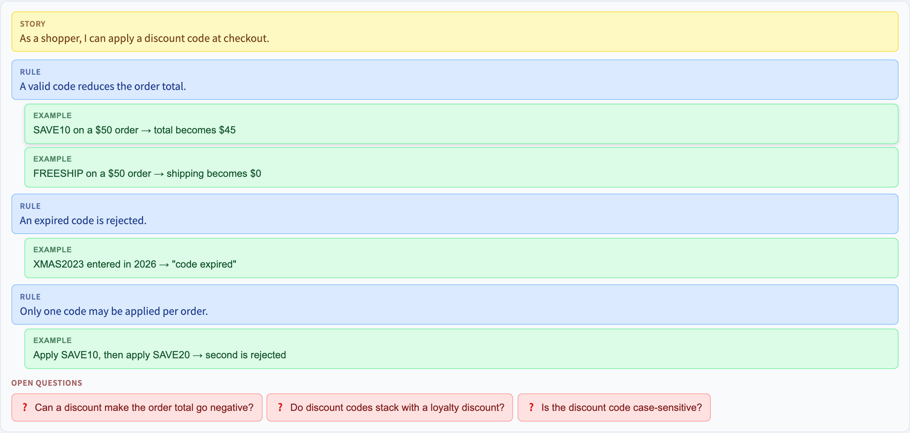

# 三方會談與範例映射
### 品質從精煉開始，先於任何一行程式碼

軟體測試視覺化系列 #55 · 敏捷測試
搭配工具：`/section-agile`（[ExampleMappingExplorer](../../src/components/ExampleMappingExplorer.js)）

<!-- BDD（#38）與 DoR（#54）的上游餵養者。本講重點：最便宜修的 bug，是你在寫程式前就談清楚的那個。 -->

---

## 為什麼有這一講

- 成本曲線（#14）說，最便宜的缺陷是在*需求*階段抓到的那個。
- 但具體而言，你要如何在*任何程式碼存在之前*抓到一個缺陷？
- 答案是一場有結構的**精煉對話** —— 以及一個進行它的技術。
- **Three Amigos** ＋ **範例映射**把一個含糊的故事，變成一個清晰、可測試的故事。

---

## Three Amigos（三方會談）

一個故事由三個視角來精煉 —— 「三位夥伴」：

| 角色 | 帶來 |
| --- | --- |
| **業務／BA** | *意圖* —— 故事為何重要、業務規則 |
| **開發者** | *可行性* —— 邊界案例、技術限制 |
| **測試者** | *懷疑* —— 遺漏的範例、含糊的措辭 |

沒有單一角色看得到整個故事。他們之間的對話讓各自單獨會漏掉的東西浮現。

---

## 範例映射：四種顏色的卡片

Matt Wynne 的**範例映射（Example Mapping）**用四種卡片顏色來組織對話：

| 卡片 | 顏色 | 裝著 |
| --- | --- | --- |
| **故事** | 黃 | 正在精煉的使用者故事 |
| **規則** | 藍 | 一條業務規則／驗收條件 |
| **範例** | 綠 | 闡明一條規則的具體範例 |
| **問題** | 紅 | 一個未解的開放問題 |

一個故事拆成規則；每條規則由範例闡明；任何未知變成一張紅卡。

---

## 一張範例映射：折扣碼

```
 [黃]  身為購物者，我可以在結帳時套用折扣碼

 [藍] 有效的折扣碼會降低總額
    [綠] SAVE10 用於 $50 訂單 → $45
    [綠] FREESHIP 用於 $50 訂單 → 運費 $0
 [藍] 過期的折扣碼會被拒絕
    [綠] 在 2026 年輸入 XMAS2023 → 「折扣碼已過期」

 [紅] 折扣能讓總額變成負數嗎？
 [紅] 折扣碼能與會員折扣疊加嗎？
```

這張映射*就是*被精煉過的規格 —— 具體，並且在紅卡之處明顯地不完整。

---

## 紅卡是就緒度訊號

**紅（問題）卡**的數量是一個直接的就緒度訊號：

- **少或沒有紅卡** → 故事被充分理解 —— 它可以進入 sprint（它通過 Definition of Ready，#54）。
- **許多紅卡** → 故事**尚未就緒**；現在把它拉進來，意味著當某個問題終於浮現時它會**在 sprint 中途卡住**。

> 紅卡是未知數。一個帶著未知數進 sprint 的故事，就是一個會卡住的故事。

---

## 範例變成 BDD scenario

**綠色範例卡**不是用完即丟的 —— 它們是下一步的原料：

- 每張綠色範例直接對應到一個 Gherkin **Scenario**（#38）：範例的設置 → *Given*、動作 → *When*、結果 → *Then*。
- 所以範例映射是 BDD 的**上游餵養者**：對話產生範例；BDD 把它們寫成可執行的 scenario。

精煉 → 範例 → scenario → 測試。一條不斷的鏈，始於任何程式碼之前。

---

## 工具演示

在 `/section-agile` 開啟**範例映射探索器**：

1. 讀一個故事的範例映射 —— 黃、藍、綠、紅卡。
2. 解決紅色問題卡，看就緒度量表變化。
3. 切換角色視角 —— BA、開發者、測試者。
4. 把一張綠色範例變成一個 Gherkin scenario。

---

## 工具 —— 映射一個故事



黃色故事、藍色規則、綠色範例、紅色問題。

---

## 工具 —— 範例映射



解決紅色問題卡，看就緒度量表上升。

---


## 小結

- **Three Amigos**（業務、開發、測試）精煉一個故事，使沒有任何單一盲點存活。
- **範例映射**用四種卡片組織它：**故事（黃）、規則（藍）、範例（綠）、問題（紅）**。
- **紅卡**是就緒度訊號 —— 太多代表故事尚未就緒（#54）。
- **綠色範例**直接餵入 BDD/Gherkin scenario（#38）—— 品質始於程式碼之前。

**課堂練習：** 為「使用者可以重設密碼」，寫一條規則（藍）、兩個範例（綠）、一個開放問題（紅）。

---

## 延伸閱讀

- 課程規格 —— 敏捷測試章節（[Specification.zh-TW.md](../Specification.zh-TW.md)）
- Wynne, *Introducing Example Mapping*（2015）
- 工具原始碼：[ExampleMappingExplorer.js](../../src/components/ExampleMappingExplorer.js)
- 相關：**#38 BDD 與 Gherkin** · **#54 就緒／完成準則** · **#44 ATDD 循環**
