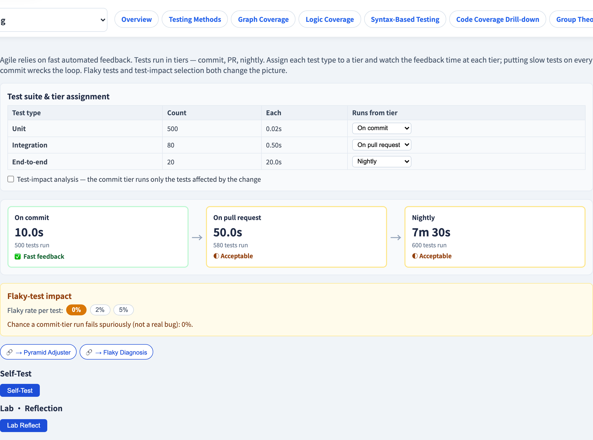
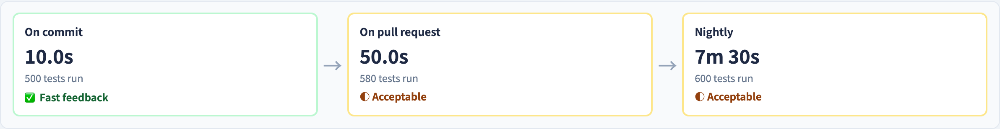

# 持續測試管線
### 快速回饋是一個設計問題

軟體測試視覺化系列 #56 · 敏捷測試
搭配工具：`/section-agile`（[ContinuousTestingPipelineExplorer](../../src/components/ContinuousTestingPipelineExplorer.js)）

<!-- 敏捷測試的 CI/CD 那一面。本講主軸：回饋時間是一份預算，而層級指派就是你花用它的方式。 -->

---

## 為什麼有這一講

- 衝刺節奏（#53）說：每次提交都測。但一個測試套件有數千個測試。
- 每次提交都全跑，回饋要**數小時** —— 開發者不再等、失去心流。
- 跑太少，bug 又溜過去。
- 一條**持續測試管線**用**分層**執行測試來解決這件事，每層有自己的速度預算。

---

## 三個層級

測試在交付流程的不同點執行，每層有一份回饋預算：

| 層級 | 何時跑 | 預算 | 典型測試 |
| --- | --- | --- | --- |
| **commit** | 每次提交／推送 | 秒 | 單元測試 |
| **PR** | 每個 pull request | 分鐘 | 單元 ＋ 整合 |
| **nightly** | 每天一次 | 小時 | ＋ 端到端 |

層級越早，**時間預算越緊** —— 回饋也越快。

---

## 把測試指派到層級

每種測試被指派一個層級 —— 而那個指派*就是*那個設計決定：

- 一個測試在它指派的層級**以及之後每一層**執行。
- 把快速的單元測試放在 **commit** → 對多數回歸即刻回饋。
- 把緩慢的 E2E 測試（#40）放在 **nightly** → 它們永遠不阻擋一次提交。

> 把一個慢測試放在 commit 層，你就替*所有人*毀掉那個迴圈。

這是把測試金字塔（#17）表達成一條管線。

---

## 回饋延遲是那個指標

要緊的數字是**開發者要等多久**才知道一次改動安不安全。

- 一個 10 秒的 commit 層 → 開發者維持心流。
- 一個 20 分鐘的 commit 層 → 他們切換脈絡，而較晚才發現的失敗修起來更貴（#14）。

對 commit 層多加一個慢的端到端測試，就能把秒變成分鐘。**回饋延遲是一份你主動花用的預算。**

---

## Flaky 測試毒化管線

一個在早期層級的 flaky 測試（#45）有腐蝕性：

- 它偽失敗 → commit 層無緣無故變紅。
- 開發者學會**無視紅燈** → 一個真實的回歸現在藏在 flake 之間。
- *某個*測試 flake 的機率隨測試數上升：500 個 commit 層測試、2% 的 flaky 率，就讓一次乾淨的執行變得不太可能。

一條沒人信任的快管線，比一條慢的還糟。

---

## 測試影響分析

最聰明的那個槓桿：別在每次提交跑*每一個*測試 —— 只跑**受該改動影響的**測試。

- **測試影響分析**把每個測試對應到它操練的程式碼。
- 一次碰到單一模組的提交，只跑該模組的測試。
- commit 層大幅縮小 → 快速回饋*與*廣覆蓋兼得。

這就是大型程式庫在套件成長時，仍讓 commit 層保持快速的方法（對照 #M6 的風險導向挑選）。

---

## 工具演示

在 `/section-agile` 開啟**持續測試管線探索器**：

1. 把每種測試指派到一個層級 —— 看各層的回饋時間。
2. 把 e2e 測試移到 commit 層，看迴圈崩掉。
3. 提高 flaky 率，讀偽失敗的機率。
4. 切換測試影響分析，看 commit 層縮小。

---

## 工具 —— 分層的測試管線

commit、PR、nightly 三層，各有自己的回饋時間。

---

## 工具 —— 管線層級

把 e2e 移到 commit 層，看快速回饋迴圈崩掉。

---

## 小結

- 一條**持續測試管線**用**分層**執行測試 —— commit（秒）、PR（分鐘）、nightly（小時）。
- **層級指派**是那個設計決定；一個慢測試放在 commit 層會替所有人毀掉回饋。
- **回饋延遲**是那個指標 —— 也是一份你主動花用的預算。
- **Flaky 測試**毒化早期層級；**測試影響分析**讓 commit 層在套件成長時仍保持快速。

**課堂練習：** 一個跑 8 分鐘的端到端測試 —— 哪一層？若它放在 commit 層，回饋延遲會怎樣？

---

## 延伸閱讀

- 課程規格 —— 持續測試章節（[Specification.zh-TW.md](../Specification.zh-TW.md)）
- Humble & Farley, *Continuous Delivery*（2010）
- 工具原始碼：[ContinuousTestingPipelineExplorer.js](../../src/components/ContinuousTestingPipelineExplorer.js)
- 相關：**#17 測試金字塔** · **#45 Flaky 診斷** · **#57 回歸與測試債**
