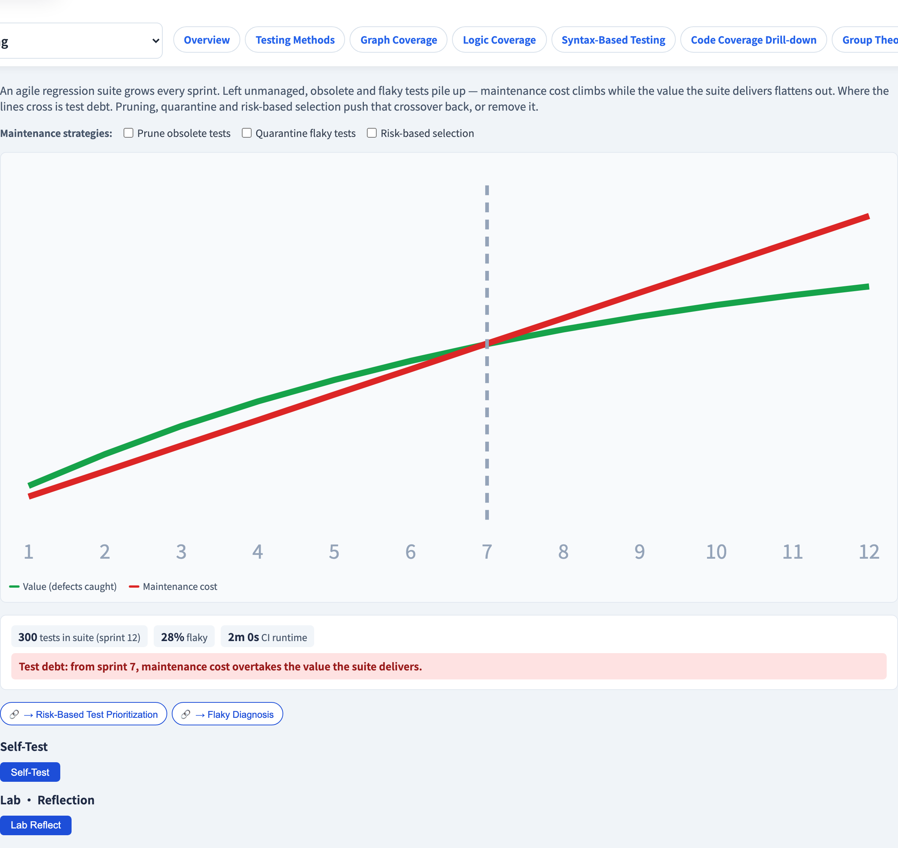
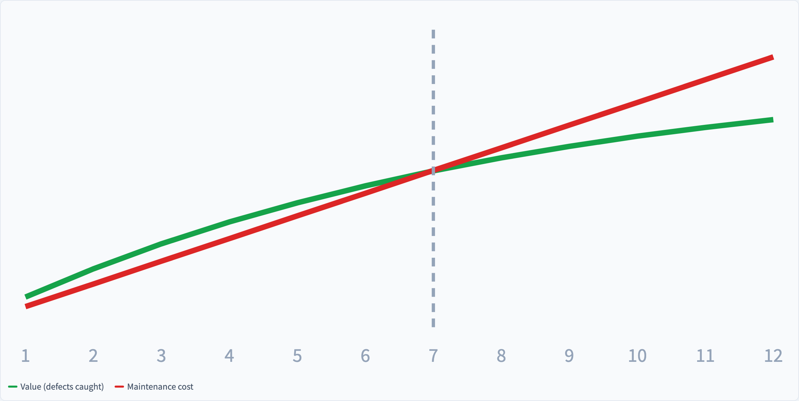

# Regression & Test Debt
### A test suite is an asset that can turn into a liability

Software Testing Visualization series #57 · Agile Testing
Companion tool: `/section-agile` ([RegressionDebtExplorer](../../src/components/RegressionDebtExplorer.js))

<!-- The closing lecture of the whole course. It turns the lens on the test suite itself: a suite, untended, becomes the problem. -->

---

## Why this lecture exists

- Every sprint adds tests. A regression suite only ever **grows.**
- Each test is an asset — but also a **liability**: it must be run, maintained, and trusted.
- Left untended, the maintenance cost of a suite can **overtake the value** it delivers.
- This closing lecture is about keeping a growing suite *worth having*.

---

## A regression suite over time

Simulate a suite across many sprints:

- Each sprint **adds** new tests.
- Some existing tests go **obsolete** — the feature they tested changed.
- Some go **flaky** (#45) — unreliable, eroding trust.

```
 sprint 1 ───────────────▶ sprint 12
 small, fast, trusted      large, slow, partly flaky
```

Without maintenance, the suite *degrades* even as it *grows*.

---

## The two curves: cost and value

Plot two quantities sprint by sprint:

- **Maintenance cost** — runtime + the effort to keep tests green. It rises roughly *linearly* with suite size.
- **Value** — the defect-catching power. It rises with *good* tests, but with **diminishing returns** — the tenth test of a feature catches far less new than the first.

```
 value  ┌──────────────  (flattens — redundancy)
 cost   ╱   (rises linearly)
        └──────────── sprint →
```

---

## Test debt: the crossover

Where the rising **cost** line crosses the flattening **value** line is **test debt**:

- Before the crossover — the suite earns its keep.
- After the crossover — you are **spending more to maintain the suite than it returns** in caught defects.

> Test debt is not "too many tests." It is the point where the suite costs more than it is worth.

An unmanaged suite reaches that crossover; the goal is to push it back, or remove it.

---

## Three maintenance strategies

You manage test debt the way you manage any debt — deliberately:

| Strategy | What it does |
| --- | --- |
| **Prune** | delete obsolete tests — tests of features that no longer exist |
| **Quarantine** | move flaky tests (#45) out of the blocking suite, then fix them |
| **Risk-based selection** | run the highest-risk tests often, the rest rarely (#31) |

Each strategy lowers the cost curve or flattens its slope — pushing the crossover later, or off the chart entirely.

---

## A suite is a product

The closing idea of the course: **your test suite is itself a product** that needs ownership.

- It has users (the team), a cost of operation, and a value it delivers.
- It accrues debt if neglected — exactly like the code it tests.
- Treat it deliberately: prune, quarantine, prioritize — every sprint, in the retrospective.

A test suite, well tended, is the foundation everything in this course was building toward.

---

## Tool demonstration

In `/section-agile`, open the **Regression & Test-Debt Explorer**:

1. Simulate the suite across 12 sprints — watch the cost and value curves.
2. Find the **crossover** — the onset of test debt.
3. Toggle **prune**, **quarantine** and **risk-based selection**.
4. See each strategy push the crossover back — or remove it.

---

## Tool — cost versus value



A regression suite simulated across 12 sprints — two curves diverging.

---

## Tool — the crossover point



Where rising cost meets flattening value — the onset of test debt.

---


## Summary

- A regression suite **only grows**; each test is both an asset and a **liability**.
- **Maintenance cost** rises linearly; **value** flattens (diminishing returns) — where they cross is **test debt**.
- **Prune, quarantine, risk-based selection** push the crossover back or remove it.
- Your test suite is a **product** — own it, and tend it every sprint.

**In-class exercise:** in your real suite, name one test to prune, one flaky test to quarantine, and the highest-risk test you would never skip.

---

## Further reading

- Course specification — test maintenance chapter ([Specification.zh-TW.md](../Specification.zh-TW.md))
- Crispin & Gregory, *Agile Testing* — sustaining a regression suite
- Tool source: [RegressionDebtExplorer.js](../../src/components/RegressionDebtExplorer.js)
- Related: **#31 Risk-Based Testing** · **#45 Flaky Diagnosis** · **#56 Continuous Testing**
