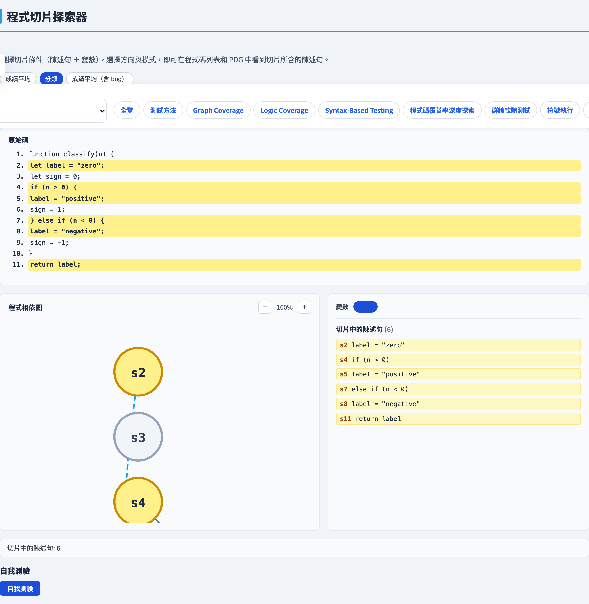
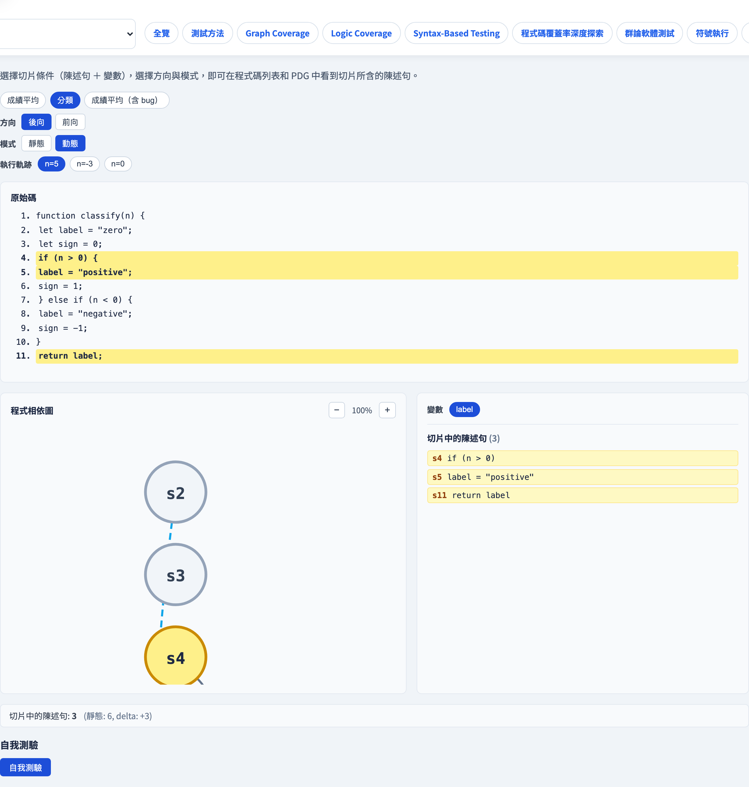

# 程式切片
### *哪些陳述式影響了這個值？*

軟體測試視覺化系列 #58 · 切片式測試
搭配工具：`/section-slicing`（[ProgramSlicingExplorer](../../src/components/ProgramSlicingExplorer.js)）

<!-- 開啟切片式測試系列。切片是基礎：後續的每個分頁（切塊、覆蓋、回歸）都重複使用相同的引擎與範例資料。 -->

---

## 為什麼有切片這門技術

- 測試失敗時，你看到的是**錯誤的輸出** —— 但整支程式都跑過了。哪幾行要負責？
- 手動追蹤很繁瑣；覆蓋率報告只告訴你*什麼被執行*，而非*什麼有影響*。
- **程式切片**（Weiser，1984）回答更精準的問題：給定這個**變數在這個位置**，哪些陳述式可能影響了它的值？
- 結果是一支更小的程式 —— **切片** —— 它保留了該變數的行為，丟棄了一切無關的東西。

<!-- 程式切片是 Weiser 博士論文的核心洞見：程式設計師在腦中模擬的是程式的一個子集，而非全部。切片讓這個子集變得明確且可計算。 -->

---

## 程式相依圖（PDG）

切片是在**程式相依圖（Program Dependence Graph）** 上計算的，它有兩種邊：

- **資料相依** —— 若 A 定義了一個變數，B 之後使用它且中間沒有被重定義，則 B *資料相依*於 A。
- **控制相依** —— 若 A（分支或迴圈條件）決定了 B 是否被執行，則 B *控制相依*於 A。

```
  s2: total = 0    ──資料──▶  s5: total = total + s
  s4: for s of scores  ──控制──▶  s5
  s4: for s of scores  ──控制──▶  s6
```

兩種邊都需要：錯誤的累計值（資料）與錯誤的迴圈條件（控制）都可能污染輸出。

<!-- PDG 結合了控制流圖的支配者資訊與資料流分析的 def-use 鏈。本課程使用人工撰寫的 PDG，以便把焦點放在切片邏輯上，而非建構圖的細節。 -->

---

## 切片準則

要計算切片，你需要一個**準則**：一對 ⟨陳述式, 變數⟩。

- **陳述式**是感興趣的位置 —— 通常是 `return` 或一個斷言。
- **變數**是你在那個位置關心的值。

範例：⟨s10, grade⟩ —— 「`return grade` 執行時，什麼影響了 `grade` 的值？」

```
criterion = { stmtId: 's10', variable: 'grade' }
```

每個切片都相對於一個準則。即使在同一個陳述式上，換一個變數可能得到截然不同的切片。

<!-- 一支程式可以有許多切片，每個準則一個。這就是為什麼切片是靈活的分析工具：你可以精確聚焦在你真正在乎的東西上。 -->

---

## 向後切片

準則 ⟨s, v⟩ 的**向後切片**是*可能影響了*第 `s` 號陳述式中 `v` 之值的陳述式集合。

計算方式：從 `s` 出發；沿**入射**的資料相依與控制相依邊往回走；收集所有可達的陳述式。

```
⟨s10, grade⟩ 的向後切片（gradeAverage）：
  s10 → s9（資料：grade）→ s8（資料：avg）→ s4（控制）→ s5（資料：total）
       → s2（資料：total）→ s6（資料：count）→ s3（資料：count）
  結果：{s2, s3, s4, s5, s6, s8, s9, s10}
```

向後切片回答**除錯**問題：「是什麼可能造成了這個錯誤輸出？」

<!-- 輸出變數的向後切片常用於錯誤定位：它告訴你哪些陳述式是錯誤的候選。切片之外的陳述式絕對不可能影響此輸出。 -->

---

## 向前切片

準則 ⟨s, v⟩ 的**向前切片**是*可能受到*第 `s` 號陳述式中 `v` 之值影響的陳述式集合。

計算方式：從 `s` 出發；沿**出射**的資料相依與控制相依邊往前走；收集所有可達的陳述式。

```
⟨s2, total⟩ 的向前切片（gradeAverage）：
  s2 → s5（資料：total）→ s5（自身迴圈：total）
     → s8（資料：total）→ s9（資料：avg）
     → s10（資料：grade）
  結果：{s2, s5, s8, s9, s10}
```

向前切片回答**影響分析**問題：「如果我改了 `total = 0`，哪些陳述式會受到影響？」

<!-- 向前切片支撐了回歸測試選取（N4）：如果你修改了一個陳述式，向前切片告訴你哪些測試可能因此失敗。 -->

---

## 靜態 vs 動態切片

兩個方向都可以用兩種模式計算：

| | **靜態** | **動態** |
|---|---|---|
| 所需輸入 | 無 —— 使用完整 PDG | 一條執行軌跡 |
| 使用的邊 | 所有 PDG 邊 | 只有該軌跡中走到的邊 |
| 切片大小 | 較大（安全的過度近似） | 較小（特定輸入下的精確近似） |
| 使用時機 | 一般分析、除錯輔助 | 精確錯誤定位 |

**動態切片**把相依邊限縮在端點都出現於軌跡中的那些，並應用*最近定義規則*：對於資料相依邊 `def → use`，只有在 `use` 之前最近一次對該變數的定義才算。

<!-- 動態切片嚴格小於或等於相同準則的靜態切片。收縮幅度對迴圈可能相當顯著：迴圈中被重定義 100 次的變數，對任何特定的使用而言只有一條最後定義邊有效。 -->

---

## 實作範例 —— `gradeAverage`

```javascript
function gradeAverage(scores) {
  let total = 0;              // s2
  let count = 0;              // s3
  for (const s of scores) {  // s4
    total = total + s;        // s5
    count = count + 1;        // s6
  }
  const avg = total / count;  // s8
  const grade = avg >= 60     // s9
    ? "pass" : "fail";
  return grade;               // s10
}
```

- **⟨s10, grade⟩ 的向後切片**（靜態）= 全部 8 個陳述式 —— 整個函式都有關。
- **⟨s10, grade⟩ 的動態向後切片**，軌跡 `scores=[80,90]`：相同的陳述式，但迴圈體節點只出現和迴圈執行次數一樣多的次數。
- 比較靜態與動態切片的*大小*，可以看出軌跡對分析的限縮程度。

<!-- 這個範例刻意設計得簡單，讓切片可以用手追蹤。在探索器中，你可以點選任何陳述式、選擇一個變數，然後看 PDG 高亮顯示切片。 -->

---

## 工具演示 — 向後靜態切片



在 `/section-slicing` 開啟**程式切片探索器**：

1. 選取 `classify` 範例 —— 並排閱讀原始碼與 PDG。
2. 點選輸出陳述式 `return label`（`s11`）並選擇變數 `label`。
3. 設定**向後**方向與**靜態**模式，切片高亮顯示 6 個陳述式（`s2, s4, s5, s7, s8, s11`）。
4. 嘗試小測驗：關於在陳述式 `s` 對變數 `v` 的向後靜態切片，下列哪項永遠成立？

---

## 工具演示 — 動態切片



1. 切換到**動態**模式，並選取 `pos` 軌跡。
2. 切片縮小至 3 個陳述式（`s4, s5, s11`）—— 只有該次執行實際走過的部分。
3. 查看詳細面板：切片大小與靜態對動態的差值（6 → 3）。
4. 試試其他軌跡（`neg`、`zero`）—— 每條軌跡都會產生不同且更小的動態切片。

---

## 小結

- **程式相依圖**結合了資料相依邊（def → use）與控制相依邊（條件 → 被控陳述式）。
- **切片準則** ⟨陳述式, 變數⟩ 同時固定了感興趣的位置與值。
- **向後切片**收集*可能影響*準則的陳述式 —— 用於除錯。
- **向前切片**收集*受準則影響*的陳述式 —— 用於影響分析。
- **靜態**切片涵蓋所有可能的輸入（過度近似）；**動態**切片限縮於一條軌跡（較小、較精確）。

**課堂練習：** 用手追蹤 `gradeAverage` 中 ⟨s8, avg⟩ 的向後切片，再在探索器中驗證。

---

## 延伸閱讀

- 課程規格 —— 切片式測試章節（[2026-05-18-slice-based-testing-design.md](../superpowers/specs/2026-05-18-slice-based-testing-design.md)）
- Weiser, M.（1984）。〈Program Slicing〉。*IEEE Transactions on Software Engineering*，10(4)，352–357。
- Tip, F.（1995）。〈A Survey of Program Slicing Techniques〉。*Journal of Programming Languages*，3(3)。
- 工具原始碼：[ProgramSlicingExplorer.js](../../src/components/ProgramSlicingExplorer.js)、[slicing.js](../../src/utils/slicing.js)
- 下一講：**#59 切塊法錯誤定位** —— 從切片縮小到可疑陳述式集合
