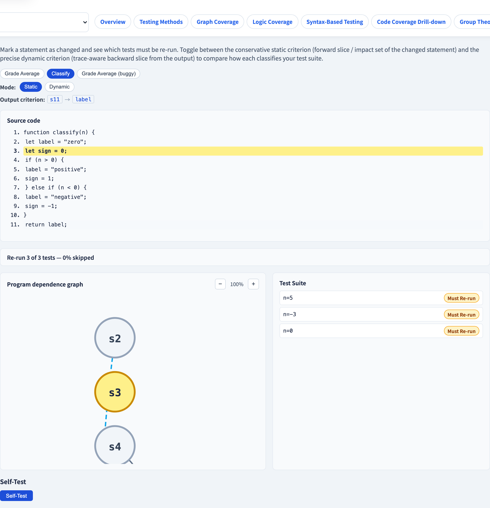
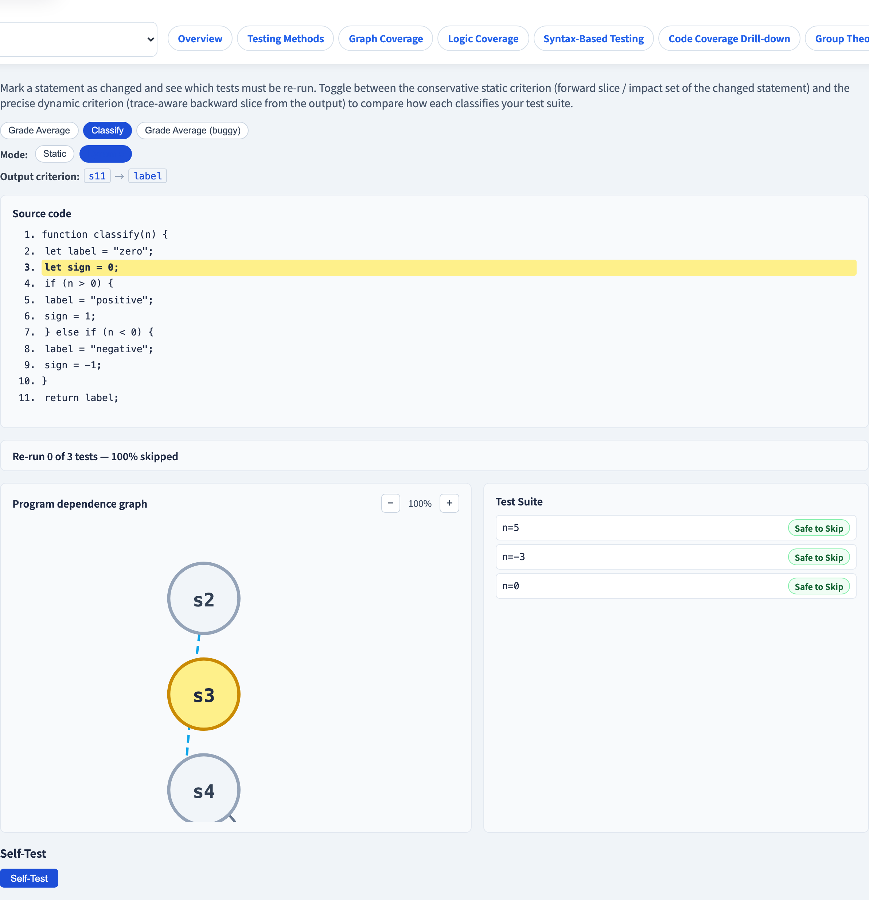

# Regression Test Selection
### *Re-run only the tests that could be affected by an edit*

Software Testing Visualization series #61 · Slice-Based Testing
Companion tool: `/section-slicing` → Regression tab ([SliceRegressionExplorer](../../src/components/SliceRegressionExplorer.js))

<!-- Final deck of the four-deck slicing section: #58 Program Slicing, #59 Fault Localization & Dicing, #60 Slice-Based Coverage, #61 Regression Test Selection. The key idea: after an edit we do not need to re-run every test — only those whose outcome the edit could have changed. Slicing tells us exactly which tests those are. -->

---

## The regression-testing problem

After every code edit, the safe action is to re-run the entire test suite.

**In practice this is expensive:**
- Large systems have thousands of tests; a full run can take hours.
- CI pipelines block on test time, slowing every developer feedback loop.
- Most tests are completely unrelated to any given change.

**Regression test selection (RTS)** asks: which subset of the test suite is it *necessary* to re-run after a specific edit?

A test is safe to skip if the edit **cannot possibly change** its outcome. The challenge is determining that — cheaply and correctly.

<!-- The cost problem is well documented. Google (Memon et al., 2017) reported that re-running all tests on every commit was infeasible at scale and adopted selection and prioritization. The academic literature on RTS dates to Rothermel and Harrold (1994, 1996) and remains active. The core tension is between precision (only re-run truly affected tests) and safety (never skip a test that could fail due to the edit). -->

---

## The safety requirement

**Definition:** An RTS technique is *safe* if it never omits a test whose outcome the edit could change.

Formally: let `E` be an edit and `T_i` a test. If there exists any execution of the modified program on the input of `T_i` that produces a different output than the original, then `T_i` must be in the selected set.

**Why safety matters:** an unsafe technique can give a green signal even though the edit introduced a regression — the test that would have caught it was skipped.

Most practical RTS techniques are *conservative* — they may include tests that turn out to be unaffected (false positives), but they never miss a truly affected test.

<!-- The formal definition of safety comes from Rothermel and Harrold (1996). An unsafe technique can create a false sense of confidence — the CI pipeline passes, but a regression has been silently introduced. In practice, every team must decide their risk tolerance; conservative over-selection is common. -->

---

## Impact set — the forward slice of the edit

After editing statement `s`, which other statements can be affected?

**Forward slice** of statement `s` (notation: `FS(s)`):
> The set of all statements that the change at `s` can *reach*, through data dependences (a value defined at `s` is used downstream) and control dependences (a branch at `s` controls whether downstream statements execute).

`FS(s)` is the **impact set** — the exact set of statements whose behavior the edit at `s` can influence.

**Key insight:** a test is potentially affected by the edit iff it executed at least one statement in `FS(s)`.

<!-- The forward slice is the mirror image of the backward slice introduced in deck #58. The backward slice answers "what affected this output?"; the forward slice answers "what could this statement affect?" Both are reachability closures in the program dependence graph, but in opposite directions. For RTS we want the forward direction. -->

---

## Static selection — conservative, always safe

**Algorithm:**

1. Compute the forward slice (impact set) `FS(s)` of the changed statement `s`.
2. For each test `T_i`, examine the set of statements it executed (its dynamic trace).
3. **Select `T_i`** iff its trace intersects `FS(s)`.

This is *static* in the sense that the impact set is computed once over the program's structure, then compared against each test's recorded trace.

**Safety guarantee:** if the edit at `s` can affect `T_i`, then `T_i` executed something in `FS(s)`, so `T_i` will be selected.

**Trade-off:** any test that happened to execute a statement in `FS(s)` is selected, even if the change does not actually flow to that test's output on that particular input.

<!-- Static selection (matching traces against the forward slice) corresponds to Rothermel and Harrold's safe static RTS. Traces must be stored from a previous run — this is the "test history" or "coverage profile" that modern CI systems maintain automatically. Tools such as Pytest-testmon and Jest's --changedSince implement variants of this idea. -->

---

## Dynamic selection — precise, still safe

A test is selected statically if it *executed* something in `FS(s)`.
But executing a statement in `FS(s)` does not mean the edit's value actually *reached* the test's output on that run.

**Dynamic selection uses the backward dynamic slice:**
- A test `T_i` is affected iff the changed statement `s` is in the **dynamic backward slice** of the output criterion for `T_i`.
- The dynamic slice only contains statements whose **values or control decisions** actually flowed to the output on that specific execution — not just any statement that could do so in theory.

**Result:** dynamic selection is a strict subset of static selection.

$$\text{dynamic-affected} \subseteq \text{static-affected}$$

Dynamic selection is more precise (fewer tests re-run) but more expensive (requires per-trace dynamic slice computation).

<!-- Dynamic selection was studied by Agrawal et al. (1993) and later formalized in the context of the program dependence graph. The dynamic backward slice is computed the same way as in deck #59 (Fault Localization & Dicing): replay the trace, track live data-dependence edges, and close over the PDG restricted to those live edges. -->

---

## Worked example — `classify`

```javascript
function classify(n) {
  let label = "zero";       // s2
  let sign = 0;             // s3  ← edit here
  if (n > 0) {              // s4
    label = "positive";     // s5
    sign = 1;               // s6
  } else if (n < 0) {       // s7
    label = "negative";     // s8
    sign = -1;              // s9
  }
  return label;             // s11
}
```

Output criterion: `label` at `s11`.
**Edit:** change statement `s3` (`sign = 0`).

Traces: `pos` (n=5), `neg` (n=−3), `zero` (n=0).

<!-- The classify function was introduced in deck #58 and used in decks #59 and #60. Here we use it for RTS: the edit is at s3 (sign = 0), and the output is label at s11. The sign variable has no data or control path to label, which will make the dynamic result instructive. -->

---

## Worked example — static selection

**Impact set** (forward slice of `s3`): `{s3}` only.
`sign` is never used in any computation that reaches `label` or controls any branch beyond what it already controls — `s3` has no successors in the forward direction.

Every trace executes `s3` (it is in every input's path), so every trace's steps intersect `{s3}`.

| Trace | Executes s3? | Static verdict |
|---|---|---|
| `pos` (n=5) | yes | **re-run** |
| `neg` (n=−3) | yes | **re-run** |
| `zero` (n=0) | yes | **re-run** |

**Static: re-run all 3 / 3 tests (0 safe to skip).**

<!-- s3 defines `sign` but sign has no data-dep successors in classify's PDG — it is defined (s3, s6, s9) but never used in any computation that reaches the output. The forward slice of s3 over the classify PDG is therefore just {s3} itself — no successors. Yet every trace executes s3, so static selection must conservatively select all three traces. -->

---

## Worked example — dynamic selection

For each trace, compute the **dynamic backward slice** of `label` at `s11`.
A trace is affected iff `s3` appears in its dynamic backward slice.

| Trace | Dynamic backward slice of label@s11 | Contains s3? | Dynamic verdict |
|---|---|---|---|
| `pos` | s4, s5, s11 | no | **safe to skip** |
| `neg` | s4, s7, s8, s11 | no | **safe to skip** |
| `zero` | s2, s11 | no | **safe to skip** |

**Dynamic: re-run 0 / 3 tests (all 3 safe to skip).**

`s3` is never in any trace's dynamic backward slice because `sign` never flows to `label` on any execution — the value defined at `s3` is simply not used in the computation of the output.

<!-- This is the key contrast with static: static is forced to select all traces because s3 is in every trace's execution steps. Dynamic looks at what actually flowed to the output and correctly identifies that sign is irrelevant to label on every input. The result: 3 safe skips vs 0 safe skips — a 100% reduction in test runs for this edit. This is a clean, pedagogically useful case where static over-selects and dynamic is exact. -->

---

## Static vs dynamic — summary comparison

| Property | Static | Dynamic |
|---|---|---|
| Selection criterion | Trace executes any statement in `FS(s)` | Changed statement is in trace's dynamic backward slice |
| Safety | Always safe (conservative) | Always safe (precise) |
| False positives | Possible — may select unaffected tests | None — only truly affected tests selected |
| `classify` (edit s3) | 3/3 re-run | 0/3 re-run |
| Cost | Low — one forward-slice computation | Higher — per-trace dynamic slice |

Dynamic-affected ⊆ Static-affected ⊆ All tests.

<!-- The hierarchy is strict in general: there exist edits and programs where dynamic-affected is a proper subset of static-affected. The classify/sign example is an extreme case (dynamic is empty). In practice, dynamic RTS is used when precision is critical and trace storage is available; static RTS is preferred when speed of selection is paramount. -->

---

## Tool demonstration — static selection



In `/section-slicing`, open the **Regression** tab (Slice Regression Explorer):

1. Select the `classify` scenario.
   - The PDG is shown on the left with the current output criterion (`label` at `s11`).
2. Click on statement `s3` (`sign = 0`) to mark it as the changed statement.
   - The forward-slice impact set `{s3}` is highlighted.
3. Switch to **Static** mode — all three traces (`pos`, `neg`, `zero`) are marked as affected (red).

---

## Tool demonstration — dynamic selection



4. Switch to **Dynamic** mode — all three traces are marked safe (green); the dynamic backward slice of each trace does not contain `s3`.
5. Try a different edit: click `s2` (`label = "zero"`) — observe that both static and dynamic now select all traces (because `s2` is in every trace's dynamic backward slice of `label`).

<!-- The tool visualizes both the forward-slice impact set and the per-trace dynamic backward slices simultaneously. The color coding (red = re-run, green = skip) makes the static vs dynamic tradeoff concrete. Encourage students to try edits at s5, s7, s8 to see intermediate cases where dynamic is a strict subset of static. -->

---

## Summary

- After an edit, **regression test selection (RTS)** identifies the subset of tests that must be re-run — those whose outcome the edit could change.
- A technique is **safe** if it never skips a truly affected test; conservative techniques may over-select.
- The **forward slice** of the changed statement is the impact set — all statements reachable through data and control dependences from the edit.
- **Static selection:** re-run a test if its recorded trace intersects the impact set. Always safe; may over-select.
- **Dynamic selection:** re-run a test only if the changed statement is in that test's dynamic backward slice from the output. Precise; dynamic-affected ⊆ static-affected.
- This completes the four slice-based testing techniques: **program slicing** (#58), **fault localization & dicing** (#59), **slice-based coverage** (#60), **regression test selection** (#61).

**In-class exercise:** for the `classify` function, find an edit where static and dynamic select the same set of tests, and an edit where dynamic selects strictly fewer.

---

## Further reading

- Course specification — regression selection design ([2026-05-19-slicing-n4-regression-design.md](../superpowers/specs/2026-05-19-slicing-n4-regression-design.md))
- Rothermel, G., & Harrold, M. J. (1996). "Analyzing regression test selection techniques." *IEEE Transactions on Software Engineering*, 22(8), 529–551.
- Rothermel, G., & Harrold, M. J. (1994). "A framework for evaluating regression test selection techniques." *Proceedings of ICSE 1994*, 201–210.
- Agrawal, H., DeMillo, R. A., & Spafford, E. H. (1993). "Debugging with dynamic slicing and backtracking." *Software: Practice and Experience*, 23(6), 589–616.
- Memon, A., et al. (2017). "Taming Google-scale continuous testing." *Proceedings of ICSE 2017*, 1–10.
- Tool source: [SliceRegressionExplorer.js](../../src/components/SliceRegressionExplorer.js), [slicing.js](../../src/utils/slicing.js)
- Previous: **#60 Slice-Based Coverage** — coverage measured relative to the backward slice
