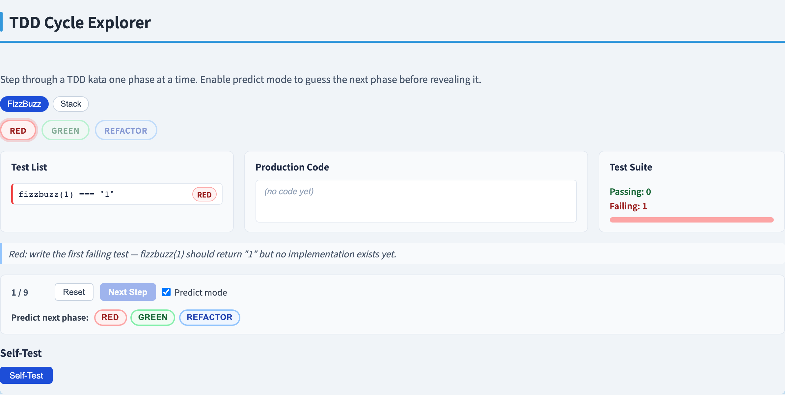
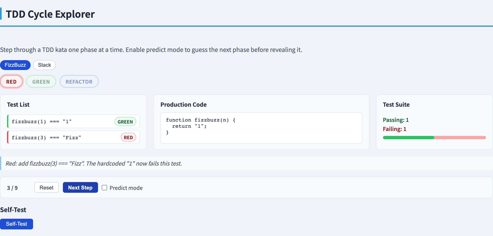
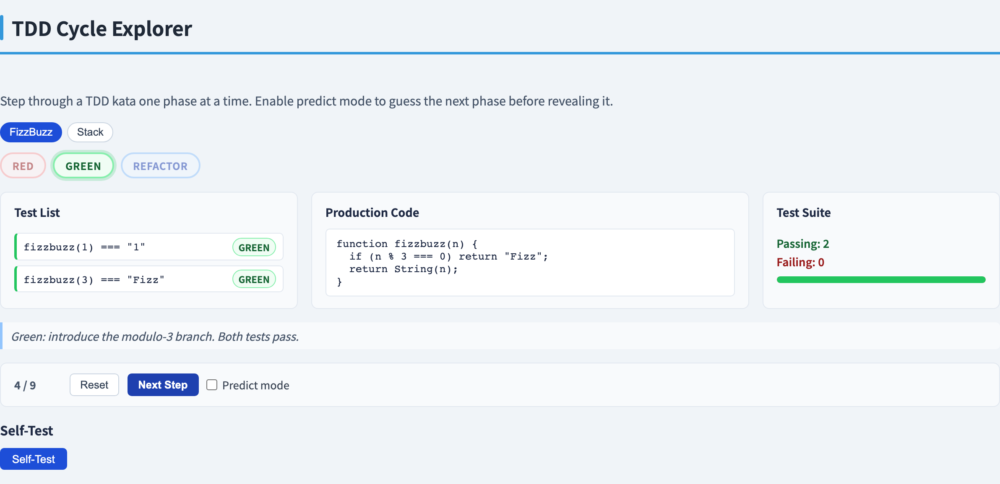
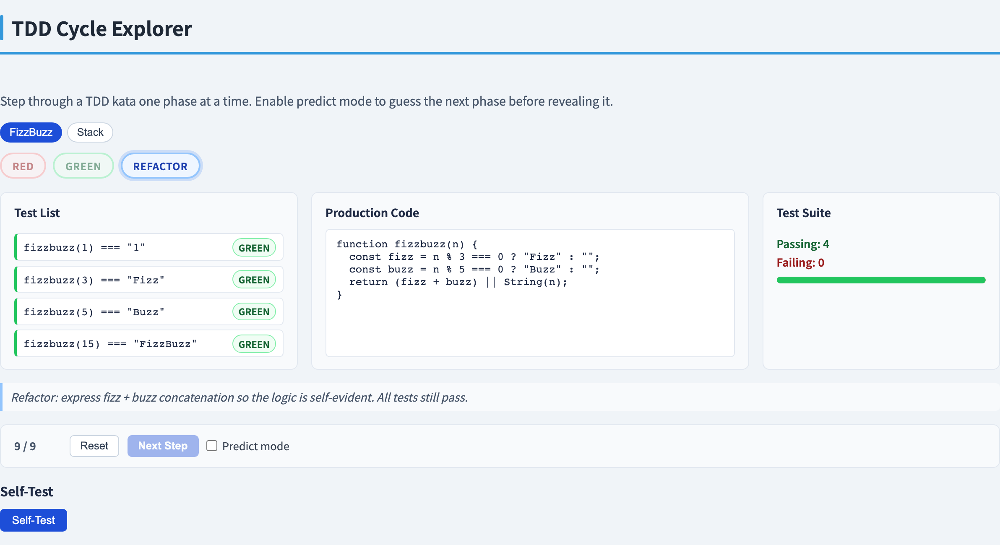
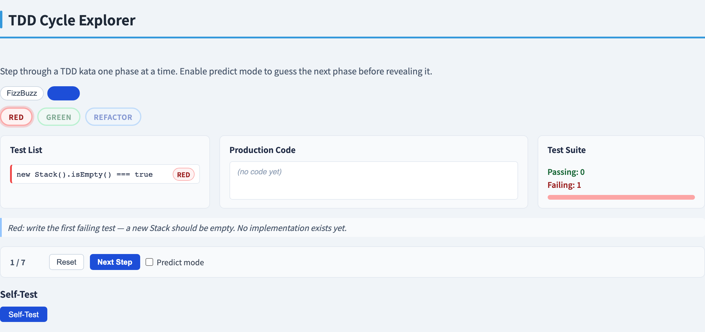
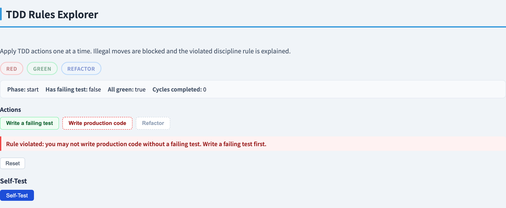
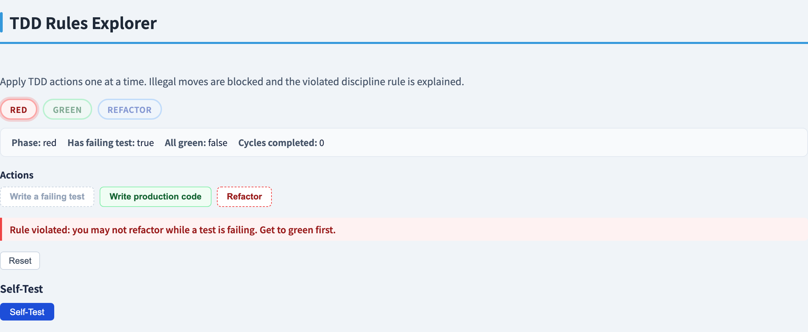
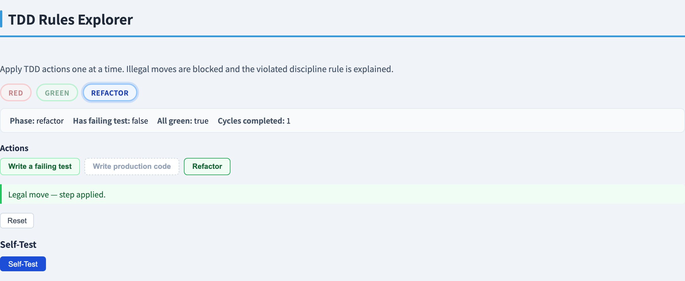

# Test-Driven Development
### *Write the test first; let it drive the design*

Software Testing Visualization series #62 · TDD
Companion tool: `/section-tdd` → Cycle tab ([TddCycleExplorer](../../src/components/TddCycleExplorer.js)) · Rules tab ([TddRulesExplorer](../../src/components/TddRulesExplorer.js))

<!-- Opening deck of the TDD section. TDD is a programming discipline, not just a testing technique — the tests come first, which turns them from a verification activity into a design activity. The deck covers the micro-cycle, the three discipline rules, the test list, the "fake it" and triangulation moves, and a nine-step FizzBuzz kata that demonstrates each move concretely. -->

---

## Why test-first?

In the conventional order: write code → then write tests.

**Test-Driven Development flips the order:** write a failing test → then write the code that makes it pass.

This is not merely a stylistic change. Writing the test first:

- **Specifies behavior** before implementation — the test *is* the specification.
- **Forces a usable API** — you call the function before it exists, so the interface must be clean enough to test.
- **Creates a safety net instantly** — you never write code that is not covered by at least one test.
- **Keeps steps small** — each cycle adds exactly one small behavior, making errors easy to locate.

<!-- The "test as specification" idea is central to Beck's original formulation. When you write the test first you are forced to think about what the code should do, not how it does it. This design pressure is the main benefit that experienced TDD practitioners cite. The safety net benefit is real but secondary — TDD's primary payoff is better-designed, more modular code. -->

---

## The red-green-refactor micro-cycle

TDD proceeds in a strict three-phase loop:

**RED** — Write one small failing test.
- Run the suite; watch it fail (confirms the test is actually testing something).
- Check that it fails *for the right reason* — a wrong error message is a warning sign.

**GREEN** — Write the *minimal* code to make the test pass.
- "Fake it" is allowed: `return "1"` passes `fizzbuzz(1) === "1"` and that is fine.
- Do not add logic that is not yet demanded by a failing test.

**REFACTOR** — Improve the code while keeping the suite green.
- Remove duplication, rename, clarify structure.
- No new behavior — stay green throughout.
- Only safe to do because the test suite is your safety net.

The cycle time is typically seconds to minutes, not hours.

<!-- Beck calls this the "red bar / green bar" rhythm. The physical metaphor — a progress bar in the test runner — is intentional. Red is danger; green is safe. The discipline of running the suite after every small edit is what makes the safety net real. Refactoring on red (broken tests) is forbidden — you cannot safely restructure code when you do not know which failures are pre-existing and which you just introduced. -->

---

## The three discipline rules

Robert Martin distilled TDD into three rules that prevent the cycle from being circumvented:

1. **No production code without a failing test.**
   You may not write any implementation code unless you first have a test that fails because that code does not exist.

2. **Write only enough test to have one failing test.**
   A single assertion failing is enough. Do not write the next test yet.

3. **Write only enough production code to pass the failing test.**
   Stop as soon as the suite turns green. Do not write code for the next behavior yet.

These rules keep steps tiny and ensure that every line of production code is traceable to a failing test that demanded it.

<!-- Martin's three rules appear in "The Three Rules of TDD" (Uncle Bob, 2014) and are also stated in "Clean Code". They are deliberately extreme — the intention is to make the ideal explicit, not to mandate that every keystroke be preceded by a failing test. In practice teams find a rhythm where the rules are followed at the level of "each small behavior", not "each line". The key invariant is: the suite is never broken for more than a minute or two. -->

---

## "Fake it till you make it" and triangulation

**Fake it:** the minimal green code is often a hardcoded constant.

```javascript
// Test: fizzbuzz(1) === "1"
function fizzbuzz(n) { return "1"; }   // fake — passes the one test
```

This is legal. The rule says "write minimal code to pass the failing test." A constant is minimal.

**Triangulation:** a second test with a different input *forces generalisation*.

```javascript
// Add test: fizzbuzz(3) === "Fizz"
// Now return "1" fails. Must generalise:
function fizzbuzz(n) {
  if (n % 3 === 0) return "Fizz";
  return String(n);                   // generalised — "1" was never correct for all n
}
```

The word "triangulation" comes from surveying: two fixed points fix a third. Two concrete test cases fix the general algorithm.

<!-- Faking and triangulation are two of the three strategies Beck lists for getting to green (the third is "obvious implementation" — when the correct code is so clear that writing a fake would be silly). The pedagogical value of starting with a fake is that it separates the concern of "does the test work?" from "is the implementation correct?" Once the test infrastructure is confirmed working, the second test drives the real logic. -->

---

## The test list

Before starting any kata or feature, write a **test list** — a bullet list of behaviors to test:

```
fizzbuzz test list (initial):
  - fizzbuzz(1)  → "1"      (plain number)
  - fizzbuzz(3)  → "Fizz"   (multiple of 3)
  - fizzbuzz(5)  → "Buzz"   (multiple of 5)
  - fizzbuzz(15) → "FizzBuzz" (multiple of both)
```

Rules for the test list:
- It is not exhaustive upfront — you add to it as you discover new cases.
- You pick one item, write that test, cycle through red-green-refactor, cross it off.
- New tests you think of mid-cycle go on the list, not into the running code.
- The list **grows and shrinks** — it is a living document, not a contract.

The test list keeps you focused: you always know what you are testing next and what is waiting.

<!-- Beck's test list is one of the underappreciated insights of TDD by Example. It solves the "blank page" problem — before writing any code you have a plan. It also prevents mid-cycle distraction: when a new edge case occurs to you during a red-green cycle, you note it and keep going rather than context-switching. The list is usually a comment or sticky note, not a formal document. -->

---

## Worked example — FizzBuzz kata (steps 1–4)

**Test list:** plain number · Fizz · Buzz · FizzBuzz.

**s1 RED** — Add test `fizzbuzz(1) === "1"`. Suite: 0 passing, 1 failing.
No implementation yet: `code = ''`.

**s2 GREEN** — Fake it:
```javascript
function fizzbuzz(n) { return "1"; }
```
Suite: 1 passing, 0 failing.

**s3 RED** — Add test `fizzbuzz(3) === "Fizz"`. Suite: 1 passing, 1 failing.
The fake `"1"` still runs; the new test fails.

**s4 GREEN** — Triangulate: a second test forces `String(n)`:
```javascript
function fizzbuzz(n) {
  if (n % 3 === 0) return "Fizz";
  return String(n);
}
```
Suite: 2 passing, 0 failing. The `"1"` fake is now gone — `String(1)` gives `"1"`.

<!-- s1–s4 demonstrate the fake-it → triangulate pattern in its purest form. The key observation at s4: the triangulation move replaces the constant "1" with String(n), which is the correct general answer for non-multiples. We know String(n) is correct not because we reasoned about all inputs, but because the second test forced us off the constant. This is the discipline: let the tests drive the design. -->

---

## Worked example — FizzBuzz kata (steps 5–9)

**s5 RED** — Add test `fizzbuzz(5) === "Buzz"`. Suite: 2 passing, 1 failing.

**s6 GREEN** — Add Buzz branch:
```javascript
function fizzbuzz(n) {
  if (n % 3 === 0) return "Fizz";
  if (n % 5 === 0) return "Buzz";
  return String(n);
}
```
Suite: 3 passing, 0 failing.

**s7 RED** — Add test `fizzbuzz(15) === "FizzBuzz"`. Suite: 3 passing, 1 failing.
The current code returns `"Fizz"` for 15 (the `%3` branch fires first).

**s8 GREEN** — The `%15` branch must come first (ordering matters):
```javascript
function fizzbuzz(n) {
  if (n % 15 === 0) return "FizzBuzz";
  if (n % 3 === 0) return "Fizz";
  if (n % 5 === 0) return "Buzz";
  return String(n);
}
```
Suite: 4 passing, 0 failing.

**s9 REFACTOR** — Eliminate the separate `%15` check; express FizzBuzz as concatenation:
```javascript
function fizzbuzz(n) {
  const fizz = n % 3 === 0 ? "Fizz" : "";
  const buzz = n % 5 === 0 ? "Buzz" : "";
  return (fizz + buzz) || String(n);
}
```
Suite stays green: 4 passing, 0 failing. The `%15` case works for free: `"Fizz" + "Buzz" = "FizzBuzz"`.

<!-- s7–s9 show why ordering of branches in if-chains matters during the green phase, and how a refactor step can remove the need for the ordering constraint entirely. The refactored form is more general: it handles any combination of Fizz and Buzz without a special case. The suite being fully green at s8 makes the refactor safe — the tests will catch any mistake. -->

---

## TDD vs test-after

| Property | Test-After | Test-Driven Development |
|---|---|---|
| Test timing | After implementation | Before implementation |
| Tests as specification | No — code already exists | Yes — test *defines* desired behavior |
| Design pressure | None — interface is already fixed | High — bad interfaces are painful to test |
| Coverage guarantee | Dependent on discipline | Structural — every line has a test that demanded it |
| Safety net availability | After a large batch of code | After every small step |
| Refactoring safety | Risky if tests are thin | Built-in — suite is always runnable |

**What test-first buys:** design pressure, always-runnable suite, small provable steps.
**What it costs:** discipline, initial unfamiliarity, slightly slower on obvious code.

<!-- The comparison is not meant to demonize test-after — well-written test-after tests are far better than no tests. The point is that test-first provides structural guarantees that test-after cannot: if you followed the three rules, coverage is 100% by construction, because no line of production code exists without a failing test that demanded it. This is a stronger claim than "we wrote tests for everything we could think of after the fact." -->

---

## Tool demonstration — Cycle tab · start

<!-- The Cycle tab is designed so that students can pause at each step and predict the outcome before advancing. The phase color coding (red background / green background / yellow for refactor) makes the rhythm visceral. The test list panel shows items being added and crossed off in real time. Encourage students to use the kata as a template for their own TDD sessions. -->

In `/section-tdd`, open the **Cycle** tab (TDD Cycle Explorer).



Select the **FizzBuzz** kata from the kata picker. The test list panel shows the initial failing test (`fizzbuzz(1) === "1"`) and the phase indicator shows **RED** — no production code exists yet.

---

## Tool demonstration — Cycle tab · fake it



After adding the next test (`fizzbuzz(3) === "Fizz"`), the fake `return "1"` still passes the first test but fails the second — phase is back to **RED**, suite shows 1 passing, 1 failing.

---

## Tool demonstration — Cycle tab · triangulate



The second test forces generalisation: `return "1"` is replaced by `String(n)` with the Fizz branch added — the s3 → s4 triangulation move. Both tests pass; phase returns to **GREEN**.

---

## Tool demonstration — Cycle tab · refactor



Continue stepping through s5–s9 — observe phase transitions: RED → GREEN → RED → GREEN → REFACTOR.

At each RED step, **predict** which test will fail before clicking Next — check your prediction against the suite counter.

---

## Tool demonstration — Cycle tab · different kata



Switch to the **Stack** kata and repeat — notice how isEmpty/push/pop are introduced one behavior at a time, following the same red-green-refactor rhythm.

---

## Tool demonstration — Rules tab · Rule 1

<!-- The Rules tab gives students a way to experience the discipline by attempting to break it and seeing the guard rail activate. This is more memorable than reading the rules. The key insight students report: Rule 3 ("write only enough code") is the hardest to follow — the temptation to write the "obvious" next piece of code is strong, but the rule says to stop at green. -->

In `/section-tdd`, open the **Rules** tab (TDD Rules Explorer).



The explorer shows the three TDD rules and a simulated code editor. Try **writing production code** when the suite is green and no failing test exists — the tool blocks the action and highlights **Rule 1**: "no production code without a failing test." Rule 2 fires similarly if you try to add a second failing test before the first passes.

---

## Tool demonstration — Rules tab · Rule 3



With one failing test, try to **refactor** — the tool blocks with "A test is failing — get to GREEN before refactoring", a discipline cousin of **Rule 3**. Rule 3 itself says "write only enough production code to pass the failing test"; the engine generalises that principle: any work not demanded by the failing test — including a refactor — is premature. You must reach green before restructuring code.

---

## Tool demonstration — Rules tab · clean cycle



Follow all three rules through a complete red-green-refactor cycle — observe that the suite stays clean throughout and the cycleCount advances to 1.

---

## Summary

- **Test-Driven Development** reverses the conventional order: write a failing test first, then write the minimal code to pass it, then refactor — repeat.
- The **red-green-refactor** micro-cycle keeps steps tiny and makes every line of code traceable to a failing test.
- The **three rules** enforce the cycle: no production code without a failing test; one failing test at a time; minimal code to pass it.
- **Fake it till you make it** — a hardcoded constant is a valid first green; the next test (triangulation) forces generalisation.
- The **test list** is a living inventory of behaviors to test: you pick one, cycle, cross it off, and add new cases as you discover them.
- The **FizzBuzz kata** demonstrates all nine moves: s1 red / s2 fake green / s3 red / s4 triangulate green / s5 red / s6 green / s7 red / s8 green (ordering matters) / s9 refactor.
- **What test-first buys:** design pressure, structural coverage, always-runnable suite, small provable steps.

**In-class exercise:** complete the Stack kata from the test list (isEmpty, push, pop, size) using strict TDD. Record each step: what test you added, what code you wrote, whether you faked it or used obvious implementation.

---

## Further reading

- Course specification — TDD visualization design ([2026-05-19-tdd-visualization-design.md](../superpowers/specs/2026-05-19-tdd-visualization-design.md))
- Beck, K. (2002). *Test-Driven Development: By Example*. Addison-Wesley. — The canonical reference; introduces TDD through the Money (currency conversion) and xUnit (test framework) examples.
- Martin, R. C. (2014). "The Three Rules of TDD." — Concise formulation of the three discipline rules.
- Tool source: [TddCycleExplorer.js](../../src/components/TddCycleExplorer.js), [TddRulesExplorer.js](../../src/components/TddRulesExplorer.js), [tddKatas.js](../../src/data/tddKatas.js)
- FizzBuzz kata data: [tddKatas.js](../../src/data/tddKatas.js) — 9 steps, each a full snapshot of phase, test list, code, and suite state.
- Stack kata data: [tddKatas.js](../../src/data/tddKatas.js) — 7 steps covering isEmpty, push, pop, refactor to size().
- Next in series: future decks in the TDD section.
