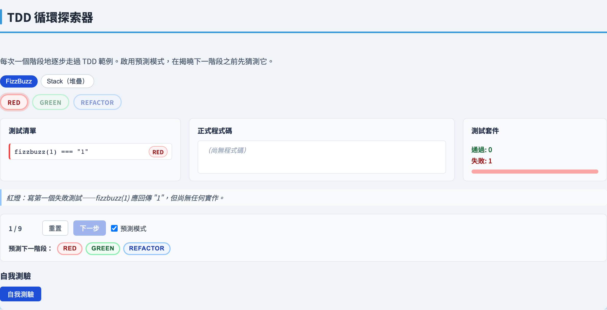
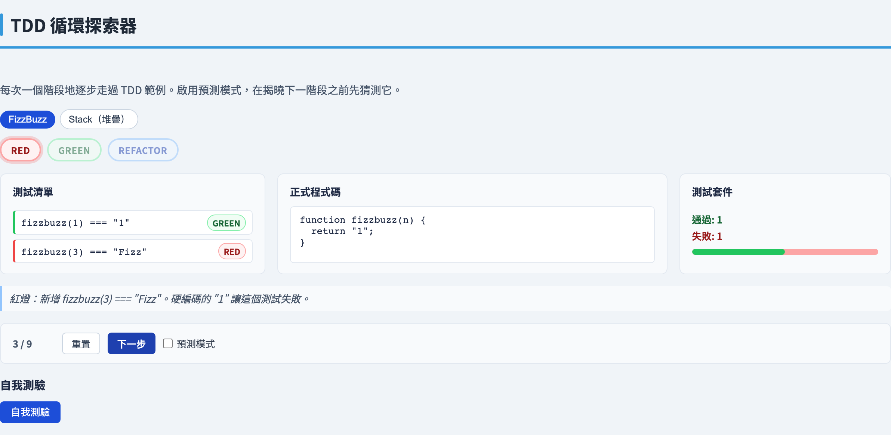
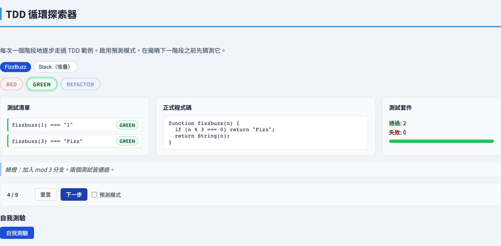
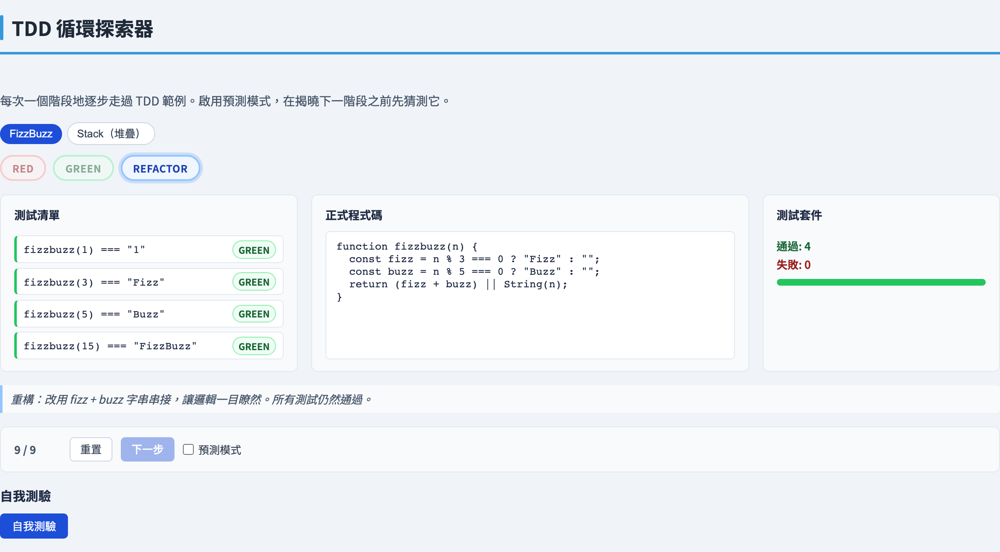
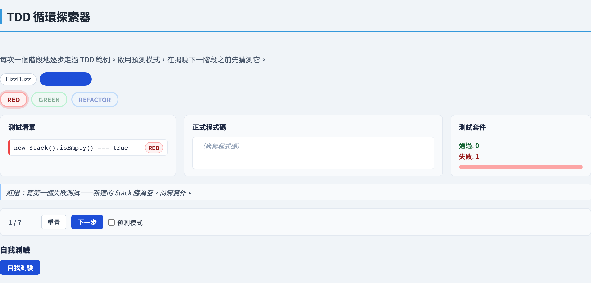
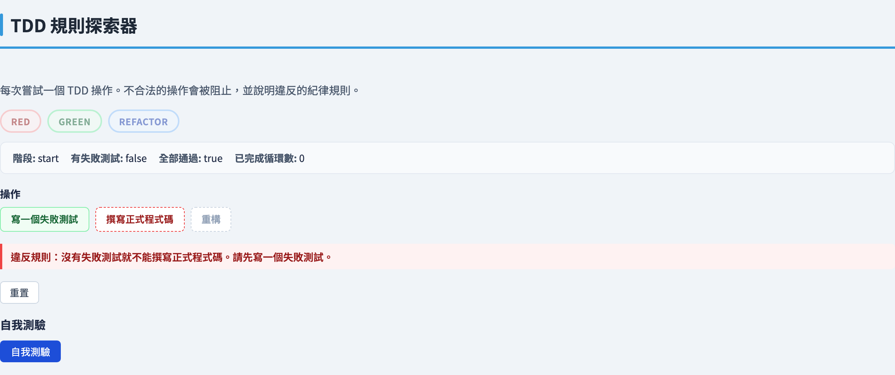
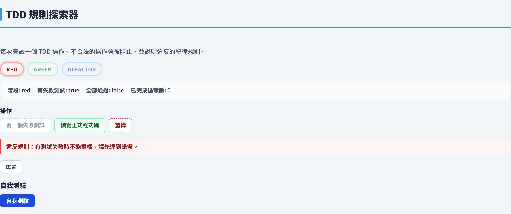
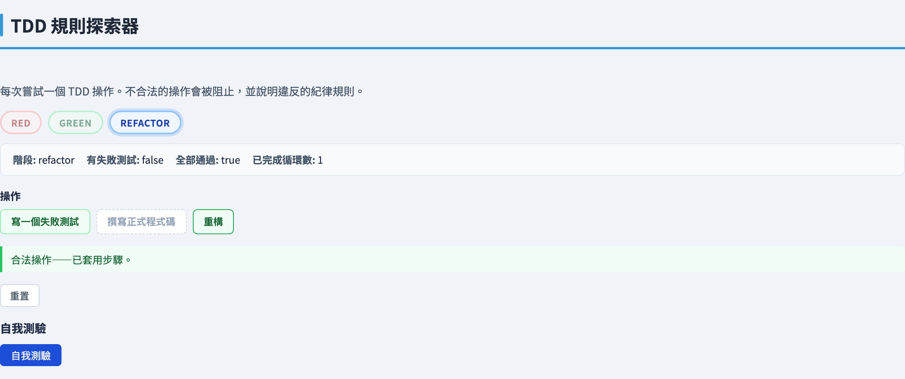

# 測試驅動開發
### *先寫測試，讓測試引導設計*

軟體測試視覺化系列 #62 · TDD
搭配工具：`/section-tdd` → 循環分頁（[TddCycleExplorer](../../src/components/TddCycleExplorer.js)）· 規則分頁（[TddRulesExplorer](../../src/components/TddRulesExplorer.js)）

<!-- TDD 章節的第一講。TDD 是一種程式設計紀律，不僅僅是測試技術——測試先行，使測試從驗證活動轉變為設計活動。本講涵蓋微循環、三條紀律規則、測試清單、假實作與三角測量，以及具體展示每個步驟的九步 FizzBuzz kata。 -->

---

## 為什麼要先寫測試？

傳統順序：寫程式碼 → 再寫測試。

**測試驅動開發顛覆了這個順序：** 先寫一個失敗的測試 → 再寫讓它通過的程式碼。

這不只是風格上的改變。先寫測試能：

- **在實作前規格化行為** ── 測試*本身就是*規格。
- **強制設計出可用的 API** ── 你在函式存在之前就呼叫它，介面必須乾淨到足以測試。
- **立即建立安全網** ── 你永遠不會寫出沒有任何測試覆蓋的程式碼。
- **保持步驟微小** ── 每個循環只新增一個小行為，錯誤很容易定位。

<!-- 「測試即規格」的概念是 Beck 原始論述的核心。當你先寫測試時，你被迫思考程式碼應該做什麼，而不是怎麼做。這種設計壓力是有經驗的 TDD 實踐者所引用的主要優點。安全網的好處是真實的，但是次要的——TDD 的主要回報是設計更好、更模組化的程式碼。 -->

---

## 紅燈／綠燈／重構微循環

TDD 以嚴格的三階段迴圈進行：

**紅燈** ── 寫一個小的失敗測試。
- 執行測試套件；看它失敗（確認測試確實在測試某些東西）。
- 確認它因為*正確的原因*失敗——錯誤的錯誤訊息是警示訊號。

**綠燈** ── 寫*最少*的程式碼使測試通過。
- 允許「假實作」：`return "1"` 能通過 `fizzbuzz(1) === "1"`，這是可以的。
- 不要新增失敗測試尚未要求的邏輯。

**重構** ── 在保持測試套件為綠燈的情況下改善程式碼。
- 移除重複、重新命名、釐清結構。
- 不新增行為——全程保持綠燈。
- 只有因為測試套件是你的安全網，才可以安全地這樣做。

循環時間通常是幾秒到幾分鐘，而不是幾小時。

<!-- Beck 稱之為「紅色條／綠色條」的節奏。實體的比喻——測試執行器中的進度條——是刻意的。紅色代表危險；綠色代表安全。每次小幅編輯後執行測試套件的紀律，是讓安全網真正發揮作用的關鍵。在紅燈（測試失敗）時重構是禁止的——當你不知道哪些失敗是預先存在的、哪些是你剛剛引入的，就無法安全地重構程式碼。 -->

---

## 三條紀律規則

Robert Martin 將 TDD 提煉為三條規則，防止循環被規避：

1. **沒有失敗測試，不寫任何生產程式碼。**
   除非你先有一個因為程式碼不存在而失敗的測試，否則你不能寫任何實作程式碼。

2. **只寫剛好讓一個測試失敗的測試程式碼。**
   一個斷言失敗就夠了。還不要寫下一個測試。

3. **只寫剛好讓失敗測試通過的生產程式碼。**
   一旦測試套件變為綠燈就停下來。還不要為下一個行為寫程式碼。

這些規則保持步驟微小，並確保每一行生產程式碼都可追溯到一個要求它的失敗測試。

<!-- Martin 的三條規則出現在「The Three Rules of TDD」（Uncle Bob，2014）和「Clean Code」中。它們刻意極端——目的是讓理想狀態明確，而不是要求每次按鍵之前都要有一個失敗測試。在實踐中，團隊找到了一種節奏，規則在「每個小行為」層面被遵循，而不是「每一行」。關鍵不變量是：測試套件不能在一兩分鐘以上的時間處於破損狀態。 -->

---

## 假實作與三角測量

**假實作：** 最少的綠燈程式碼通常是一個硬編碼的常數。

```javascript
// 測試：fizzbuzz(1) === "1"
function fizzbuzz(n) { return "1"; }   // 假實作——通過這一個測試
```

這是合法的。規則說「寫最少的程式碼通過失敗的測試」。常數就是最少的。

**三角測量：** 具有不同輸入的第二個測試*迫使泛化*。

```javascript
// 新增測試：fizzbuzz(3) === "Fizz"
// 現在 return "1" 失敗了。必須泛化：
function fizzbuzz(n) {
  if (n % 3 === 0) return "Fizz";
  return String(n);                   // 已泛化——"1" 對所有 n 來說從來都不正確
}
```

「三角測量」這個詞來自測量學：兩個固定點確定第三個點。兩個具體的測試案例確定了通用演算法。

<!-- 假實作和三角測量是 Beck 列出的三種達到綠燈策略中的兩種（第三種是「顯然的實作」——當正確的程式碼非常清楚，寫假實作會很愚蠢時）。從假實作開始的教學價值在於它將「測試是否有效？」和「實作是否正確？」這兩個關切分開。一旦測試基礎設施被確認有效，第二個測試就驅動真正的邏輯。 -->

---

## 測試清單

在開始任何 kata 或功能之前，寫一個**測試清單**——一份要測試的行為清單：

```
fizzbuzz 測試清單（初始）：
  - fizzbuzz(1)  → "1"        （普通數字）
  - fizzbuzz(3)  → "Fizz"     （3 的倍數）
  - fizzbuzz(5)  → "Buzz"     （5 的倍數）
  - fizzbuzz(15) → "FizzBuzz" （兩者的倍數）
```

測試清單的規則：
- 它不是事先詳盡的——你會在發現新案例時加入。
- 你選取一個項目，寫那個測試，循環完紅燈－綠燈－重構，劃掉它。
- 你在循環中途想到的新測試放到清單上，而不是正在執行的程式碼中。
- 清單**會增長也會縮短**——它是活的文件，不是合約。

測試清單讓你保持專注：你永遠知道下一個要測試什麼，以及什麼在等待中。

<!-- Beck 的測試清單是《TDD by Example》中被低估的洞見之一。它解決了「空白頁面」問題——在寫任何程式碼之前你有一個計劃。它也防止了循環中途的分心：當你在紅燈－綠燈循環中想到一個新的邊緣案例時，你記下它然後繼續，而不是切換情境。清單通常是一個注釋或便利貼，不是正式文件。 -->

---

## 實作範例 —— FizzBuzz kata（步驟 1–4）

**測試清單：** 普通數字 · Fizz · Buzz · FizzBuzz。

**s1 紅燈** ── 新增測試 `fizzbuzz(1) === "1"`。套件：0 通過，1 失敗。
尚無實作：`code = ''`。

**s2 綠燈** ── 假實作：
```javascript
function fizzbuzz(n) { return "1"; }
```
套件：1 通過，0 失敗。

**s3 紅燈** ── 新增測試 `fizzbuzz(3) === "Fizz"`。套件：1 通過，1 失敗。
假實作 `"1"` 仍在執行；新測試失敗。

**s4 綠燈** ── 三角測量：第二個測試迫使使用 `String(n)`：
```javascript
function fizzbuzz(n) {
  if (n % 3 === 0) return "Fizz";
  return String(n);
}
```
套件：2 通過，0 失敗。`"1"` 假實作已消失——`String(1)` 得到 `"1"`。

<!-- s1–s4 以最純粹的形式展示了假實作→三角測量的模式。s4 的關鍵觀察：三角測量步驟將常數 "1" 替換為 String(n)，這是非倍數的正確通用答案。我們知道 String(n) 是正確的，不是因為我們對所有輸入進行了推理，而是因為第二個測試迫使我們離開了常數。這就是紀律：讓測試驅動設計。 -->

---

## 實作範例 —— FizzBuzz kata（步驟 5–9）

**s5 紅燈** ── 新增測試 `fizzbuzz(5) === "Buzz"`。套件：2 通過，1 失敗。

**s6 綠燈** ── 新增 Buzz 分支：
```javascript
function fizzbuzz(n) {
  if (n % 3 === 0) return "Fizz";
  if (n % 5 === 0) return "Buzz";
  return String(n);
}
```
套件：3 通過，0 失敗。

**s7 紅燈** ── 新增測試 `fizzbuzz(15) === "FizzBuzz"`。套件：3 通過，1 失敗。
目前程式碼對 15 返回 `"Fizz"`（`%3` 分支先觸發）。

**s8 綠燈** ── `%15` 分支必須排在最前面（順序很重要）：
```javascript
function fizzbuzz(n) {
  if (n % 15 === 0) return "FizzBuzz";
  if (n % 3 === 0) return "Fizz";
  if (n % 5 === 0) return "Buzz";
  return String(n);
}
```
套件：4 通過，0 失敗。

**s9 重構** ── 消除獨立的 `%15` 判斷；以串接表達 FizzBuzz：
```javascript
function fizzbuzz(n) {
  const fizz = n % 3 === 0 ? "Fizz" : "";
  const buzz = n % 5 === 0 ? "Buzz" : "";
  return (fizz + buzz) || String(n);
}
```
套件保持綠燈：4 通過，0 失敗。`%15` 情況自然成立：`"Fizz" + "Buzz" = "FizzBuzz"`。

<!-- s7–s9 展示了為什麼 if 鏈中分支的順序在綠燈階段很重要，以及重構步驟如何完全消除對順序限制的需求。重構後的形式更通用：它處理任何 Fizz 和 Buzz 的組合，不需要特殊情況。s8 時套件完全為綠燈，使重構安全——測試會捕捉任何錯誤。 -->

---

## TDD vs 後測試

| 屬性 | 後測試 | 測試驅動開發 |
|---|---|---|
| 測試時機 | 實作之後 | 實作之前 |
| 測試即規格 | 否——程式碼已存在 | 是——測試*定義*期望的行為 |
| 設計壓力 | 無——介面已固定 | 高——難以測試的介面很痛苦 |
| 覆蓋率保證 | 依賴紀律 | 結構性——每一行都有要求它的測試 |
| 安全網可用性 | 一大批程式碼之後 | 每個小步驟之後 |
| 重構安全性 | 測試薄弱時有風險 | 內建——套件永遠可執行 |

**先寫測試的收穫：** 設計壓力、永遠可執行的套件、小而可證明的步驟。
**代價：** 紀律、初始的不熟悉感、在顯然的程式碼上稍慢。

<!-- 此比較並非要否定後測試——寫得好的後測試遠優於沒有測試。重點是先寫測試提供了後測試無法給予的結構性保證：如果你遵守了三條規則，覆蓋率在構造上就是 100%，因為每一行正式程式碼，背後都必須有一個失敗的測試在驅動它。這比「我們事後盡可能想到的都寫了測試」是更強的聲明。 -->

---

## 工具演示 — 循環分頁 · 起點

<!-- 循環分頁的設計讓學生可以在每個步驟暫停，在前進之前預測結果。階段顏色編碼（紅色背景／綠色背景／重構用黃色）使節奏變得直觀。測試清單面板實時顯示項目的新增和劃除。鼓勵學生將此 kata 作為他們自己 TDD 工作階段的模板。 -->

在 `/section-tdd` 開啟**循環**分頁（TDD 循環探索器）。



從 kata 選擇器選取 **FizzBuzz** kata。測試清單面板顯示初始失敗測試（`fizzbuzz(1) === "1"`），階段指示器顯示**紅燈** ── 尚無任何生產程式碼。

---

## 工具演示 — 循環分頁 · 假實作



新增下一個測試（`fizzbuzz(3) === "Fizz"`）後，假實作 `return "1"` 仍通過第一個測試，卻讓第二個測試失敗 ── 階段回到**紅燈**，套件顯示 1 通過，1 失敗。

---

## 工具演示 — 循環分頁 · 三角測量



第二個測試迫使泛化：`return "1"` 被替換為加上 Fizz 分支的 `String(n)` ── 即 s3 → s4 的三角測量步驟。兩個測試均通過，階段回到**綠燈**。

---

## 工具演示 — 循環分頁 · 重構



繼續逐步執行 s5–s9 ── 觀察階段轉換：紅燈→綠燈→紅燈→綠燈→重構。

在每個紅燈步驟，**預測**哪個測試會失敗，然後再點擊下一步 ── 對照套件計數器驗證你的預測。

---

## 工具演示 — 循環分頁 · 另一個 kata



切換到 **Stack** kata 並重複 ── 注意 isEmpty、push、pop 是如何遵循相同的紅燈－綠燈－重構節奏，一次一個行為地引入的。

---

## 工具演示 — 規則分頁 · 規則 1

<!-- 規則分頁讓學生通過嘗試打破紀律並看到護欄啟動，來親身體驗這種紀律。這比閱讀規則更令人難忘。學生報告的關鍵洞見：規則 3（「只寫足夠的程式碼」）是最難遵守的——寫「顯然的」下一段程式碼的誘惑很強，但規則說在綠燈時停下來。 -->

在 `/section-tdd` 開啟**規則**分頁（TDD 規則探索器）。



探索器顯示三條 TDD 規則和一個模擬的程式碼編輯器。嘗試在測試套件為綠燈且不存在失敗測試時**寫生產程式碼** ── 工具阻止該動作並高亮顯示**規則 1**：「沒有失敗測試，不寫任何生產程式碼。」若在第一個測試通過前嘗試新增第二個失敗測試，規則 2 也會同樣觸發。

---

## 工具演示 — 規則分頁 · 規則 3



有一個失敗測試後，嘗試**重構**──工具阻止並顯示「有測試失敗──重構前先讓套件變綠燈」，這是**規則 3**家族的紀律違反。規則 3 本身說「只寫剛好讓失敗測試通過的生產程式碼」；引擎將此原則推廣：任何失敗測試未要求的工作──包括重構──都太早了。你必須先讓套件變綠，再進行任何結構性整理。

---

## 工具演示 — 規則分頁 · 完整循環



遵守全部三條規則完成一個完整的紅燈－綠燈－重構循環 ── 觀察套件全程保持乾淨，cycleCount 推進至 1。

---

## 小結

- **測試驅動開發**顛覆傳統順序：先寫失敗測試，再寫最少的程式碼使其通過，再重構——如此循環。
- **紅燈／綠燈／重構**微循環保持步驟微小，使每一行程式碼都可追溯到一個要求它的失敗測試。
- **三條規則**強制執行循環：沒有失敗測試不寫生產程式碼；每次只有一個失敗測試；只寫最少的程式碼通過它。
- **假實作（Fake it till you make it）** ── 硬編碼常數是有效的首次綠燈；下一個測試（三角測量）迫使泛化。
- **測試清單**是要測試的行為的活躍清單：你選取一個，循環，劃掉它，並在發現新案例時新增。
- **FizzBuzz kata** 展示了全部九個步驟：s1 紅燈 / s2 假實作綠燈 / s3 紅燈 / s4 三角測量綠燈 / s5 紅燈 / s6 綠燈 / s7 紅燈 / s8 綠燈（順序很重要）/ s9 重構。
- **先寫測試的收穫：** 設計壓力、結構性覆蓋率、永遠可執行的套件、小而可證明的步驟。

**課堂練習：** 使用嚴格的 TDD 從測試清單完成 Stack kata（isEmpty、push、pop、size）。記錄每個步驟：你新增了什麼測試、你寫了什麼程式碼、你是假實作還是用了顯然的實作。

---

## 延伸閱讀

- 課程規格 —— TDD 視覺化設計（[2026-05-19-tdd-visualization-design.md](../superpowers/specs/2026-05-19-tdd-visualization-design.md)）
- Beck, K.（2002）。*Test-Driven Development: By Example*。Addison-Wesley。—— TDD 的經典教材；以 Money（貨幣轉換）與 xUnit（測試框架）兩個案例貫穿教學。
- Martin, R. C.（2014）。〈The Three Rules of TDD〉。—— 三條紀律規則的簡潔表述。
- 工具原始碼：[TddCycleExplorer.js](../../src/components/TddCycleExplorer.js)、[TddRulesExplorer.js](../../src/components/TddRulesExplorer.js)、[tddKatas.js](../../src/data/tddKatas.js)
- FizzBuzz kata 資料：[tddKatas.js](../../src/data/tddKatas.js) —— 9 個步驟，每個步驟都是階段、測試清單、程式碼和套件狀態的完整快照。
- Stack kata 資料：[tddKatas.js](../../src/data/tddKatas.js) —— 7 個步驟，涵蓋 isEmpty、push、pop、重構為 size()。
- 下一講：TDD 章節的後續講次。
