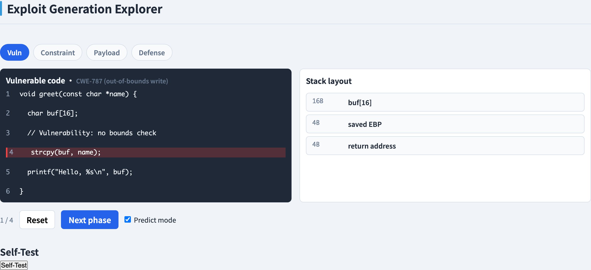
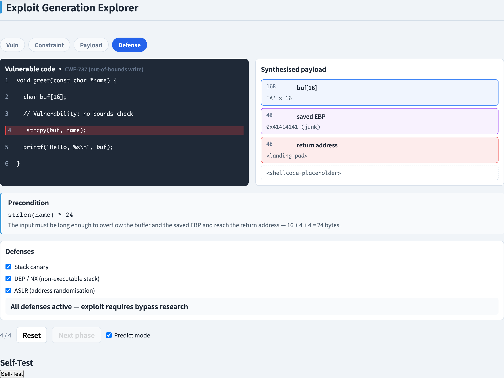
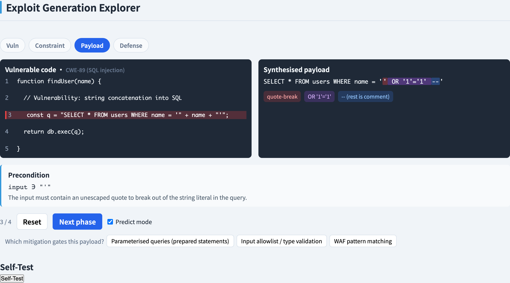
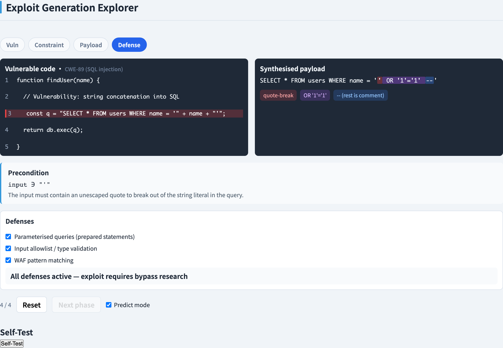
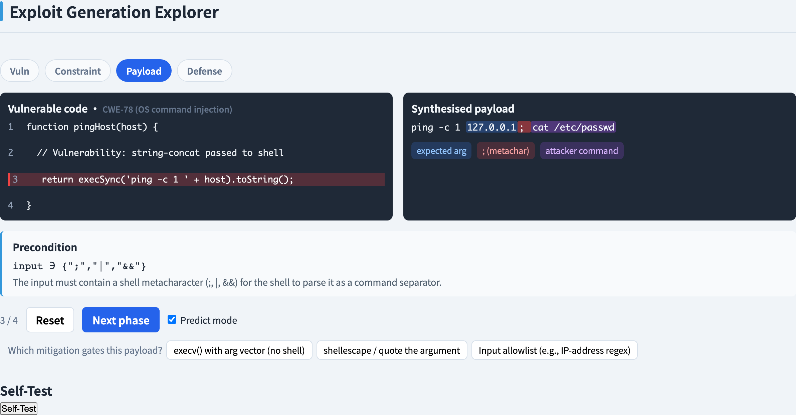
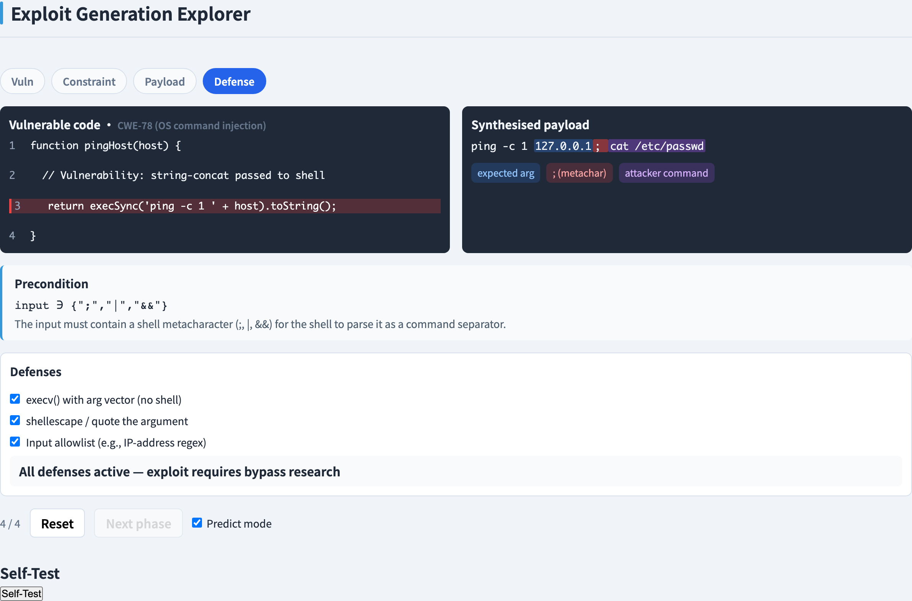
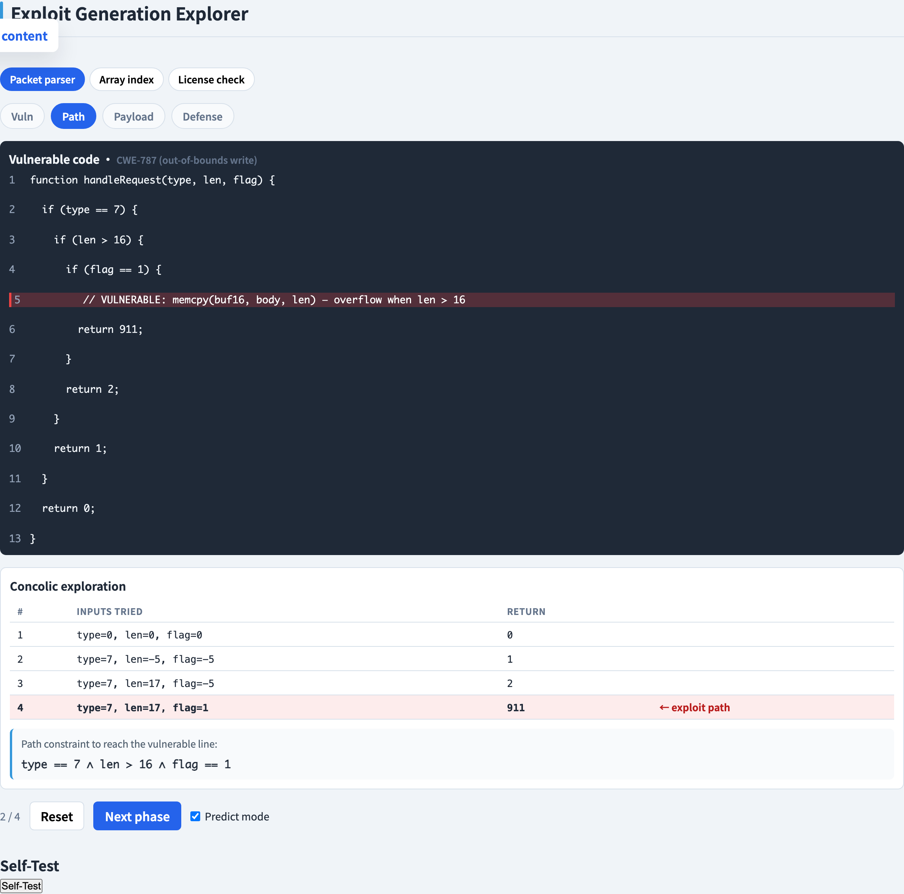
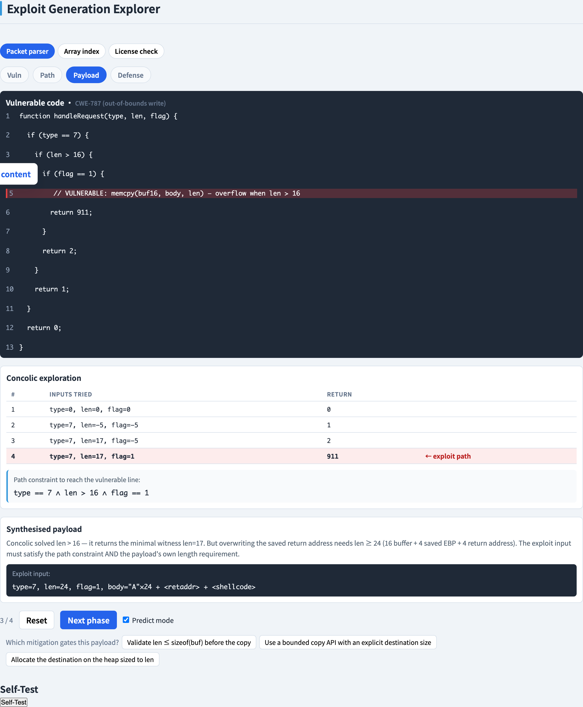

# Exploit Generation
### *Turn a vulnerability into the ultimate failing test case*

Software Testing Visualization series #63 · Exploit Generation
Companion tool: `/section-exploit` → Stack Buffer Overflow ([ExploitOverflowExplorer](../../src/components/ExploitOverflowExplorer.js)) · SQL Injection ([ExploitSqliExplorer](../../src/components/ExploitSqliExplorer.js)) · Command Injection ([ExploitCmdiExplorer](../../src/components/ExploitCmdiExplorer.js)) · Path-Constrained ([ExploitPathExplorer](../../src/components/ExploitPathExplorer.js))

<!-- Opening deck of the Exploit Generation section. Frame the topic defensively: exploit generation in a testing course is about *proving* a vulnerability is real and *understanding* the defense that removes it. An exploit is the most convincing failing test case there is. Every payload in this deck and the companion tool is an authored, non-functional placeholder. -->

---

## What is exploit generation?

**Exploit generation** is the act of constructing a concrete input that turns a known vulnerability into a controlled, demonstrable effect.

In a testing course this is a **defensive discipline**, not an offensive one. Keep two terms separate:

- A **vulnerability** is a latent weakness in the code — a missing bounds check, an unsanitised query, an unescaped shell call. It is a property of the program that simply *exists*.
- An **exploit** is the activating input — the specific data that walks the vulnerability from "latent" to "triggered" and makes the consequence visible.

The exploit is the most convincing failing test case there is: it does not merely *report* that a line looks risky, it *proves* the line is dangerous and shows you exactly what removes the danger.

Every payload shown in this deck and in the companion tool is an **authored, non-functional placeholder** — enough to teach the mechanism, never enough to run.

<!-- Stress the defensive framing here. The reason a testing course studies exploit generation is the same reason it studies any failing test: a concrete failure pins down a real defect far more reliably than a static warning. The pedagogical move is to keep "vulnerability" and "exploit" rigorously distinct — students who blur them tend to think a defense that hides the exploit has removed the vulnerability, which is exactly the wrong lesson. The placeholder posture is a hard rule, not a courtesy. -->

---

## Vulnerability → exploit

A bug becomes an exploit the moment **attacker-controlled data reaches a dangerous operation**. Three ingredients have to line up:

- A **source** — an input the attacker controls (a form field, a URL parameter, a file, a command-line argument).
- A **path** — the bug is *reachable*: there is an execution path from the source to the bug with no validation that stops the bad input.
- A **sink** — the dangerous operation itself (a memory copy, a SQL query, a shell call).

Source, path, and sink together make exploit generation a **constraint-satisfaction problem**: find an input that (a) follows a path to the sink and (b) shapes the data so the sink misbehaves. This is exactly the framing of symbolic and concolic execution — the input is a solution to a logical formula.

<!-- The source–path–sink triple is the standard taint-analysis model and it is worth drawing on the board. The key teaching point is the last sentence: exploit generation is constraint solving, which is why decks #10 (symbolic execution) and #11 (concolic execution) are direct prerequisites. Family 4 in this deck makes the connection literal by running the concolic engine. Frame the whole deck as "automated test generation, pointed at the failure cases." -->

---

## The exploit lifecycle

The companion tool models **every family** with one shared four-phase pipeline:

**Vuln → Constraint → Payload → Defense**

- **Vuln** — locate the weak line. The tool highlights the exact statement and shows the relevant program state (stack layout, query string, shell command).
- **Constraint** — state the condition the input must satisfy to trigger the bug (a length, a piece of syntax, a reachable branch).
- **Payload** — construct the placeholder input that meets the constraint, and watch the effect.
- **Defense** — apply a mitigation and watch the payload's status change from *succeeds* to *gated* to *neutralised*.

One structure, four bug classes. Because the phases are identical across families, students can compare buffer overflow, SQL injection, command injection, and path-reaching exploits side by side instead of treating each as a special case.

<!-- The four-phase ring is the spine of the whole section. Emphasise that the shared structure is a deliberate teaching device: once a student understands the ring for one family, the other three are "the same shape with different details." The Constraint phase is the one students skip — they jump from "here is the bug" to "here is the payload" — so make them articulate the constraint explicitly every time. -->

---

## Family 1 — Buffer overflow

A **stack buffer overflow** is a fixed-size buffer on the stack that gets written past its end (CWE-787, out-of-bounds write; CWE-121, stack-based buffer overflow).

The stack frame of a function places three things in adjacent memory:

- the **local buffer** itself,
- the **saved base pointer**,
- the **return address** — where execution resumes when the function returns.

Because they are adjacent, writing past the end of the buffer overwrites the saved base pointer and then the return address.

- **Constraint:** the input length exceeds the buffer's capacity.
- **Effect:** a **control-flow hijack** — the corrupted return address sends execution somewhere the program never intended.

<!-- This is the classic "smashing the stack" model. Keep it conceptual — the point is the adjacency of buffer / saved base pointer / return address, not any concrete shellcode. The companion tool's stack panel colours each region so students can see the overflow march from the buffer into the return address. Note that modern compilers reorder and protect the stack; the simplified layout is a teaching abstraction, which is fine to say out loud. -->

---

## Family 2 — SQL injection

**SQL injection** happens when user input is concatenated into a SQL string, so the input can change the query's *structure* rather than just its data (CWE-89).

A placeholder injection payload has three syntactic regions:

- **break** — characters that close the open string literal the input was supposed to sit inside, so the rest of the input is read as SQL code, not data.
- **tautology** — an always-true clause (a condition that holds for every row) that widens what the query matches.
- **comment** — the SQL line-comment marker, which discards whatever the original query had after the injection point so the remaining syntax stays valid.

- **Constraint:** input is concatenated into the query without parameterisation.
- **Effect:** **authentication bypass** or **data exfiltration** — the query returns rows it was never meant to.

<!-- The break / tautology / comment decomposition is the heart of the SQLi family and the tool colours those three regions in the resulting query. The teaching point is structure vs. data: the bug is that input crosses from the data plane into the code plane. That framing makes the structural fix — parameterised queries, slide #9 — feel inevitable rather than arbitrary. -->

---

## Family 3 — Command injection

**Command injection** happens when user input is passed to a shell, so shell metacharacters in the input can start or chain extra commands (CWE-78, OS command injection).

The shell treats certain characters specially — the **command separator**, the **pipe**, the **AND** operator, and the **command-substitution** forms. When attacker-controlled text containing these characters reaches the shell, the characters are interpreted as syntax: they end the intended command and begin a new one.

- **Constraint:** the input reaches a shell-invoking call **unsanitised** — it is interpolated into a command string the shell will parse.
- **Effect:** **arbitrary command execution** — whatever the attacker appended runs with the program's privileges.

<!-- Command injection is structurally the same bug as SQL injection — input crossing from data to code — but the "interpreter" is the shell instead of the database. The tool colours the metacharacter and the injected command so the parallel with the SQLi family is visible. The primary defense (slide #9) is to remove the shell from the equation entirely: exec with an argument array, so there is no string for metacharacters to be syntax in. -->

---

## Family 4 — Path-reaching exploit

For some vulnerabilities the bug is not the hard part — **reaching** the bug is. The vulnerable line sits behind several branches, and a random input almost never gets there.

**Concolic execution** (deck #11) solves exactly this. It derives a **path constraint**: the conjunction of the branch conditions taken along one execution path. Solving that conjunction yields an input guaranteed to follow that path.

A path-reaching exploit must therefore satisfy **two constraints at once**:

- the **path constraint** — reach the vulnerable line, and
- the **payload constraint** — once there, shape the data so the bug does something.

The companion tool runs the **real concolic engine** for this family: the input it shows is a genuine solution to the path constraint, not a hand-written example.

<!-- This family is where exploit generation and automated test generation become the same activity: the concolic engine that generates a test to cover a deep branch is the same engine that generates an input to reach a deep vulnerability. Stress the two-constraint structure — students who have only seen the other three families think "payload" is the whole job and forget reachability. Deck #11 is a hard prerequisite for this slide. -->

---

## Defenses & mitigations

Every family has well-known defenses, toggled in the tool's **Defense** phase:

- **Overflow:** stack canaries, ASLR, DEP/NX, and bounds-checked APIs. The structural fix is the bounds check.
- **SQL injection:** **parameterised queries / prepared statements** keep input on the data plane so it can never change query structure — this is the structural fix. Input validation and least-privilege database accounts are defence in depth.
- **Command injection:** avoid the shell entirely — **exec with an argument array** so metacharacters are literal data. Allowlisting inputs and escaping metacharacters are secondary.
- **Path-reaching:** the same validation and memory-safety defenses, applied at the reachable sink.

For each family one defense is the **primary** fix — a *structural* change that removes the vulnerability — while the others are layers that make exploitation harder but do not eliminate the bug.

<!-- The distinction to hammer home: a structural fix (parameterised queries, exec with an argv array, a bounds check) removes the vulnerability, whereas a blocklist (escape these characters, reject these strings) only hides today's exploit and breaks the moment someone finds an unlisted case. Canaries and ASLR are valuable but they raise cost, they do not remove the bug. Students should be able to classify any proposed defense as structural or fragile. -->

---

## Predict the defense

The tool's **Payload** phase has a **predict mode**. Before the Defense phase is revealed, you pick which of the listed defenses you believe is the *primary* — the structural fix that actually removes the vulnerability.

This forces the reasoning that matters: not "name a defense" but "explain *why* this defense works while the others only raise the bar."

The **Defense** phase then reveals the answer and lets you toggle every mitigation independently. As you toggle, the payload-status line updates in real time — **succeeds → gated → neutralised** — so you can see which combination of defenses actually closes the vulnerability and which merely slow it down.

<!-- Predict mode is the same self-test device used across the visualization series: commit to an answer before the reveal. The specific value here is that it separates "I can recite the OWASP defense list" from "I understand the mechanism." Encourage students to predict before every single reveal, and to articulate the failure mode of each non-primary defense, not just point at the winner. -->

---

## Tool demonstration — Buffer overflow · the vulnerability

<!-- This is the first demo slide. Introduce the tool's four-phase ring here: every family tab walks Vuln → Constraint → Payload → Defense, and the ring is always visible so students can see where they are. Walk the room through opening /section-exploit and selecting the Stack Buffer Overflow tab before advancing. -->

In `/section-exploit`, open the **Stack Buffer Overflow** tab.

The Vuln phase shows the vulnerable function with the buggy line highlighted, and the stack-layout panel: the local buffer, the saved base pointer, and the return address in adjacent memory.

---

## Tool demonstration — Buffer overflow · defended

The Defense phase with every mitigation enabled — the stack panel shows the payload regions and the payload-status line reports the exploit **neutralised**; the primary defense (the bounds check) is highlighted.

---

## Tool demonstration — SQL injection · the payload

The SQL Injection tab at the Payload phase — the resulting query with the injected substring coloured by region: **break**, **tautology**, and **comment**.

---

## Tool demonstration — SQL injection · defended

The Defense phase with mitigations enabled — parameterised queries keep the input on the data plane so it cannot change the query's structure; the payload status reports **neutralised**.

---

## Tool demonstration — Command injection · the payload

The Command Injection tab at the Payload phase — the shell command with the injected **metacharacters** and the **chained command** coloured.

---

## Tool demonstration — Command injection · defended

The Defense phase with mitigations enabled — executing with an argument array and an allowlist make the metacharacters literal data; the shell never parses them as syntax.

---

## Tool demonstration — Path exploit · the concolic path

The Path-Constrained Exploit tab at the Path phase — the concolic engine's iteration table; the row that reaches the vulnerable return is flagged, and the path constraint is the conjunction shown below it.

---

## Tool demonstration — Path exploit · the payload

The Payload phase — the exploit input that satisfies **both** the path constraint (reach the line) and the payload constraint (make the bug do something).

---

## Summary

- **Exploit generation** is a defensive discipline: an exploit is the ultimate failing test case — it *proves* a vulnerability is real and reveals the defense that removes it. Every payload here is an authored, non-functional placeholder.
- The **four-phase lifecycle** — Vuln → Constraint → Payload → Defense — is one shared structure that lets four bug classes be compared side by side.
- Exploit generation is **constraint satisfaction**: a vulnerability becomes an exploit when attacker-controlled data flows source → path → sink.
- The **four families** and their sinks: buffer overflow (a memory copy, CWE-787), SQL injection (a query string, CWE-89), command injection (a shell call, CWE-78), and the path-reaching exploit (a sink behind several branches).
- **Defenses** split into structural fixes that remove the vulnerability — bounds checks, parameterised queries, exec with an argument array — and layered mitigations that only raise the cost of exploitation.
- A path-reaching exploit must satisfy **two constraints at once**: the path constraint (reach the line) and the payload constraint (trigger the bug).
- **Predict mode** is the self-test: commit to which defense is primary before the reveal, then toggle mitigations and watch the payload status change.

**In-class exercise:** for each of the four families, name the sink, state the constraint the input must satisfy, and identify the primary (structural) defense — and explain why the secondary defenses do not remove the vulnerability.

---

## Further reading

- Course specification — Exploit generation visualization design ([2026-05-21-exploit-isp-slide-decks-design.md](../superpowers/specs/2026-05-21-exploit-isp-slide-decks-design.md))
- OWASP Top 10 — the community list of the most critical web application security risks; injection and related classes appear throughout.
- CWE-787, *Out-of-bounds Write* — the weakness behind the buffer overflow family.
- CWE-89, *Improper Neutralization of Special Elements used in an SQL Command (SQL Injection)*.
- CWE-78, *Improper Neutralization of Special Elements used in an OS Command (OS Command Injection)*.
- Tool source: [ExploitOverflowExplorer.js](../../src/components/ExploitOverflowExplorer.js), [ExploitSqliExplorer.js](../../src/components/ExploitSqliExplorer.js), [ExploitCmdiExplorer.js](../../src/components/ExploitCmdiExplorer.js), [ExploitPathExplorer.js](../../src/components/ExploitPathExplorer.js)
- Next in series: future decks in the Exploit Generation section.
