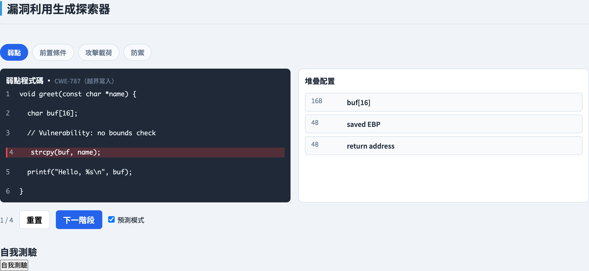
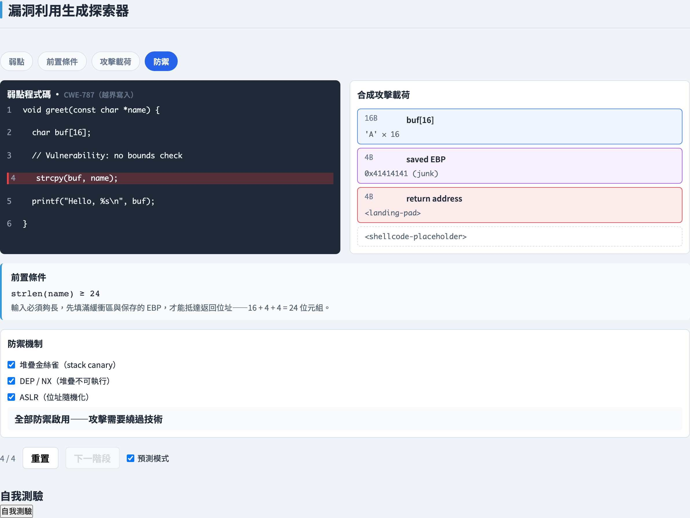
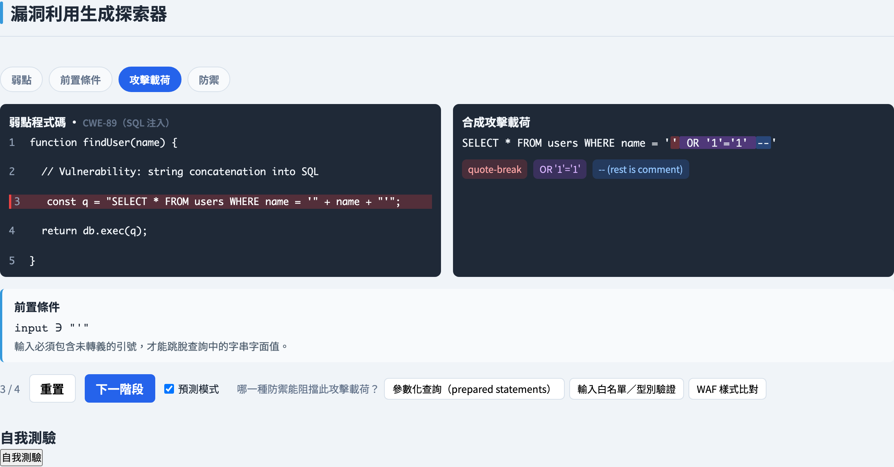
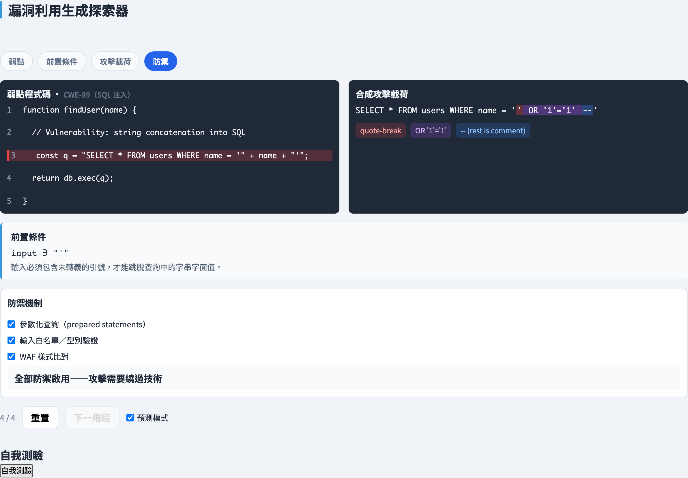
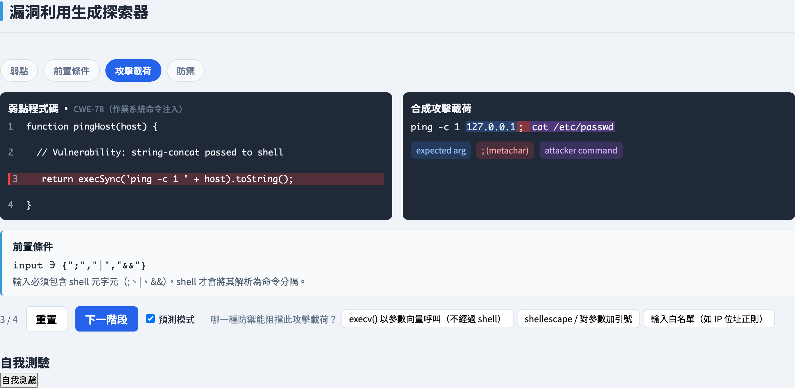
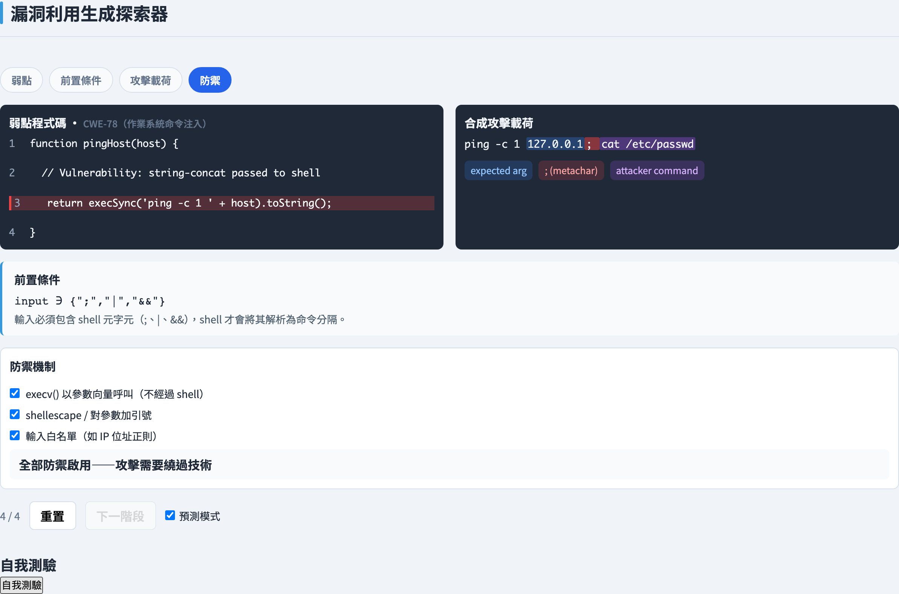
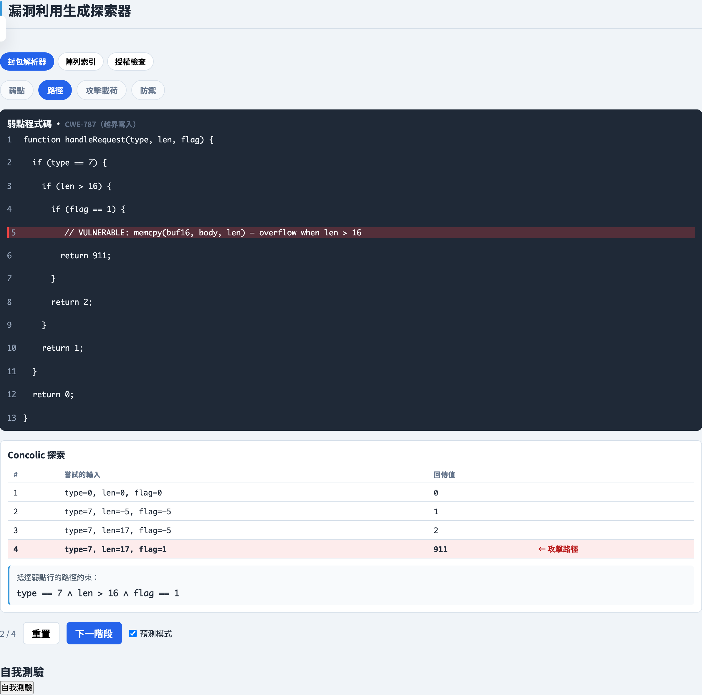
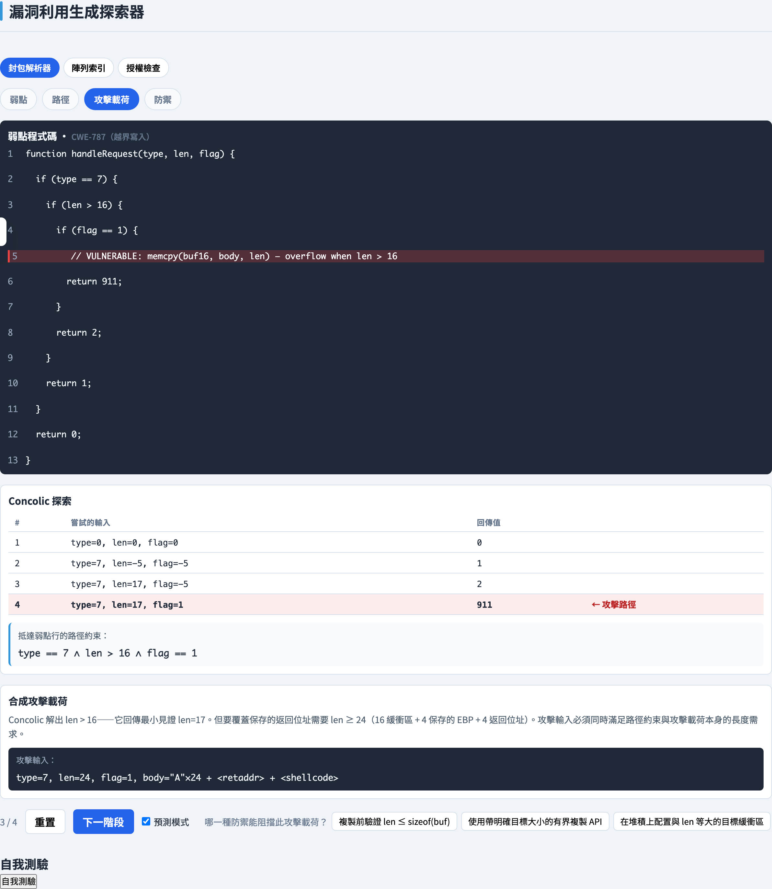

# 漏洞利用生成
### *把弱點轉化為終極的失敗測試案例*

軟體測試視覺化系列 #63 · 漏洞利用生成
搭配工具：`/section-exploit` → 堆疊緩衝區溢位（[ExploitOverflowExplorer](../../src/components/ExploitOverflowExplorer.js)）· SQL 注入（[ExploitSqliExplorer](../../src/components/ExploitSqliExplorer.js)）· 命令注入（[ExploitCmdiExplorer](../../src/components/ExploitCmdiExplorer.js)）· 路徑約束利用（[ExploitPathExplorer](../../src/components/ExploitPathExplorer.js)）

<!-- 漏洞利用生成章節的第一講。以防禦角度框定主題：在測試課程中，漏洞利用生成是為了*證明*弱點確實存在，並*理解*消除它的防禦。漏洞利用是最有說服力的失敗測試案例。本講與搭配工具中的每一個攻擊載荷，都是經過撰寫、無法實際運作的佔位範例。 -->

---

## 什麼是漏洞利用生成？

**漏洞利用生成**是建構一個具體輸入的行為，把已知的弱點轉化為一個受控、可示範的效果。

在測試課程中，這是一種**防禦性紀律**，而非攻擊性的。請把兩個詞嚴格分開：

- **弱點（vulnerability）**是程式碼中潛伏的缺陷——缺少的邊界檢查、未消毒的查詢、未跳脫的 shell 呼叫。它是程式的一種屬性，只是單純地*存在*。
- **漏洞利用（exploit）**則是那個觸發的輸入——把弱點從「潛伏」走到「觸發」並讓後果現形的特定資料。

漏洞利用是最有說服力的失敗測試案例：它不只是*回報*某一行看起來有風險，而是*證明*那一行很危險，並精確地展示什麼能消除這份危險。

本講與搭配工具中展示的每一個攻擊載荷，都是**經過撰寫、無法實際運作的佔位範例**——足以教學機制，但永遠不足以執行。

<!-- 在此強調防禦框架。測試課程之所以研究漏洞利用生成，理由與研究任何失敗測試相同：一個具體的失敗，比一條靜態警告更可靠地釘住一個真實缺陷。教學動作是把「弱點」與「漏洞利用」嚴格區分——把兩者混淆的學生，往往會認為一個藏住漏洞利用的防禦就消除了弱點，而這正是錯誤的一課。佔位範例的姿態是硬性規則，不是禮貌。 -->

---

## 弱點 → 漏洞利用

當**攻擊者可控制的資料抵達一個危險操作**的那一刻，缺陷就成為漏洞利用。三個要素必須對齊：

- **來源（source）**——攻擊者能控制的輸入（表單欄位、URL 參數、檔案、命令列引數）。
- **路徑（path）**——缺陷是*可達的*：存在一條從來源到缺陷的執行路徑，且沒有任何驗證能擋下這個壞輸入。
- **匯點（sink）**——危險操作本身（一次記憶體複製、一個 SQL 查詢、一個 shell 呼叫）。

來源、路徑、匯點三者合起來，使漏洞利用生成成為一個**約束滿足問題**：找出一個輸入，使其（a）沿著一條路徑抵達匯點，且（b）將資料塑形成讓匯點出錯。這正是符號執行與動態符號執行的框架——輸入是一個邏輯公式的解。

<!-- 來源—路徑—匯點三元組是標準的污點分析模型，值得畫在黑板上。關鍵教學點是最後一句：漏洞利用生成就是約束求解，這正是第 #10 講（符號執行）與第 #11 講（動態符號執行）成為直接先備知識的原因。本講的第 4 個家族讓這個連結變得具體——它會實際執行動態符號執行引擎。把整講框定為「對準失敗案例的自動化測試生成」。 -->

---

## 漏洞利用生命週期

搭配工具以一條共用的四階段流水線為**每一個家族**建模：

**弱點 → 前置條件 → 攻擊載荷 → 防禦**

- **弱點** ── 定位脆弱的那一行。工具高亮顯示確切的敘述，並展示相關的程式狀態（堆疊佈局、查詢字串、shell 命令）。
- **前置條件** ── 陳述輸入必須滿足才能觸發缺陷的條件（一個長度、一段語法、一個可達的分支）。
- **攻擊載荷** ── 建構滿足前置條件的佔位輸入，並觀察效果。
- **防禦** ── 套用一項緩解措施，觀察攻擊載荷的狀態從*成功*變為*受阻*再到*已化解*。

一個結構，四種缺陷類別。由於各家族的階段完全相同，學生可以把緩衝區溢位、SQL 注入、命令注入與路徑可達利用並排比較，而不必把每一個都當成特例。

<!-- 四階段環是整個章節的脊柱。強調共用結構是刻意的教學裝置：學生一旦理解了某一家族的環，其他三個就是「同樣的形狀，只是細節不同」。前置條件階段是學生會跳過的——他們會從「這是缺陷」直接跳到「這是攻擊載荷」——所以每一次都要他們明確說出前置條件。 -->

---

## 家族 1 — 緩衝區溢位

**堆疊緩衝區溢位**是堆疊上一個固定大小的緩衝區被寫越過它的尾端（CWE-787，越界寫入；CWE-121，堆疊型緩衝區溢位）。

一個函式的堆疊框架，在相鄰的記憶體中放置三樣東西：

- **區域緩衝區**本身，
- **儲存的基底指標**，
- **回傳位址** ── 函式回傳時執行恢復的去處。

因為它們相鄰，寫越過緩衝區尾端會覆寫儲存的基底指標，接著覆寫回傳位址。

- **前置條件：** 輸入長度超過緩衝區的容量。
- **效果：** 一次**控制流劫持** ── 被破壞的回傳位址把執行送往程式從未打算去的地方。

<!-- 這是經典的「砸毀堆疊」模型。保持概念性——重點是緩衝區／儲存的基底指標／回傳位址的相鄰性，而不是任何具體的 shellcode。搭配工具的堆疊面板為每個區段上色，讓學生看到溢位從緩衝區一路推進到回傳位址。注意現代編譯器會重排並保護堆疊；這個簡化的佈局是教學抽象，這點可以明說。 -->

---

## 家族 2 — SQL 注入

**SQL 注入**發生在使用者輸入被串接進一個 SQL 字串時，於是輸入能改變查詢的*結構*，而不只是它的資料（CWE-89）。

一個佔位注入攻擊載荷有三個語法區段：

- **break（破出）** ── 用來關閉那個輸入原本應該待在裡面的開放字串字面值的字元，讓輸入的其餘部分被當成 SQL 程式碼而非資料來讀取。
- **tautology（恆真式）** ── 一個永遠為真的子句（對每一列都成立的條件），擴大查詢所匹配的範圍。
- **comment（註解）** ── SQL 行註解標記，丟棄原始查詢在注入點之後的部分，讓剩下的語法仍然有效。

- **前置條件：** 輸入未經參數化就被串接進查詢。
- **效果：** **認證繞過**或**資料外洩** ── 查詢回傳了它本不該回傳的列。

<!-- break／tautology／comment 的拆解是 SQL 注入家族的核心，工具會在結果查詢中為這三個區段上色。教學點是結構 vs. 資料：缺陷在於輸入從資料平面跨進了程式碼平面。這個框架讓結構性修復——參數化查詢，第 #9 講——感覺是必然的，而非任意的。 -->

---

## 家族 3 — 命令注入

**命令注入**發生在使用者輸入被傳給一個 shell 時，於是輸入中的 shell 元字元能啟動或串接額外的命令（CWE-78，OS 命令注入）。

shell 會特殊對待某些字元 ── **命令分隔符**、**管線**、**AND** 運算子，以及**命令替換**形式。當含有這些字元、攻擊者可控制的文字抵達 shell 時，這些字元就被解讀為語法：它們結束原本打算執行的命令，並開始一個新的命令。

- **前置條件：** 輸入**未經消毒**就抵達一個會喚起 shell 的呼叫 ── 它被插入到一個 shell 將會剖析的命令字串中。
- **效果：** **任意命令執行** ── 攻擊者附加的任何東西，都以該程式的權限執行。

<!-- 命令注入在結構上與 SQL 注入是同一種缺陷——輸入從資料跨進程式碼——只是「直譯器」是 shell 而非資料庫。工具為元字元與被注入的命令上色，讓與 SQL 注入家族的對應變得可見。主要防禦（第 #9 講）是把 shell 從等式中完全移除：用引數陣列來 exec，這樣就沒有任何字串能讓元字元成為語法。 -->

---

## 家族 4 — 路徑可達利用

對某些弱點而言，缺陷本身不是難處 ── **抵達**缺陷才是。脆弱的那一行藏在數個分支之後，一個隨機輸入幾乎永遠到不了那裡。

**動態符號執行**（第 #11 講）正是解決這件事。它推導出一個**路徑約束**：沿著某一條執行路徑所取的分支條件的合取。求解那個合取，會產生一個保證沿著那條路徑走的輸入。

因此，一個路徑可達利用必須**同時滿足兩個約束**：

- **路徑約束** ── 抵達脆弱的那一行，以及
- **攻擊載荷約束** ── 一旦抵達，將資料塑形成讓缺陷做出某些事。

搭配工具為這個家族執行**真正的動態符號執行引擎**：它所展示的輸入是路徑約束的一個真實解，而非手寫的範例。

<!-- 這個家族是漏洞利用生成與自動化測試生成成為同一活動之處：產生一個測試以覆蓋深層分支的動態符號執行引擎，就是產生一個輸入以抵達深層弱點的同一引擎。強調雙約束結構——只看過其他三個家族的學生會認為「攻擊載荷」就是全部工作，而忘了可達性。第 #11 講是本投影片的硬性先備知識。 -->

---

## 防禦與緩解措施

每一個家族都有眾所周知的防禦，在工具的**防禦**階段切換：

- **溢位：** 堆疊金絲雀、ASLR、DEP/NX，以及帶邊界檢查的 API。結構性修復是邊界檢查。
- **SQL 注入：** **參數化查詢／預備語句**讓輸入留在資料平面，使它永遠無法改變查詢結構 ── 這是結構性修復。輸入驗證與最小權限資料庫帳號是縱深防禦。
- **命令注入：** 完全避開 shell ── **用引數陣列來 exec**，讓元字元成為字面資料。對輸入做白名單與跳脫元字元是次要的。
- **路徑可達：** 同樣的驗證與記憶體安全防禦，套用在那個可達的匯點上。

對每一個家族，有一項防禦是**主要**修復 ── 一種移除弱點的*結構性*改變 ── 而其他的是讓利用更困難、卻不能消除缺陷的層次。

<!-- 要敲進腦中的區別：結構性修復（參數化查詢、用 argv 陣列 exec、邊界檢查）移除弱點，而黑名單（跳脫這些字元、拒絕這些字串）只藏住今天的漏洞利用，並在有人找到一個未列入的案例時當場失效。金絲雀與 ASLR 有價值，但它們提高成本，並不移除缺陷。學生應該能把任何提出的防禦歸類為結構性或脆弱。 -->

---

## 預測防禦

工具的**攻擊載荷**階段有一個**預測模式**。在防禦階段揭曉之前，你先挑出你認為列出的防禦中哪一個是*主要*的 ── 那個真正移除弱點的結構性修復。

這迫使真正重要的推理：不是「說出一個防禦」，而是「解釋*為什麼*這個防禦有效，而其他的只是把門檻抬高」。

接著**防禦**階段揭曉答案，並讓你獨立切換每一項緩解措施。當你切換時，攻擊載荷狀態行即時更新 ── **成功 → 受阻 → 已化解** ── 於是你能看到哪一組防禦組合真正關閉了弱點，而哪一些只是拖慢它。

<!-- 預測模式是視覺化系列中通用的自我測驗裝置：在揭曉前先承諾一個答案。此處的特定價值是它把「我能背出 OWASP 防禦清單」與「我理解機制」分開。鼓勵學生在每一次揭曉前都先預測，並說出每一個非主要防禦的失效模式，而不只是指出贏家。 -->

---

## 工具演示 — 緩衝區溢位 · 弱點

<!-- 這是第一張演示投影片。在此介紹工具的四階段環：每一個家族分頁都走過弱點 → 前置條件 → 攻擊載荷 → 防禦，而這個環始終可見，讓學生看到自己在哪裡。在前進之前，帶全班開啟 /section-exploit 並選取堆疊緩衝區溢位分頁。 -->

在 `/section-exploit` 開啟**堆疊緩衝區溢位**分頁。

弱點階段顯示脆弱的函式，缺陷那一行被高亮，並有堆疊佈局面板：相鄰記憶體中的區域緩衝區、儲存的基底指標與回傳位址。

---

## 工具演示 — 緩衝區溢位 · 已防禦

防禦階段，所有緩解措施都已啟用 ── 堆疊面板顯示攻擊載荷區段，攻擊載荷狀態行回報漏洞利用**已化解**；主要防禦（邊界檢查）被高亮。

---

## 工具演示 — SQL 注入 · 攻擊載荷

SQL 注入分頁處於攻擊載荷階段 ── 結果查詢中被注入的子字串按區段上色：**break**、**tautology** 與 **comment**。

---

## 工具演示 — SQL 注入 · 已防禦

防禦階段，緩解措施都已啟用 ── 參數化查詢讓輸入留在資料平面，使它無法改變查詢的結構；攻擊載荷狀態回報**已化解**。

---

## 工具演示 — 命令注入 · 攻擊載荷

命令注入分頁處於攻擊載荷階段 ── shell 命令中被注入的**元字元**與**串接的命令**被上色。

---

## 工具演示 — 命令注入 · 已防禦

防禦階段，緩解措施都已啟用 ── 用引數陣列來執行並加上白名單，讓元字元成為字面資料；shell 永遠不會把它們剖析為語法。

---

## 工具演示 — 路徑利用 · 動態符號執行的路徑

路徑約束利用分頁處於路徑階段 ── 動態符號執行引擎的迭代表；抵達脆弱回傳的那一列被標記，而路徑約束就是顯示在其下方的合取。

---

## 工具演示 — 路徑利用 · 攻擊載荷

攻擊載荷階段 ── 那個**同時**滿足路徑約束（抵達那一行）與攻擊載荷約束（讓缺陷做出某些事）的漏洞利用輸入。

---

## 小結

- **漏洞利用生成**是一種防禦性紀律：漏洞利用是終極的失敗測試案例 ── 它*證明*弱點確實存在，並揭示移除它的防禦。此處每一個攻擊載荷都是經過撰寫、無法實際運作的佔位範例。
- **四階段生命週期** ── 弱點 → 前置條件 → 攻擊載荷 → 防禦 ── 是一條共用結構，讓四種缺陷類別能並排比較。
- 漏洞利用生成是**約束滿足**：當攻擊者可控制的資料沿著來源 → 路徑 → 匯點流動時，弱點就成為漏洞利用。
- **四個家族**及其匯點：緩衝區溢位（一次記憶體複製，CWE-787）、SQL 注入（一個查詢字串，CWE-89）、命令注入（一個 shell 呼叫，CWE-78），以及路徑可達利用（一個藏在數個分支之後的匯點）。
- **防禦**分為移除弱點的結構性修復 ── 邊界檢查、參數化查詢、用引數陣列來 exec ── 以及只抬高利用成本的層次性緩解措施。
- 一個路徑可達利用必須**同時滿足兩個約束**：路徑約束（抵達那一行）與攻擊載荷約束（觸發缺陷）。
- **預測模式**是自我測驗：在揭曉前先承諾哪一個防禦是主要的，再切換緩解措施並觀察攻擊載荷狀態的改變。

**課堂練習：** 對四個家族的每一個，說出匯點、陳述輸入必須滿足的前置條件，並指出主要（結構性）防禦 ── 並解釋為什麼次要防禦不能移除弱點。

---

## 延伸閱讀

- 課程規格 —— 漏洞利用生成視覺化設計（[2026-05-21-exploit-isp-slide-decks-design.md](../superpowers/specs/2026-05-21-exploit-isp-slide-decks-design.md)）
- OWASP Top 10 —— 社群整理的最關鍵 Web 應用程式安全風險清單；注入及相關類別貫穿其中。
- CWE-787，《越界寫入》—— 緩衝區溢位家族背後的弱點。
- CWE-89，《SQL 命令中特殊元素的不當中和（SQL 注入）》。
- CWE-78，《OS 命令中特殊元素的不當中和（OS 命令注入）》。
- 工具原始碼：[ExploitOverflowExplorer.js](../../src/components/ExploitOverflowExplorer.js)、[ExploitSqliExplorer.js](../../src/components/ExploitSqliExplorer.js)、[ExploitCmdiExplorer.js](../../src/components/ExploitCmdiExplorer.js)、[ExploitPathExplorer.js](../../src/components/ExploitPathExplorer.js)
- 下一講：漏洞利用生成章節的後續講次。
