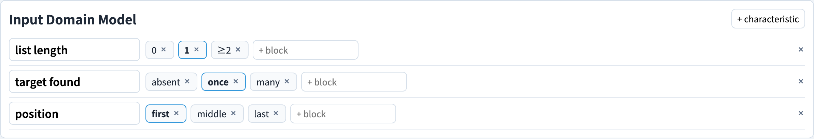
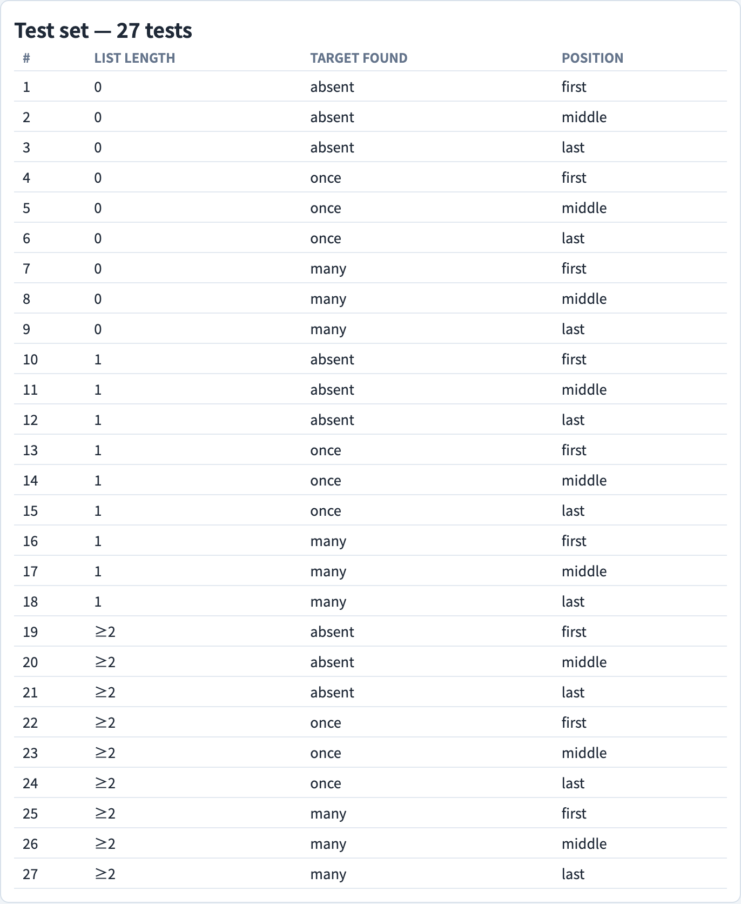
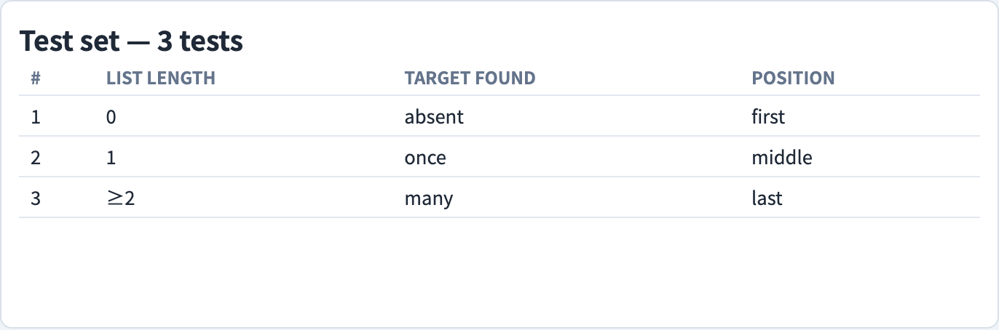
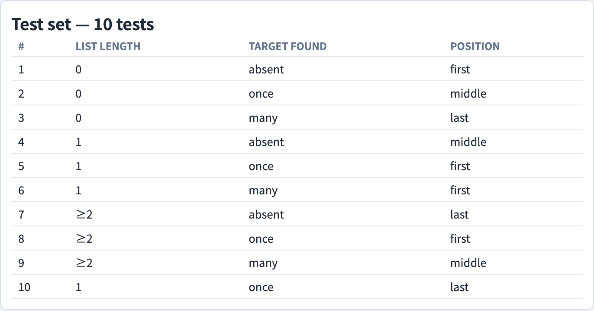

# Input Space Partitioning
### *Model the input domain; let a coverage criterion pick the tests*

Software Testing Visualization series #64 · Black-Box Test Design
Companion tool: `/section-blackbox` → Input Space Partitioning tab ([InputSpacePartitioningExplorer](../../src/components/InputSpacePartitioningExplorer.js))

<!-- Opening deck for the Input Space Partitioning topic. ISP is a black-box technique from Ammann & Offutt: model the input domain as characteristics partitioned into blocks, then let a coverage criterion decide which combinations of blocks become tests. The deck covers the Input Domain Model, the partitioning rules, and all six criteria with their subsumption order and cost. -->

---

## What is Input Space Partitioning?

**Input Space Partitioning (ISP)** is a black-box test-design technique: it derives tests from a model of the program's input domain, with no access to the source code.

The **input domain** is the set of all possible inputs a program can receive. For any realistic program this set is astronomically large — exhaustive testing is impossible. ISP solves this by *partitioning* the domain:

- Divide the domain into a small number of **blocks** of related values.
- Assume that every value within a block behaves the same way, so testing one representative of a block stands in for testing them all.
- Test a representative from each block instead of every individual value.

The technique comes from Ammann & Offutt, *Introduction to Software Testing*, Chapter 6. Because it works purely from a model of the inputs, ISP needs only the specification — never the implementation.

<!-- Contrast ISP sharply with the white-box graph-coverage and logic-coverage decks earlier in the series: those criteria are computed from the source code, while ISP is computed from a model the tester builds from the specification. The core assumption to articulate is the partition assumption — every value in a block is treated as equivalent — because every criterion in this deck rests on it. If the partition is badly chosen, "one test per block" tests very little. -->

---

## The Input Domain Model

ISP builds an **Input Domain Model (IDM)** in two steps.

**Step 1 — identify characteristics.** A **characteristic** is an input feature that matters to the program's behavior — for the *find element* function, the length of the list, whether the target is present, and where it sits.

**Step 2 — partition each characteristic into blocks.** A **block** is a group of values for one characteristic that are expected to behave alike — list length partitioned into {0, 1, ≥2}, for instance.

A **test** is then formed by picking exactly one block from every characteristic and choosing a concrete value from each.

An IDM can be built from the **interface** (the parameters in isolation) or from the **functionality** (what the program is meant to do). Functionality-based IDMs are harder to build but find more faults, because they capture how inputs interact.

<!-- The two-step structure is the heart of ISP and the companion tool mirrors it exactly: a panel for characteristics and, under each, its blocks. Stress that characteristic selection is the creative, fault-finding part — a good IDM is mostly about choosing the right characteristics. The interface-vs-functionality distinction is Ammann & Offutt's; the practical advice is to prefer functionality-based modelling whenever the specification supports it. -->

---

## Partitioning rules

The blocks of a single characteristic must satisfy two properties to form a proper **partition**:

- **Complete** — the blocks together cover the whole domain of that characteristic. Every possible value lands in *some* block; nothing is left out.
- **Disjoint** — no two blocks overlap. No value lands in *more than one* block.

Taken together, completeness and disjointness mean every value lands in **exactly one** block. Only then does the partition assumption hold and "one test per block" become meaningful: a gap leaves values untested by construction, and an overlap makes the choice of representative ambiguous.

ISP generalises **equivalence partitioning** (deck #20): equivalence partitioning splits a single input into equivalence classes; ISP applies the same idea to several characteristics at once and then adds criteria for combining them.

<!-- Completeness and disjointness are easy to state and easy to get wrong — boundary values are the usual culprit (does 1 belong to the "single element" block or the "≥2" block?). Make students check both properties explicitly for every characteristic. The link back to deck #20 is worth drawing: ISP is equivalence partitioning scaled up to multiple dimensions, which is exactly why it needs combination criteria. -->

---

## Six criteria and the subsumption lattice

Once the IDM exists, a **coverage criterion** decides which *combinations* of blocks become tests. There are six, in two families:

- **Combination family** — **ACoC**, **TWC**, **PWC**, **ECC** — defined by how thoroughly blocks across characteristics are combined.
- **Base-choice family** — **MBCC**, **BCC** — built around a chosen base test that is varied one characteristic at a time.

The criteria are ordered by **subsumption**: ACoC → TWC → PWC → ECC, and MBCC → BCC → ECC. If criterion A subsumes criterion B, any test set satisfying A also satisfies B — the stronger criterion's tests give the weaker one for free.

The companion tool draws this lattice and, beside it, a live bar chart of the test count each criterion produces.

<!-- Subsumption is the single most important relationship in this deck: it is what you *gain* by moving up the lattice, while the test count is what you *pay*. Both chains converge on ECC, the weakest criterion. Emphasise that subsumption is a guarantee about test sets, not about fault detection — a subsuming criterion is at least as strong, but a weaker criterion can still happen to catch a fault the stronger one's particular test set misses in practice. -->

---

## ACoC — All Combinations Coverage

**All Combinations Coverage** requires that **every combination** of blocks, taken across all characteristics, appears in at least one test.

Its test count is the **product of the block counts**:

**tests = ∏ bᵢ** — multiply the number of blocks of every characteristic together.

ACoC is the most thorough criterion and the most expensive: the count grows combinatorially, so it explodes with even a modest IDM. For three characteristics of three blocks each, ACoC needs 3 × 3 × 3 = **27 tests**.

In practice ACoC is rarely usable — it is the exhaustive baseline against which the cheaper criteria are judged. The value of the other five is precisely how much they economise relative to this product.

<!-- ACoC is the ceiling. It is worth computing the product out loud for a slightly bigger IDM (say four characteristics of four blocks: 256 tests) so students feel the combinatorial explosion. The teaching point is that ACoC is almost never the practical choice — it exists to define "complete" so the weaker criteria have something to be measured against. -->

---

## ECC — Each Choice Coverage

**Each Choice Coverage** requires only that **every block of every characteristic** appears in at least one test.

Because blocks need not be combined with one another, the test count is the **largest block count**:

**tests = max(bᵢ)** — the number of blocks of the characteristic with the most blocks.

ECC is the cheapest of the six criteria. For three characteristics of three blocks each, ECC needs just **3 tests** — each test pairs one fresh block from every characteristic.

The price of that cheapness is interaction coverage: ECC guarantees every single block is exercised, but it makes no promise about *combinations* of blocks. A fault that only appears when two specific blocks occur together can slip through ECC entirely.

<!-- ECC is the floor of the lattice — both subsumption chains end here. The key contrast with ACoC: ECC tests every block once, ACoC tests every combination. ECC catches "single-block" faults — a bad value class on its own — but is blind to interaction faults. This blindness is the motivation for everything between ECC and ACoC. -->

---

## PWC — Pair-Wise Coverage

**Pair-Wise Coverage** requires that **every pair of blocks** drawn from **every pair of characteristics** appears together in some test.

PWC is realised as a **covering array**: a compact set of tests engineered so that all pairs are covered with as few rows as possible. The count grows roughly with the *square* of the largest block count, not the product — so it stays manageable as the IDM grows.

PWC catches every **2-way interaction fault** — any fault triggered by a specific pair of blocks. For three characteristics of three blocks each, PWC needs about **9 tests**, comfortably between ECC's 3 and ACoC's 27.

This is the same idea as the Pairwise Testing deck (#23); ISP frames pairwise as one criterion among six rather than a standalone technique.

<!-- PWC is the practical sweet spot and the empirical justification is worth stating: studies repeatedly find that a large majority of interaction faults are 2-way, so covering all pairs catches most of them at a fraction of ACoC's cost. The covering-array construction is the machinery; students do not need to build one by hand, but they should know the count scales sub-combinatorially. Cross-reference deck #23 for the algorithmic detail. -->

---

## TWC — t-Wise Coverage

**t-Wise Coverage** generalises pair-wise: it requires that **every combination of blocks** from **every set of *t* characteristics** appears together in some test.

The parameter *t* slides between the two extremes:

- *t* = 2 is exactly **PWC**.
- *t* = (the number of characteristics) is exactly **ACoC**.

So TWC is a dial: raising *t* catches higher-order interaction faults — faults that need three, four, or more specific blocks together — at a steadily rising test count. The companion tool exposes a *t* selector so students can watch the count climb step by step from PWC up toward ACoC.

Higher *t* buys stronger interaction coverage; the cost is the count moving back toward the combinatorial product.

<!-- TWC is the unifying criterion — it shows PWC and ACoC are the same family at different settings of one parameter. The pedagogical move is to have students predict the count at t = 3 before revealing it in the tool. Most real faults are 2-way or 3-way, so t rarely exceeds 3 in practice; beyond that the count approaches ACoC and the marginal fault-finding drops off. -->

---

## BCC — Base Choice Coverage

**Base Choice Coverage** starts from a **base test**: pick one **base block** for every characteristic — a typical, valid, "happy-path" value — and combine them into one test.

Then, for every *other* block of every characteristic, form one more test that **changes exactly that one block** away from the base, holding all other characteristics at their base block.

The test count is therefore:

**tests = 1 + Σ(bᵢ − 1)** — the base test, plus one test for every non-base block.

For three characteristics of three blocks each: 1 + (2 + 2 + 2) = **7 tests**.

Because each non-base test differs from the base in exactly one characteristic, a failure points cleanly at that one characteristic — BCC gives excellent **fault attribution**.

<!-- BCC's selling point is diagnosis, not just detection: when a non-base test fails, exactly one thing changed, so you know which block caused it. Stress that the base block must be a genuine happy-path value — a sensible, common, valid input — otherwise the base test itself fails and the whole star of derived tests is suspect. The count formula is linear in the block counts, which is why BCC is cheap. -->

---

## MBCC — Multiple Base Choice Coverage

**Multiple Base Choice Coverage** relaxes BCC's single-base assumption: a characteristic may have **several base blocks** rather than just one.

The tool forms a base test for each combination of the chosen base blocks, then — exactly as in BCC — varies one characteristic at a time away from each base. The result is a small constellation of base tests, each surrounded by its own single-change variations.

MBCC is more robust than BCC when **no single value is obviously "the" typical one** — when a characteristic has two or more equally representative cases, picking just one would bias the test set. By covering each, MBCC **subsumes BCC**.

In the companion tool, selecting MBCC lets you mark more than one base block per characteristic; the test count and the test list update to reflect the extra bases.

<!-- MBCC answers the obvious objection to BCC: "what if there isn't one typical value?" A login form whose user can be admin or regular has two natural base cases, not one. MBCC's cost sits between BCC and the combination criteria — it multiplies BCC's count by the number of base combinations. Note for students that MBCC subsumes BCC, so it inherits BCC's clean fault attribution. -->

---

## Choosing a criterion

Picking a criterion is a **cost-versus-thoroughness trade-off**:

- **ACoC** — exhaustive, but the count explodes (∏ bᵢ). Usable only for very small IDMs.
- **TWC / PWC** — interaction faults caught at a count that scales sub-combinatorially. The usual practical choice for real systems.
- **ECC** — the cheapest (max bᵢ), but it catches only single-block faults and no interactions.
- **BCC / MBCC** — cheap and linear in the block counts, with clean fault attribution because each test changes one thing.

There is no universally right answer: a tiny IDM can afford ACoC, a safety-critical interaction-heavy system wants TWC, a quick smoke test wants ECC. The tool's test-count bar chart puts the trade-off on screen — you see exactly what each criterion costs before committing.

<!-- The honest summary is that most real projects land on PWC or BCC: PWC when interaction faults are the worry, BCC when fast feedback and clean diagnosis matter more. Encourage students to reason from the IDM in front of them rather than memorising a single default. The bar chart is the decision aid — make them read the count off it for two or three criteria before choosing. -->

---

## Tool demonstration — the Input Domain Model

<!-- This is the first demo slide. Introduce the tool here: the Input Space Partitioning tab in /section-blackbox is built around the IDM panel on the left and the criterion selector plus test list on the right. Walk the room through opening the tab and reading the find-element IDM before advancing — every later demo slide builds on this same 3×3×3 model. -->

In `/section-blackbox`, open the **Input Space Partitioning** tab.

The IDM panel shows the *find element* example — three characteristics (list length, target found, position), each partitioned into three blocks. Characteristics and blocks are editable, so students can build and revise the model directly.

---

## Tool demonstration — All Combinations

Select **All Combinations (ACoC)** — the test set lists all 27 combinations of the 3 × 3 × 3 IDM. The header reports the count, the product of the three block counts.

---

## Tool demonstration — Each Choice

Select **Each Choice (ECC)** — only 3 tests, just enough for every block to appear at least once. Compare the count with ACoC's 27 to see the cost of dropping interaction coverage.

---

## Tool demonstration — Pair-Wise

Select **Pair-Wise (PWC)** — 9 tests, a covering array that hits every pair of blocks. The count sits between ECC's 3 and ACoC's 27 — the practical middle ground.

---

## Tool demonstration — the subsumption lattice

The lattice panel draws the subsumption order — ACoC → TWC → PWC → ECC and MBCC → BCC → ECC — with the active criterion highlighted, so the strength relationships are visible at a glance.

---

## Summary

- **Input Space Partitioning** is a black-box technique: model the input domain, then let a coverage criterion pick the tests — no source code required.
- The **Input Domain Model** is built in two steps: identify **characteristics**, then partition each into **blocks**; a test picks one block per characteristic.
- Each characteristic's blocks must be **complete** (cover the whole domain) and **disjoint** (no overlap) — so every value lands in exactly one block.
- The **six criteria** and their test counts: ACoC = ∏ bᵢ; ECC = max(bᵢ); PWC and TWC are covering arrays (sub-combinatorial); BCC = 1 + Σ(bᵢ − 1); MBCC multiplies that by the number of base combinations.
- The **subsumption order** is ACoC → TWC → PWC → ECC and MBCC → BCC → ECC — a stronger criterion's test set satisfies every weaker one.
- Choosing a criterion is a **cost-versus-thoroughness trade-off**: ACoC for tiny IDMs, TWC/PWC for interaction faults, ECC for the cheapest pass, BCC/MBCC for cheap tests with clean fault attribution.
- Most real projects use **PWC or BCC** — interaction coverage at a manageable count, or fast feedback with clear diagnosis.

**In-class exercise:** build an Input Domain Model for a `daysInMonth(month, year)` function — identify the characteristics, partition each into blocks, check completeness and disjointness, then compute the test count under ACoC, ECC, PWC, and BCC.

---

## Further reading

- Ammann, P. & Offutt, J. (2016). *Introduction to Software Testing* (2nd ed.). Cambridge University Press. — Chapter 6, *Input Space Partitioning*, is the canonical treatment of the IDM and the six criteria.
- Course specification — Input Space Partitioning visualization design ([2026-05-21-exploit-isp-slide-decks-design.md](../superpowers/specs/2026-05-21-exploit-isp-slide-decks-design.md))
- Tool source: [InputSpacePartitioningExplorer.js](../../src/components/InputSpacePartitioningExplorer.js), [inputSpacePartition.js](../../src/utils/inputSpacePartition.js)
- Related decks: #20 Equivalence Partitioning — the single-input precursor to ISP; #23 Pairwise Testing — covering arrays in depth.
- Next in series: future decks in the Black-Box Test Design section.
