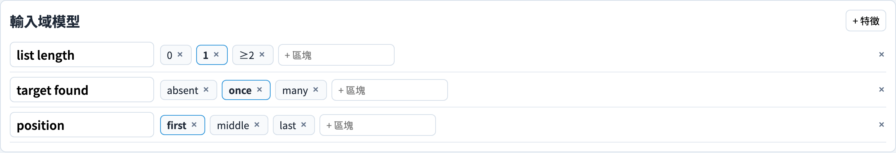
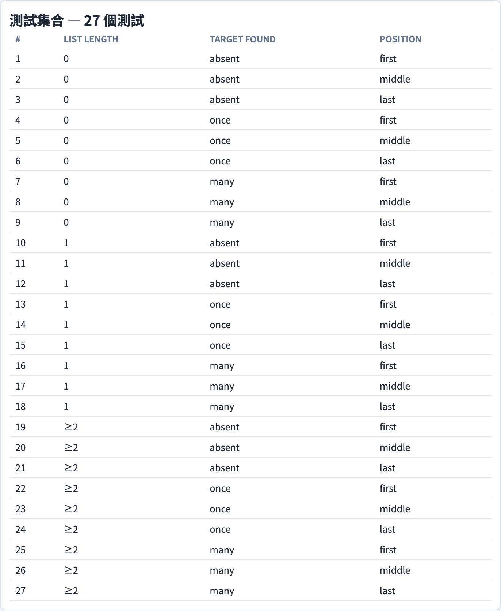
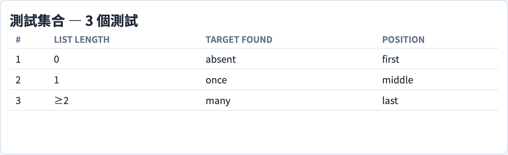
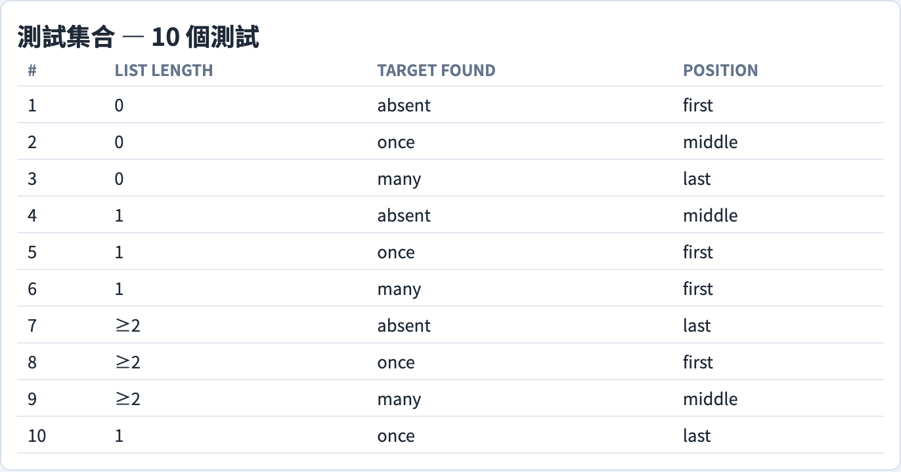

# 輸入空間劃分
### *為輸入域建模，讓覆蓋準則挑出測試*

軟體測試視覺化系列 #64 · 黑盒測試設計
搭配工具：`/section-blackbox` → 輸入空間劃分分頁（[InputSpacePartitioningExplorer](../../src/components/InputSpacePartitioningExplorer.js)）

<!-- 輸入空間劃分主題的第一講。輸入空間劃分是 Ammann 與 Offutt 提出的黑盒技術：把輸入域建模為被劃分成區塊的特徵，再讓覆蓋準則決定哪些區塊的組合成為測試。本講涵蓋輸入域模型、劃分規則，以及全部六種準則，連同它們的包含關係順序與成本。 -->

---

## 什麼是輸入空間劃分？

**輸入空間劃分（Input Space Partitioning，ISP）**是一種黑盒測試設計技術：它從程式輸入域的一個模型來推導測試，完全不需要存取原始碼。

**輸入域**是程式可能收到的所有輸入所構成的集合。對任何實際的程式而言，這個集合都大得驚人——徹底測試是不可能的。輸入空間劃分透過*劃分*輸入域來解決這個問題：

- 把輸入域分割成少數幾個相關值的**區塊（block）**。
- 假設一個區塊內的每一個值行為都相同，因此測試該區塊的一個代表，就足以代替測試全部。
- 測試每個區塊的一個代表，而不是每一個個別的值。

這項技術出自 Ammann 與 Offutt 的《Introduction to Software Testing》第 6 章。由於它純粹從輸入的模型運作，輸入空間劃分只需要規格——永遠不需要實作。

<!-- 把輸入空間劃分與本系列稍早的白盒圖覆蓋與邏輯覆蓋各講鮮明對比：那些準則是從原始碼計算而來，而輸入空間劃分是從測試者依規格建立的模型計算而來。要明說的核心假設是劃分假設——一個區塊內的每一個值都被視為等價——因為本講的每一種準則都建立在它之上。如果劃分選得不好，「每個區塊一個測試」幾乎測不到什麼。 -->

---

## 輸入域模型

輸入空間劃分以兩個步驟建立一個**輸入域模型（Input Domain Model，IDM）**。

**步驟一——找出特徵。**一個**特徵（characteristic）**是對程式行為有影響的輸入要素——以*尋找元素*函式為例，就是清單的長度、目標是否存在，以及它位於何處。

**步驟二——把每個特徵劃分成區塊。**一個**區塊**是某一個特徵中、預期行為相似的一群值——例如把清單長度劃分成 {0、1、≥2}。

接著，從每一個特徵恰好挑出一個區塊、並各自選一個具體的值，就構成一個**測試**。

輸入域模型可以從**介面**（孤立看待參數）建立，也可以從**功能**（程式應該做什麼）建立。以功能為基礎的輸入域模型較難建立，但能找到更多缺陷，因為它捕捉了輸入之間如何互動。

<!-- 兩步驟結構是輸入空間劃分的核心，搭配工具完全照此呈現：一個特徵面板，每個特徵下方是它的區塊。強調特徵的選擇是富創造性、能找出缺陷的部分——一個好的輸入域模型，大半在於選對特徵。介面對功能的區別出自 Ammann 與 Offutt；實務建議是只要規格支持，就優先採用以功能為基礎的建模。 -->

---

## 劃分規則

單一特徵的各區塊必須滿足兩個性質，才能構成一個恰當的**劃分（partition）**：

- **完整（complete）**——各區塊合起來涵蓋該特徵的整個值域。每一個可能的值都落在*某一個*區塊裡；沒有任何遺漏。
- **互斥（disjoint）**——沒有任何兩個區塊重疊。沒有任何值落在*超過一個*區塊裡。

完整與互斥兩者合起來，意味著每一個值恰好落在**唯一一個**區塊裡。唯有如此，劃分假設才成立，「每個區塊一個測試」才有意義：缺口在構造上就留下了未測試的值，重疊則讓代表的選擇變得模稜兩可。

輸入空間劃分把**等價劃分**（第 #20 講）一般化：等價劃分把單一輸入分成等價類；輸入空間劃分把同一個概念同時套用到數個特徵上，再加上組合它們的準則。

<!-- 完整與互斥容易陳述、也容易出錯——邊界值是常見的罪魁禍首（1 屬於「單一元素」區塊還是「≥2」區塊？）。要求學生對每一個特徵都明確檢查這兩個性質。回連第 #20 講值得一畫：輸入空間劃分就是放大到多維度的等價劃分，這正是它需要組合準則的原因。 -->

---

## 六種準則與包含關係格

一旦輸入域模型存在，一個**覆蓋準則**就決定哪些區塊的*組合*成為測試。共有六種，分為兩個家族：

- **組合家族**——**ACoC、TWC、PWC、ECC**——以跨特徵的區塊被組合得多徹底來定義。
- **基準選擇家族**——**MBCC、BCC**——圍繞一個選定的基準測試，每次只變動一個特徵來建立。

這些準則以**包含關係（subsumption）**排序：ACoC → TWC → PWC → ECC，以及 MBCC → BCC → ECC。若準則 A 包含準則 B，則任何滿足 A 的測試集也滿足 B——較強準則的測試免費附送較弱的那一個。

搭配工具會畫出這個格，並在其旁邊呈現一張即時長條圖，顯示每一種準則所產生的測試數量。

<!-- 包含關係是本講最重要的單一關係：它是你沿著格往上走所*得到*的，而測試數量是你所*付出*的。兩條鏈都匯聚到最弱的準則 ECC。強調包含關係是關於測試集的保證，不是關於缺陷偵測的保證——一個包含他者的準則至少同樣強，但在實務上，較弱的準則仍可能恰巧抓到較強準則的那一組特定測試所漏掉的缺陷。 -->

---

## ACoC — 全組合覆蓋

**全組合覆蓋（All Combinations Coverage）**要求跨所有特徵、各區塊的**每一個組合**都至少出現在一個測試中。

它的測試數量是**各區塊數量的乘積**：

**測試數 = ∏ bᵢ**——把每個特徵的區塊數全部相乘。

ACoC 是最徹底的準則，也是最昂貴的：數量以組合方式成長，所以即使輸入域模型不大也會爆炸。對三個各有三個區塊的特徵，ACoC 需要 3 × 3 × 3 = **27 個測試**。

實務上 ACoC 鮮少可用——它是用來評斷較便宜準則的徹底基準。其他五種的價值，正在於它們相對於這個乘積節省了多少。

<!-- ACoC 是上限。值得對稍大一點的輸入域模型把乘積算出來（譬如四個各有四個區塊的特徵：256 個測試），讓學生感受到組合爆炸。教學點是 ACoC 幾乎從來不是實務上的選擇——它的存在是為了定義「完整」，好讓較弱的準則有可被衡量的對象。 -->

---

## ECC — 各選擇覆蓋

**各選擇覆蓋（Each Choice Coverage）**只要求**每個特徵的每個區塊**都至少出現在一個測試中。

由於各區塊不必彼此組合，測試數量是**最大的區塊數量**：

**測試數 = max(bᵢ)**——區塊數最多的那個特徵的區塊數。

ECC 是六種準則中最便宜的。對三個各有三個區塊的特徵，ECC 只需要 **3 個測試**——每個測試從每一個特徵各取一個新區塊配在一起。

這份便宜的代價是互動覆蓋：ECC 保證每一個單獨的區塊都被執行到，卻不對區塊的*組合*作任何承諾。一個只有在兩個特定區塊同時出現時才現形的缺陷，可能完全從 ECC 溜走。

<!-- ECC 是格的下限——兩條包含關係鏈都終止於此。與 ACoC 的關鍵對比：ECC 每個區塊測一次，ACoC 每個組合都測。ECC 抓得到「單一區塊」缺陷——某個壞的值類別本身——卻對互動缺陷視而不見。這份盲點正是 ECC 與 ACoC 之間一切事物的動機。 -->

---

## PWC — 成對覆蓋

**成對覆蓋（Pair-Wise Coverage）**要求取自**每一對特徵**的**每一對區塊**，都在某個測試中一起出現。

PWC 以一個**覆蓋陣列（covering array）**實現：一組精心設計的測試，使所有的對都以盡可能少的列被涵蓋。數量大致以最大區塊數的*平方*成長，而非乘積——所以隨著輸入域模型變大仍維持可控。

PWC 抓得到每一個**二維互動缺陷**——任何由一對特定區塊觸發的缺陷。對三個各有三個區塊的特徵，PWC 約需 **9 個測試**，舒適地落在 ECC 的 3 個與 ACoC 的 27 個之間。

這與成對測試一講（第 #23 講）是同一個概念；輸入空間劃分把成對視為六種準則之一，而非一項獨立技術。

<!-- PWC 是實務上的甜蜜點，其實證理由值得一提：研究一再發現絕大多數互動缺陷是二維的，所以涵蓋所有的對能以 ACoC 一小部分的成本抓到其中大多數。覆蓋陣列的建構是其機制；學生不必親手建一個，但應知道數量以次組合的方式擴展。演算法細節可交叉參考第 #23 講。 -->

---

## TWC — T 維覆蓋

**T 維覆蓋（t-Wise Coverage）**把成對一般化：它要求取自**每一組 *t* 個特徵**的**每一個區塊組合**，都在某個測試中一起出現。

參數 *t* 在兩個極端之間滑動：

- *t* = 2 恰好就是 **PWC**。
- *t* =（特徵的數目）恰好就是 **ACoC**。

所以 TWC 是一個旋鈕：調高 *t* 能抓到更高階的互動缺陷——需要三個、四個或更多特定區塊同時出現的缺陷——代價是測試數量穩定上升。搭配工具提供一個 *t* 選擇器，讓學生看著數量從 PWC 一步步往 ACoC 攀升。

較高的 *t* 換來較強的互動覆蓋；代價是數量往組合乘積靠回去。

<!-- TWC 是統合性的準則——它顯示 PWC 與 ACoC 是同一個家族在某一個參數不同設定下的樣貌。教學動作是讓學生在工具揭曉之前先預測 t = 3 時的數量。大多數真實缺陷是二維或三維的，所以實務上 t 鮮少超過 3；超過之後數量逼近 ACoC，邊際的找缺陷能力下降。 -->

---

## BCC — 基準選擇覆蓋

**基準選擇覆蓋（Base Choice Coverage）**從一個**基準測試（base test）**出發：為每一個特徵挑一個**基準區塊（base block）**——一個典型、有效、「快樂路徑」的值——把它們組合成一個測試。

接著，對每一個特徵的每一個*其他*區塊，再構成一個測試，**恰好把那一個區塊**從基準變動開來，而其他所有特徵都維持在它們的基準區塊。

因此測試數量是：

**測試數 = 1 + Σ(bᵢ − 1)**——基準測試，加上每一個非基準區塊各一個測試。

對三個各有三個區塊的特徵：1 + (2 + 2 + 2) = **7 個測試**。

由於每一個非基準測試與基準恰好在一個特徵上不同，一次失敗能乾淨地指向那一個特徵——BCC 提供出色的**缺陷歸因**。

<!-- BCC 的賣點是診斷，不只是偵測：當一個非基準測試失敗時，恰好只有一件事改變了，所以你知道是哪個區塊造成的。強調基準區塊必須是真正的快樂路徑值——一個合理、常見、有效的輸入——否則基準測試本身就會失敗，整個衍生測試的星形結構都會啟人疑竇。數量公式對區塊數是線性的，這正是 BCC 便宜的原因。 -->

---

## MBCC — 多重基準選擇覆蓋

**多重基準選擇覆蓋（Multiple Base Choice Coverage）**放寬了 BCC 的單一基準假設：一個特徵可以有**數個基準區塊**，而非僅僅一個。

工具為選定基準區塊的每一個組合構成一個基準測試，接著——完全如同 BCC——從每一個基準出發，每次變動一個特徵。結果是一小群基準測試的星座，每一個都被它自己的單一變動衍生測試所環繞。

當**沒有任何單一值明顯就是「那個」典型值**時——當一個特徵有兩個或更多同樣具代表性的情況時，只挑一個會使測試集產生偏差——MBCC 比 BCC 更穩健。由於涵蓋了每一個，MBCC **包含 BCC**。

在搭配工具中，選取 MBCC 後可以為每個特徵標記不止一個基準區塊；測試數量與測試清單會隨著額外的基準而更新。

<!-- MBCC 回答了對 BCC 的明顯異議：「如果沒有單一典型值怎麼辦？」一個使用者可以是管理員或一般使用者的登入表單，有兩個自然的基準情況，而非一個。MBCC 的成本落在 BCC 與組合準則之間——它把 BCC 的數量乘以基準組合的數目。向學生指出 MBCC 包含 BCC，所以它繼承了 BCC 乾淨的缺陷歸因。 -->

---

## 選擇一種準則

挑選一種準則是一個**成本對徹底度的權衡**：

- **ACoC**——徹底，但數量爆炸（∏ bᵢ）。只有非常小的輸入域模型才負擔得起。
- **TWC / PWC**——以次組合方式擴展的數量抓到互動缺陷。是真實系統通常的實務選擇。
- **ECC**——最便宜（max bᵢ），但只抓得到單一區塊缺陷，沒有任何互動。
- **BCC / MBCC**——便宜、對區塊數呈線性，且因每個測試只改變一件事而有乾淨的缺陷歸因。

沒有普世正確的答案：一個微小的輸入域模型負擔得起 ACoC，一個安全關鍵、互動繁重的系統會想要 TWC，一次快速的冒煙測試會想要 ECC。工具的測試數量長條圖把這個權衡呈現在螢幕上——你在下決定之前就看得到每一種準則的成本。

<!-- 誠實的總結是大多數真實專案落在 PWC 或 BCC：互動缺陷是隱憂時用 PWC，快速回饋與乾淨診斷更重要時用 BCC。鼓勵學生從眼前的輸入域模型來推理，而不是死背一個單一預設。長條圖是決策輔助——在選擇之前，要他們從圖上讀出兩三種準則的數量。 -->

---

## 工具演示 — 輸入域模型

<!-- 這是第一張演示投影片。在此介紹工具：/section-blackbox 的輸入空間劃分分頁，環繞著左側的輸入域模型面板，以及右側的準則選擇器加測試清單而建。在前進之前，帶全班開啟分頁並讀過尋找元素的輸入域模型——後面每一張演示投影片都建立在這同一個 3×3×3 模型上。 -->

在 `/section-blackbox` 開啟**輸入空間劃分**分頁。

輸入域模型面板顯示*尋找元素*範例——三個特徵（清單長度、目標是否找到、位置），每一個都被劃分成三個區塊。特徵與區塊都可編輯，學生可以直接建立並修訂這個模型。

---

## 工具演示 — 全組合

選取**全組合（ACoC）**——測試集列出 3 × 3 × 3 輸入域模型的全部 27 個組合。標題回報數量，即三個區塊數的乘積。

---

## 工具演示 — 各選擇

選取**各選擇（ECC）**——只有 3 個測試，剛好足以讓每個區塊至少出現一次。把這個數量與 ACoC 的 27 相比，便看出捨棄互動覆蓋的代價。

---

## 工具演示 — 成對

選取**成對（PWC）**——9 個測試，一個命中每一對區塊的覆蓋陣列。數量落在 ECC 的 3 與 ACoC 的 27 之間——實務上的中間地帶。

---

## 工具演示 — 包含關係格

格面板畫出包含關係順序——ACoC → TWC → PWC → ECC 以及 MBCC → BCC → ECC——並高亮顯示作用中的準則，讓強度關係一目了然。

---

## 小結

- **輸入空間劃分**是一種黑盒技術：為輸入域建模，再讓覆蓋準則挑出測試——不需要原始碼。
- **輸入域模型**以兩個步驟建立：找出**特徵**，再把每一個劃分成**區塊**；一個測試從每個特徵各挑一個區塊。
- 每個特徵的各區塊必須**完整**（涵蓋整個值域）且**互斥**（沒有重疊）——使每一個值恰好落在唯一一個區塊裡。
- **六種準則**及其測試數量：ACoC = ∏ bᵢ；ECC = max(bᵢ)；PWC 與 TWC 是覆蓋陣列（次組合方式）；BCC = 1 + Σ(bᵢ − 1)；MBCC 把該數量乘以基準組合的數目。
- **包含關係順序**是 ACoC → TWC → PWC → ECC 以及 MBCC → BCC → ECC——較強準則的測試集滿足每一個較弱的。
- 選擇一種準則是一個**成本對徹底度的權衡**：微小的輸入域模型用 ACoC，互動缺陷用 TWC/PWC，最便宜的一輪用 ECC，便宜又有乾淨缺陷歸因的測試用 BCC/MBCC。
- 大多數真實專案使用 **PWC 或 BCC**——以可控的數量取得互動覆蓋，或以清晰的診斷取得快速回饋。

**課堂練習：** 為一個 `daysInMonth(month, year)` 函式建立一個輸入域模型——找出特徵、把每一個劃分成區塊、檢查完整與互斥，再計算在 ACoC、ECC、PWC 與 BCC 下的測試數量。

---

## 延伸閱讀

- Ammann, P. & Offutt, J.（2016）。*Introduction to Software Testing*（第 2 版）。Cambridge University Press。—— 第 6 章《Input Space Partitioning》是輸入域模型與六種準則的經典論述。
- 課程規格 —— 輸入空間劃分視覺化設計（[2026-05-21-exploit-isp-slide-decks-design.md](../superpowers/specs/2026-05-21-exploit-isp-slide-decks-design.md)）
- 工具原始碼：[InputSpacePartitioningExplorer.js](../../src/components/InputSpacePartitioningExplorer.js)、[inputSpacePartition.js](../../src/utils/inputSpacePartition.js)
- 相關講次：第 #20 講 等價劃分 —— 輸入空間劃分的單一輸入前身；第 #23 講 成對測試 —— 深入覆蓋陣列。
- 下一講：黑盒測試設計章節的後續講次。
