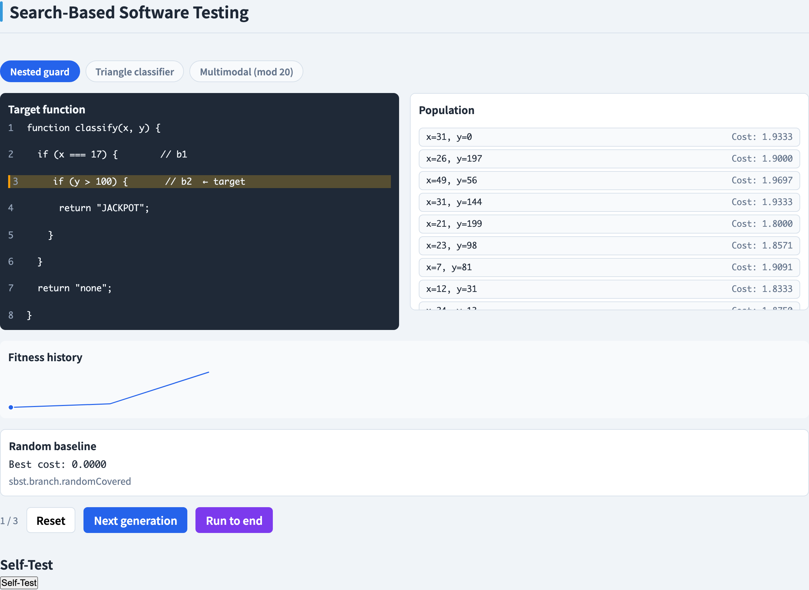
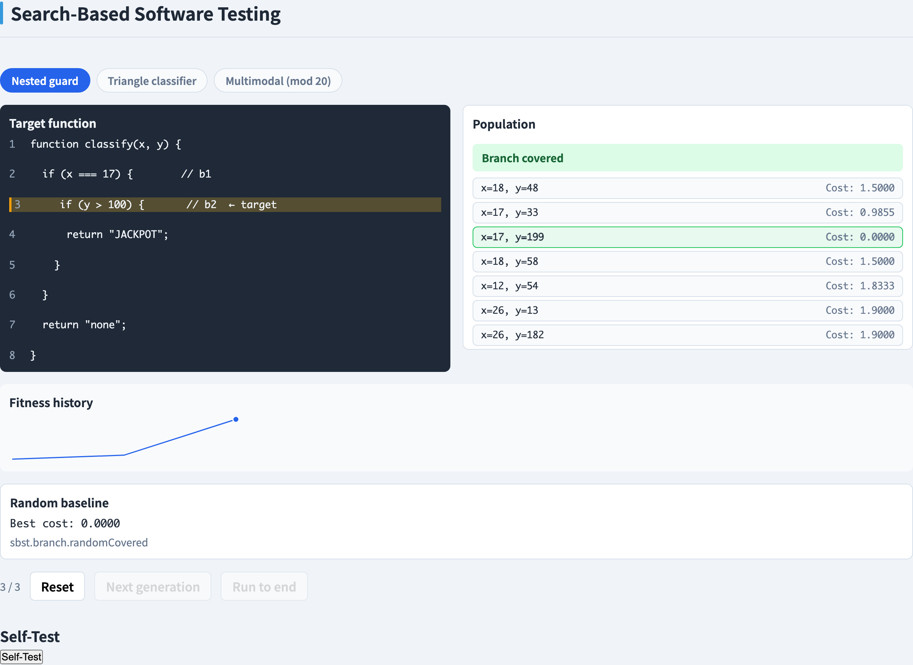
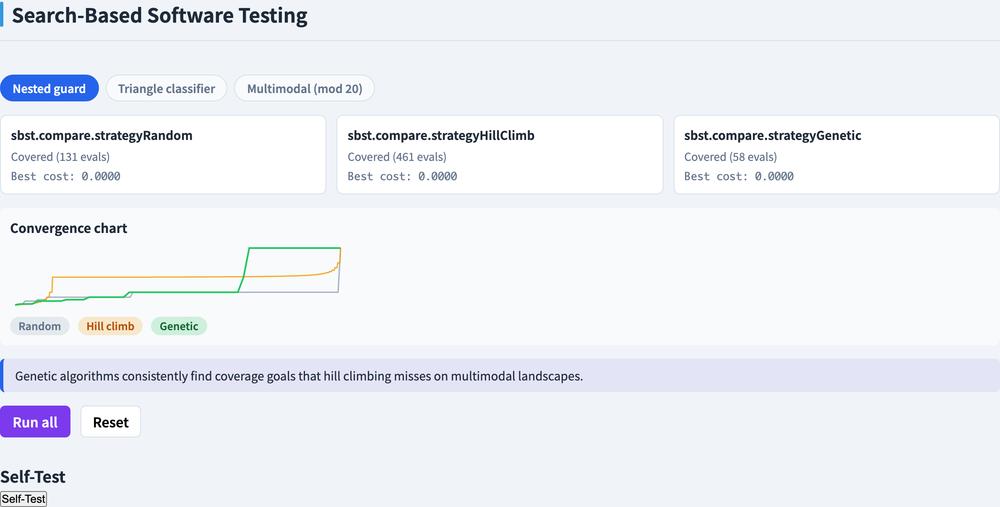
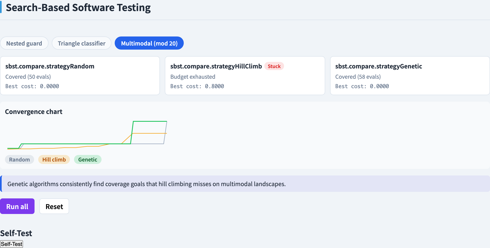
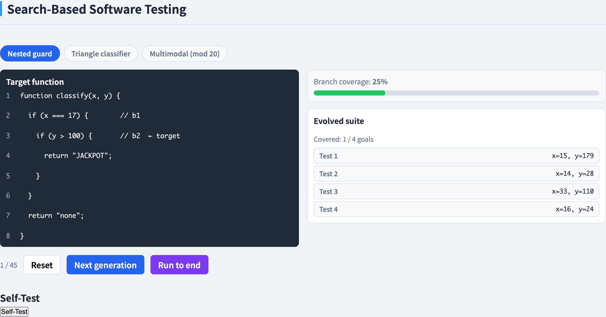
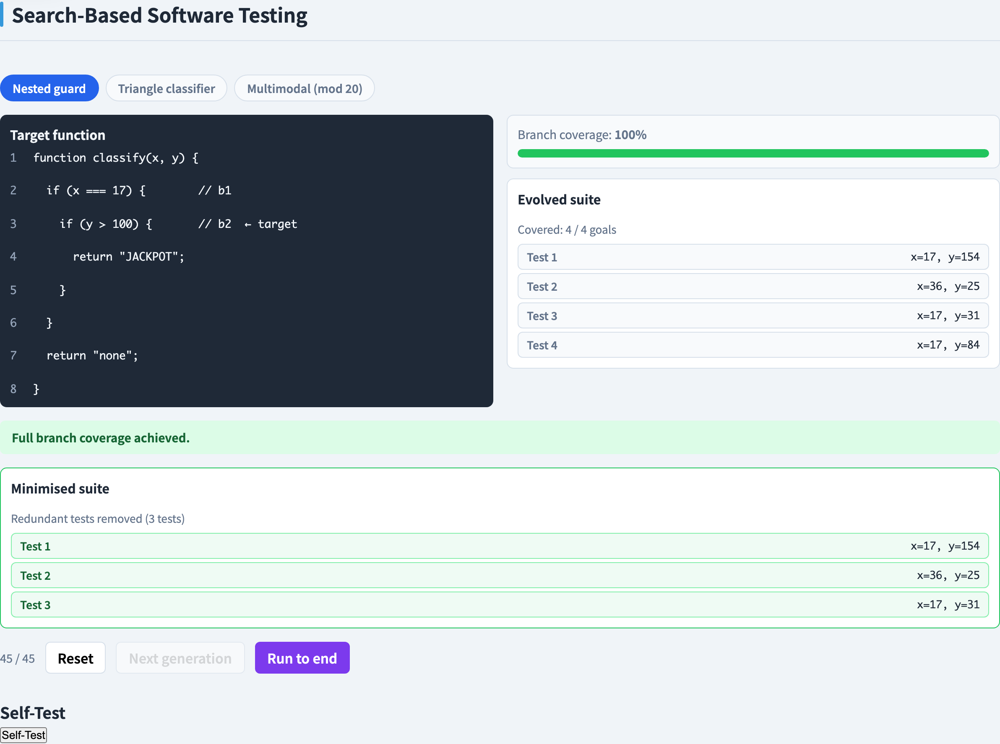
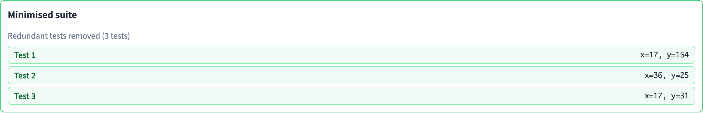

# Search-Based Software Testing
### *Let a fitness function search for the tests*

Software Testing Visualization series #65 · Search-Based Testing
Companion tool: `/section-sbst` → GA Branch Search ([SbstBranchExplorer](../../src/components/SbstBranchExplorer.js)) · Metaheuristic Comparison ([SbstCompareExplorer](../../src/components/SbstCompareExplorer.js)) · Whole-Suite Evolution ([SbstSuiteExplorer](../../src/components/SbstSuiteExplorer.js))

<!-- Opening deck for the Search-Based Software Testing section. SBST reframes test generation as an optimisation problem: a metaheuristic search over the input space, guided by a fitness function that measures how close an input is to covering a target. The deck covers the fitness function (branch distance + approach level), the random / hill-climbing / genetic-algorithm metaheuristics, and whole-test-suite generation. -->

---

## Test generation as search

Most of this course generates tests by **enumerating coverage requirements** — list the branches, then find an input for each one. Search-based software testing (SBST) takes a different stance: it treats test generation as an **optimisation problem**.

Fix one coverage goal — say, a particular branch. The **search space** is the set of all possible input vectors to the function under test. Somewhere in that space sit the inputs that cover the goal. SBST hands the search space to a **metaheuristic**: an algorithm that samples candidates, scores them, and steers toward better ones.

The contrast with the coverage-driven `testgen` section (deck #12) is the *direction* of work. There, the engine reasons forward from the program structure to a test. Here, the engine searches the input space and lets a numeric score — the fitness function — tell it whether it is getting warmer or colder.

<!-- The reframing is the whole point of the section: stop enumerating requirements and start optimising. Draw the search space on the board as a landscape and the coverage goal as a target region inside it. Stress that SBST does not need to understand the program's logic the way symbolic execution does — it only needs to *run* the program and *measure* the result. That is its great strength (it scales to code symbolic execution chokes on) and its great weakness (with no gradient it is blind). Deck #12 is the natural contrast: requirement-driven vs. search-driven. -->

---

## The fitness function

A search is only as good as its **gradient**. If every non-covering input scores the same, the metaheuristic is reduced to blind guessing. The job of the **fitness function** is to give the search a smooth slope to descend.

For a single branch goal, fitness measures **how close an input came to covering that branch**. It has two components added together:

- **approach level** — how many enclosing decisions the execution still had to get right, and
- **branch distance** — at the decision where execution diverged, how close the predicate was to flipping the other way.

The convention is **lower is closer**: a fitness of 0 means the input covers the goal, and larger values mean further away. The search's task is simply to **minimise** this number.

<!-- Hammer the gradient idea: coverage alone — covered / not covered — is a flat function with no slope, so a search guided only by coverage cannot improve. The fitness function turns that cliff into a ramp. The two-part structure (approach level for *how far through the nesting*, branch distance for *how close the last predicate was*) is the standard Wegener/McMinn formulation and every later slide depends on it. Emphasise the minimise-to-zero convention so the demo curves later make sense. -->

---

## Branch distance

**Branch distance** asks, at a single decision: *how close was the predicate to taking the other outcome?* It turns a true/false test into a continuous number.

The Korel/Tracey formulas give one rule per relational operator. For a predicate that needs to become true:

- `a == b` → distance `|a − b|`
- `a != b` → distance `0` if `a ≠ b`, else `K`
- `a < b` → distance `a − b + K` if `a ≥ b`, else `0`
- `a <= b` → distance `a − b` if `a > b`, else `0`

where `K` is a small positive constant so a *just-barely-false* predicate still scores above zero. Boolean connectives compose: `&&` adds (or takes the worst of) its operands, `||` takes the minimum.

A raw distance can be any size, so it is **normalised** into `[0, 1)` with `d / (d + 1)` before it is combined with the approach level — keeping every decision on the same scale.

<!-- Put one formula on the board and work a number through it: for a < b with a = 7, b = 3, the distance is 7 - 3 + K = 4 + K, and as a drops toward 3 the distance shrinks toward K, then hits 0 the instant a < b. That shrinking number *is* the gradient the search rides. The K constant is the subtle bit — without it a predicate one step from flipping would tie with one already flipped. Normalisation matters because approach level counts in whole decisions, so branch distance must be capped below 1 to never outweigh a single level. -->

---

## Approach level

**Branch distance** only describes the *one* decision where execution went wrong. **Approach level** describes *how far through the nest of decisions* the execution got before that happened.

A target branch is usually guarded by several enclosing decisions — to reach it, execution must take the right outcome at each one. The approach level counts **how many of those enclosing decisions the execution still diverged from**: if it took the wrong outcome at the very first guard, the approach level is high; if it sailed through every guard but the last, the approach level is low.

The two combine into one cost:

**cost = approach level + normalised branch distance at the first point of divergence**

So progress shows up two ways. Get *deeper* into the nest and the approach level drops by a whole integer. Get *closer* at the decision where you are still stuck and the fractional branch-distance term shrinks. Either way the cost goes down, and the search has a slope to follow.

<!-- The mental picture: approach level is the coarse, integer part of the gradient (which guard am I stuck at) and branch distance is the fine, fractional part (how close am I to clearing that guard). Because branch distance is normalised below 1, clearing a whole guard always beats any amount of fractional progress — the cost is lexicographic in disguise. This composite is what makes deeply nested targets searchable: without approach level every failure outside the final guard would look equally bad. -->

---

## Random search — the baseline

The simplest metaheuristic is **random search**: sample inputs uniformly from the search space, evaluate each one's fitness, and keep the best seen so far.

Random search is **unguided**. It computes the fitness of every candidate but never *uses* that signal to choose the next sample — each draw is independent of the last. It throws away the gradient the fitness function worked to provide.

That makes it a useful **baseline**, and occasionally enough on its own. If the inputs that cover a goal occupy a sizeable fraction of the search space, a handful of random draws will land one. But the moment a target sits behind nested guards — so the covering region is a vanishingly small sliver — random search **stalls**: the odds of stumbling onto the sliver by chance are negligible.

<!-- Random search is the control group for the whole section: any guided metaheuristic must beat it or it is not earning its complexity. Make the key admission explicit — random search *does* evaluate fitness, it just ignores it for sampling. The takeaway is the contrast set up for the next slides: easy targets fall to random search; nested targets need a search that actually climbs the gradient. -->

---

## Hill climbing

**Hill climbing** is the first genuinely guided metaheuristic. It picks one starting input, examines the **neighbours** of that input — the candidates a small step away — evaluates their fitness, and moves to the **best improving neighbour**. Repeat from the new point until no neighbour is better.

Now the fitness gradient is doing real work: each move is a deliberate step downhill in cost, so on a smooth fitness landscape hill climbing converges far faster than random sampling.

Its weakness is structural. Hill climbing follows a **single trajectory** from a single start. When that trajectory reaches a point where every neighbour is worse — a **local optimum** — it stops, even if that point does not cover the goal. A non-covering local optimum is a dead end, and a lone climber has no way out of it.

<!-- This is the first taste of the central tension of the section: a guided search is much faster than random, but a *single* guided search is brittle. Draw a fitness landscape with two valleys — the climber rolls into whichever one its start point sits above and gets stuck there. Random restarts patch this a little, but the real fix is a population, which is the next slide. Define local optimum carefully: it is local to the neighbourhood, not the global best. -->

---

## Genetic algorithms

A **genetic algorithm** (GA) replaces the lone climber with a whole **population** of candidate inputs, evolved over successive **generations**. Each generation applies four operators:

- **selection** — pick parents, biased toward fitter individuals; **tournament selection** draws a small random group and keeps its best.
- **crossover** — combine two parents into offspring that mix their input values, recombining partial solutions.
- **mutation** — randomly perturb some offspring values, injecting fresh variation so the search can reach inputs no parent held.
- **elitism** — carry the best individual(s) unchanged into the next generation, so the best fitness can never get worse.

Because a population holds **many individuals scattered across the search space**, the GA explores **many regions at once** instead of committing to a single trajectory. That breadth is what the next slide builds on.

<!-- Walk the four operators as a cycle: select → cross over → mutate → keep the elite, then repeat. Tournament selection is the workhorse — explain that it tunes selection pressure via the tournament size. Elitism is the safety rail: without it a good solution can be lost to an unlucky crossover. The phrase to leave ringing is "many regions at once" — that population breadth is precisely the property hill climbing lacks, and the reason the GA escapes traps. -->

---

## Escaping local optima

Why does the GA succeed where hill climbing gets stuck? Two mechanisms, both consequences of holding a **population**.

First, **diversity**. The population is spread across the search space, so different individuals sit in different basins of the fitness landscape. One unlucky basin traps the individuals inside it — but not the whole search. While some individuals stall at a local optimum, others are still descending elsewhere.

Second, **crossover recombines partial solutions**. A nested target often needs several input values to all be right at once. One parent may have value A correct, another value B; crossover can produce a child with **both** — a jump across the landscape that no single-step neighbour move could make.

A hill climber has neither: one point, one trajectory, only small steps. The GA's population and crossover are exactly what let it climb out of the basins that trap a lone climber.

<!-- This slide is the payoff of slides 6-8 and the conceptual heart of the section. Make the contrast sharp: hill climbing fails not because it is poorly tuned but because *one trajectory of small steps* is structurally incapable of escaping a basin. The GA escapes for two distinct reasons — keep them separate. Crossover is the genuinely surprising one: it is a *large* move built from two *good* parents, which is why it can cross a fitness valley that a mutation-sized step cannot. The Metaheuristic Comparison demo makes this visible. -->

---

## Whole-test-suite generation

Everything so far optimised toward **one branch goal at a time**. That has a known failure mode: effort spent on an easy goal is wasted, and a goal whose fitness landscape is flat starves while the search fixates on it.

**Whole-test-suite generation** changes what an individual *is*. Instead of one individual = one test aimed at one branch, **one individual = an entire test suite**, and its fitness is the **total coverage over all branch goals at once** — summed branch distances across every uncovered goal in the program.

The GA now evolves whole suites. Coverage of every branch improves together, and the search naturally reallocates effort from goals already covered to goals still open. This is the **EvoSuite** formulation. It runs in two stages: first **evolve** a suite toward full coverage, then **minimise** it — drop redundant tests that cover nothing the rest of the suite does not already cover.

<!-- Two ideas land here. First, the redefinition of "individual" — students who have only seen one-goal-at-a-time SBST find this genuinely surprising, so spell it out: the search variable is now a set of tests. Second, why it is better — a single global fitness sums all goals, so a flat sub-goal can no longer stall the whole search and effort flows where it helps. Name EvoSuite explicitly and stress that minimisation is a *separate post-pass*: evolution maximises coverage, minimisation then trims size without losing it. -->

---

## Tools & foundations

SBST is a mature field with production tools and a clear research lineage.

- **EvoSuite** is the reference implementation of whole-test-suite generation. It generates JUnit test suites for Java classes using exactly the genetic-algorithm-over-suites formulation of the previous slide, and is widely used in both research and practice.
- **Korel's branch-distance work** (1990) gave the search its gradient: the per-operator distance formulas that turn a true/false predicate into a continuous, minimisable number. Without it there is nothing for a metaheuristic to descend.
- **McMinn's SBST survey** (2004) is the standard map of the field — it consolidated the fitness-function design, the metaheuristics, and the open problems into one reference, and named the area "search-based software testing."

These three together — a fitness function, a metaheuristic, and a whole-suite formulation — are the foundations the companion tool makes interactive.

<!-- Use this slide to anchor the abstractions in real artefacts. EvoSuite is the one students can download and run today, so point at it as proof the section is not theoretical. Korel and McMinn are the historical bookends: Korel supplies the gradient, McMinn supplies the synthesis and the name. The Further Reading slide cites all three, so this is a preview of where to go deeper. -->

---

## Tool demonstration — GA branch search · start

<!-- This is the first demo slide. Introduce the three-tab section here: /section-sbst has GA Branch Search (one branch goal, GA vs. random baseline), Metaheuristic Comparison (random vs. hill climbing vs. GA on one goal), and Whole-Suite Evolution (suites as individuals, then minimisation). Walk the room through opening /section-sbst and selecting the GA Branch Search tab before advancing. -->

In `/section-sbst`, open the **GA Branch Search** tab.

Generation 0: a random initial population, with each individual's fitness cost shown — approach level plus normalised branch distance toward the nested target branch.

---

## Tool demonstration — GA branch search · covered

After running the search to coverage — an evolved individual reaches **cost 0** and covers the nested target branch, while the random-search baseline lags well behind.

---

## Tool demonstration — metaheuristic comparison

The **Metaheuristic Comparison** tab — the best-cost curves for random search, hill climbing, and the genetic algorithm overlaid on a single coverage goal, so their convergence rates can be read off directly.

---

## Tool demonstration — the local-optimum trap

On the multimodal example, **hill climbing settles on a non-covering local optimum** — its curve flattens above zero — while the genetic algorithm's population escapes the basin and drives the cost to zero, covering the target.

---

## Tool demonstration — whole-suite · start

The **Whole-Suite Evolution** tab — an early generation where each individual is an entire test suite, and total branch coverage across the program is still low.

---

## Tool demonstration — whole-suite · covered

After evolution — the suite reaches **full branch coverage**, the summed branch distance across all goals having been driven to zero.

---

## Tool demonstration — whole-suite · minimised

The **minimisation** pass drops redundant tests — those covering nothing the rest of the suite does not already cover — leaving a small suite that keeps full coverage.

---

## Summary

- **SBST reframes test generation as optimisation**: fix a coverage goal, treat the input space as a search space, and hand it to a metaheuristic that minimises a fitness function — rather than enumerating coverage requirements (deck #12).
- A coverage signal alone is a flat function with no gradient; the **fitness function** supplies the slope, and the convention is *lower is closer, 0 means covered*.
- **Fitness = approach level + normalised branch distance**: approach level is the integer count of enclosing decisions still diverged from; branch distance is the per-operator Korel/Tracey measure of how close the failing predicate was to flipping, normalised into `[0, 1)`.
- The **three metaheuristics**: random search ignores the gradient (a baseline), hill climbing follows it from one start (fast but trappable), the genetic algorithm evolves a population with selection, crossover, mutation, and elitism.
- A hill climber gets stuck in a **local optimum**; the GA escapes because population diversity covers many basins and crossover recombines partial solutions into large jumps.
- **Whole-test-suite generation** (EvoSuite) makes an individual an entire suite and fitness the total coverage over all goals, then runs a separate **minimisation** pass to trim redundant tests without losing coverage.

**In-class exercise:** for a target branch nested behind two guards, compute the fitness cost (approach level + normalised branch distance) of a given input, then explain why a hill climber starting from it could stall and a genetic algorithm would not.

---

## Further reading

- Course specification — Search-based testing visualization design ([2026-05-21-search-based-testing-design.md](../superpowers/specs/2026-05-21-search-based-testing-design.md))
- McMinn, P. (2004) *Search-Based Software Test Data Generation: A Survey* — the standard survey of the field; fitness functions, metaheuristics, and open problems.
- Korel, B. (1990) *Automated Software Test Data Generation* — introduced the branch-distance formulation that gives the search its gradient.
- The EvoSuite project — the reference implementation of whole-test-suite generation for Java.
- Tool source: [SbstBranchExplorer.js](../../src/components/SbstBranchExplorer.js), [SbstCompareExplorer.js](../../src/components/SbstCompareExplorer.js), [SbstSuiteExplorer.js](../../src/components/SbstSuiteExplorer.js), [searchBasedTesting.js](../../src/utils/searchBasedTesting.js)
- Next in series: future decks in the Search-Based Software Testing section.
