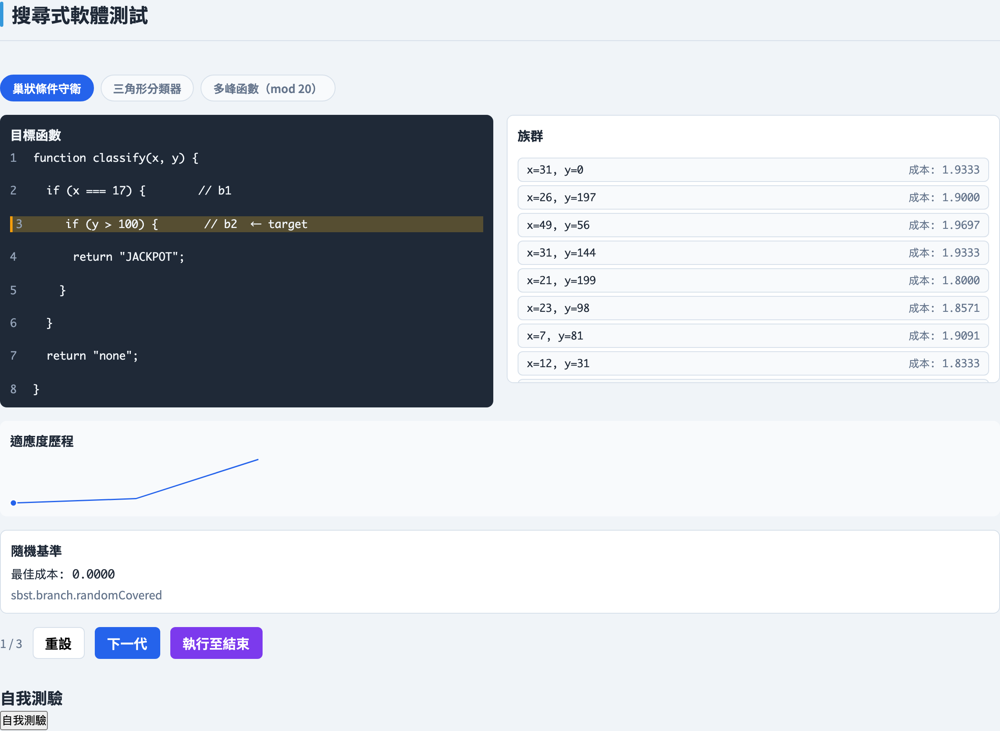
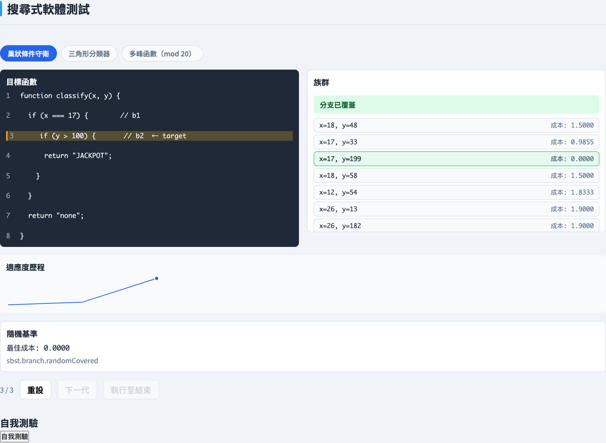
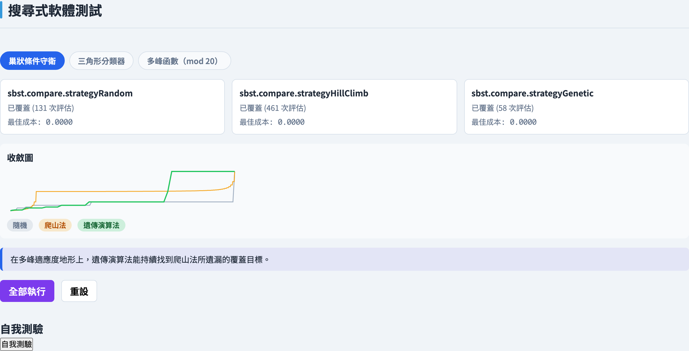
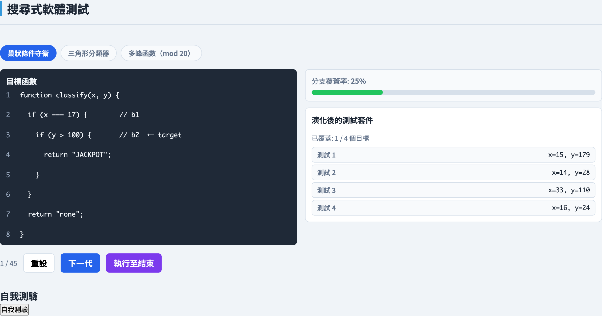
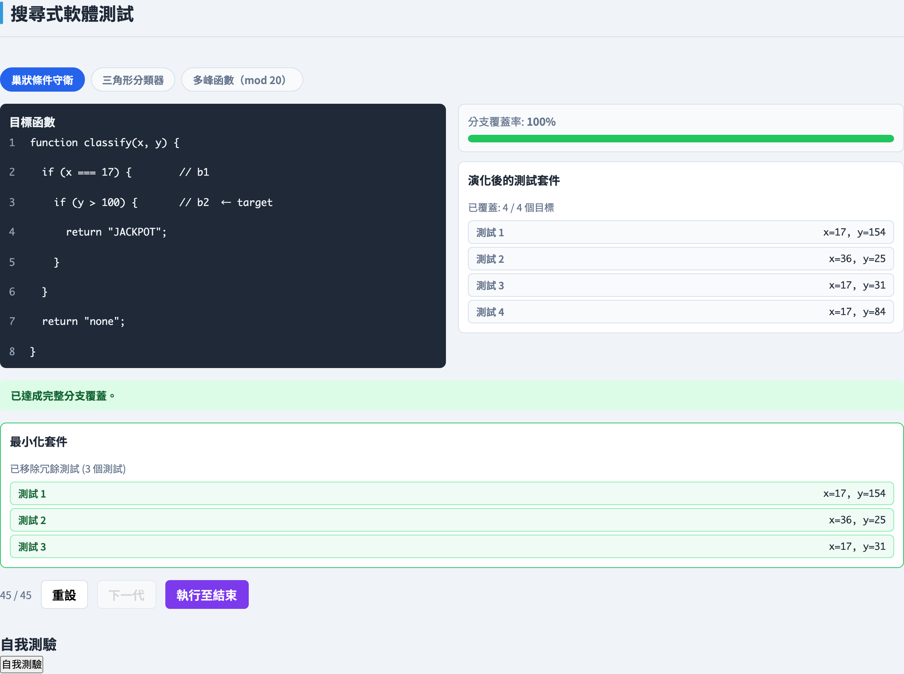

# 搜尋式軟體測試
### *讓適應度函式去搜尋測試*

軟體測試視覺化系列 #65 · 搜尋式測試
搭配工具：`/section-sbst` → 基因演算法分支搜尋（[SbstBranchExplorer](../../src/components/SbstBranchExplorer.js)）· 元啟發式比較（[SbstCompareExplorer](../../src/components/SbstCompareExplorer.js)）· 整體套件演化（[SbstSuiteExplorer](../../src/components/SbstSuiteExplorer.js)）

<!-- 搜尋式軟體測試章節的第一講。SBST 把測試生成重新框定為一個最佳化問題：對輸入空間進行元啟發式搜尋，並由一個衡量輸入有多接近覆蓋目標的適應度函式來引導。本講涵蓋適應度函式（分支距離 + 逼近層級）、隨機／爬山／基因演算法等元啟發式，以及整體測試套件生成。 -->

---

## 把測試生成視為搜尋

本課程多數內容是透過**列舉覆蓋需求**來生成測試——把分支列出來，再為每一個找一個輸入。搜尋式軟體測試（SBST）採取不同立場：它把測試生成當成一個**最佳化問題**。

固定一個覆蓋目標——比方說某個特定分支。**搜尋空間**就是受測函式所有可能輸入向量的集合。覆蓋該目標的輸入，就坐落在那個空間中的某處。SBST 把搜尋空間交給一個**元啟發式**：一個會取樣候選、為它們評分、並朝較佳者引導的演算法。

它與覆蓋驅動的 `testgen` 章節（第 #12 講）的對比，在於工作的*方向*。在那裡，引擎從程式結構向前推理出一個測試。在這裡，引擎搜尋輸入空間，並讓一個數值分數——適應度函式——告訴它是越來越熱還是越來越冷。

<!-- 這個重新框定是整個章節的重點：別再列舉需求，開始最佳化。在黑板上把搜尋空間畫成一片地景，把覆蓋目標畫成其中的一塊目標區域。強調 SBST 不需要像符號執行那樣理解程式的邏輯——它只需要*執行*程式並*衡量*結果。這既是它的巨大優勢（它能擴展到符號執行卡住的程式碼），也是它的巨大弱點（沒有梯度時它就是盲的）。第 #12 講是自然的對比：需求驅動 vs. 搜尋驅動。 -->

---

## 適應度函式

一個搜尋的好壞，取決於它的**梯度**。如果每一個未覆蓋的輸入都得到相同分數，元啟發式就退化成盲目猜測。**適應度函式**的工作，就是給搜尋一道可以下降的平滑斜坡。

對於單一分支目標，適應度衡量**一個輸入有多接近覆蓋那個分支**。它由兩個相加的成分構成：

- **逼近層級（approach level）**——執行還需要做對多少個包圍它的決策，以及
- **分支距離（branch distance）**——在執行偏離的那個決策處，述詞有多接近翻向另一邊。

慣例是**越低越接近**：適應度為 0 表示輸入覆蓋了目標，數值越大表示越遠。搜尋的任務就是單純地**最小化**這個數字。

<!-- 把梯度的概念敲進腦中：單靠覆蓋——覆蓋／未覆蓋——是一個沒有斜率的平坦函式，因此只靠覆蓋引導的搜尋無法改善。適應度函式把那道斷崖變成一道斜坡。兩部分的結構（逼近層級表示*穿過了多少層巢狀*，分支距離表示*最後那個述詞有多接近*）是標準的 Wegener／McMinn 公式，後面每一張投影片都依賴它。強調最小化至零的慣例，這樣後面的演示曲線才講得通。 -->

---

## 分支距離

**分支距離**在單一決策處問：*述詞有多接近採取另一個結果？* 它把一個真／假的測試變成一個連續的數字。

Korel／Tracey 公式為每一個關係運算子給出一條規則。對於一個需要變為真的述詞：

- `a == b` → 距離 `|a − b|`
- `a != b` → 若 `a ≠ b` 距離 `0`，否則為 `K`
- `a < b` → 若 `a ≥ b` 距離 `a − b + K`，否則為 `0`
- `a <= b` → 若 `a > b` 距離 `a − b`，否則為 `0`

其中 `K` 是一個小的正常數，讓一個*只差一點就為假*的述詞仍得到大於零的分數。布林連接詞會組合：`&&` 把運算元相加（或取其最差者），`||` 取最小值。

原始距離可以是任意大小，因此在與逼近層級結合之前，會用 `d / (d + 1)` **正規化**到 `[0, 1)`——讓每一個決策都在同一個尺度上。

<!-- 在黑板上放一條公式並帶一個數字走過它：對於 a < b，當 a = 7、b = 3 時，距離是 7 − 3 + K = 4 + K，而當 a 朝 3 下降時距離朝 K 縮小，接著在 a < b 的那一刻命中 0。那個縮小的數字*就是*搜尋所騎乘的梯度。K 常數是微妙之處——少了它，一個離翻轉只差一步的述詞會與一個已翻轉的並列。正規化之所以重要，是因為逼近層級以整個決策為單位計數，所以分支距離必須被限制在 1 以下，才永遠不會壓過單獨一個層級。 -->

---

## 逼近層級

**分支距離**只描述執行出錯的*那一個*決策。**逼近層級**描述執行在出錯之前*穿過巢狀決策有多深*。

一個目標分支通常被數個包圍它的決策所守衛——要抵達它，執行必須在每一個守衛處採取正確的結果。逼近層級計算**執行仍然偏離了那些包圍決策中的多少個**：如果它在最前面的守衛就採取了錯誤結果，逼近層級就高；如果它順利通過了除最後一個以外的每一個守衛，逼近層級就低。

兩者結合成一個成本：

**成本 = 逼近層級 + 第一個偏離點處的正規化分支距離**

於是進展有兩種顯現方式。*更深*地進入巢狀，逼近層級就降低一整個整數。在你仍然卡住的那個決策處*更接近*，分支距離那一個分數項就縮小。無論哪一種，成本都下降，搜尋也就有了一道可以跟隨的斜坡。

<!-- 心智圖像：逼近層級是梯度粗略的整數部分（我卡在哪一個守衛），分支距離是精細的分數部分（我離清掉那個守衛有多近）。因為分支距離被正規化到 1 以下，清掉一整個守衛永遠勝過任何幅度的分數進展——這個成本其實是偽裝的字典序。這個複合量正是讓深層巢狀目標可被搜尋的原因：少了逼近層級，最終守衛之外的每一次失敗看起來都同樣糟。 -->

---

## 隨機搜尋 — 基準線

最簡單的元啟發式是**隨機搜尋**：從搜尋空間中均勻地取樣輸入，評估每一個的適應度，並保留至今見過的最佳者。

隨機搜尋是**無引導的**。它計算每一個候選的適應度，卻從不*使用*那個訊號來選擇下一個樣本——每一次抽取都與上一次獨立。它丟棄了適應度函式辛苦提供的梯度。

這使它成為一個有用的**基準線**，偶爾它自己就足夠。如果覆蓋某目標的輸入佔據了搜尋空間相當的一部分，少數幾次隨機抽取就會落中一個。但一旦目標坐落在巢狀守衛之後——使得覆蓋區域成為一條趨近於零的細縫——隨機搜尋就**停滯**：靠運氣絆中那條細縫的機率微不足道。

<!-- 隨機搜尋是整個章節的對照組：任何有引導的元啟發式都必須勝過它，否則它就不值得它的複雜度。把關鍵的承認講明白——隨機搜尋*確實*評估適應度，它只是在取樣時忽略它。要帶走的重點是為接下來幾張投影片鋪設的對比：容易的目標敗於隨機搜尋；巢狀目標需要一個真正爬上梯度的搜尋。 -->

---

## 爬山法

**爬山法**是第一個真正有引導的元啟發式。它挑一個起始輸入，檢視那個輸入的**鄰居**——只差一小步的候選——評估它們的適應度，並移動到**最佳的改善鄰居**。從新的點重複，直到沒有任何鄰居更好。

現在適應度梯度真正派上用場了：每一次移動都是在成本上刻意向下走的一步，因此在平滑的適應度地景上，爬山法的收斂遠快於隨機取樣。

它的弱點是結構性的。爬山法從單一起點跟隨**單一軌跡**。當那條軌跡抵達一個每一個鄰居都更糟的點——一個**局部最佳解**——它就停止，即使那個點並不覆蓋目標。一個未覆蓋的局部最佳解是一條死路，而孤獨的爬山者沒有辦法脫離它。

<!-- 這是本章節核心張力的第一次嚐味：有引導的搜尋比隨機快得多，但*單一*有引導的搜尋很脆弱。畫一個有兩個山谷的適應度地景——爬山者滾進它起點上方所在的那一個並卡在那裡。隨機重啟稍微補救這點，但真正的修復是族群，這是下一張投影片。仔細定義局部最佳解：它是相對於鄰域的局部，而非全域最佳。 -->

---

## 基因演算法

**基因演算法**（GA）以一整個候選輸入的**族群**取代孤獨的爬山者，並在連續的**世代**中演化。每一個世代套用四個運算子：

- **選擇（selection）**——挑選親代，偏向較適應的個體；**錦標賽選擇**抽取一小組隨機個體並保留其中最佳者。
- **交配（crossover）**——把兩個親代結合成混合其輸入值的子代，重組部分解。
- **突變（mutation）**——隨機擾動某些子代的值，注入新鮮的變異，使搜尋能抵達沒有任何親代持有的輸入。
- **菁英保留（elitism）**——把最佳個體原封不動地帶進下一個世代，使最佳適應度永遠不會變差。

由於一個族群持有**散佈在搜尋空間各處的許多個體**，GA 同時探索**許多區域**，而非投身於單一軌跡。那份廣度正是下一張投影片所建立之物。

<!-- 把四個運算子當成一個循環走過：選擇 → 交配 → 突變 → 保留菁英，然後重複。錦標賽選擇是主力——說明它透過錦標賽大小來調整選擇壓力。菁英保留是安全護欄：少了它，一個好的解可能因一次不幸的交配而流失。要留在耳邊迴響的詞是「同時探索許多區域」——那份族群廣度正是爬山法所缺乏的性質，也是 GA 脫離陷阱的原因。 -->

---

## 脫離局部最佳解

為什麼 GA 能在爬山法卡住之處成功？兩個機制，都是持有一個**族群**的後果。

第一，**多樣性**。族群散佈在搜尋空間各處，因此不同的個體坐落在適應度地景的不同盆地中。一個不幸的盆地困住其中的個體——但不會困住整個搜尋。當某些個體在某個局部最佳解停滯時，其他個體仍在別處下降。

第二，**交配重組部分解**。一個巢狀目標往往需要好幾個輸入值同時正確。一個親代可能值 A 正確，另一個值 B 正確；交配能產生一個**兩者皆有**的子代——這是一次跨越地景的跳躍，是任何單步鄰居移動都做不到的。

爬山者兩者皆無：一個點、一條軌跡、只有小步。GA 的族群與交配，正是讓它爬出那些困住孤獨爬山者的盆地之物。

<!-- 這張投影片是第 6 到 8 張的回報，也是本章節的概念核心。把對比畫得鮮明：爬山法失敗不是因為它調校不佳，而是因為*一條由小步構成的軌跡*在結構上就無法脫離一個盆地。GA 因兩個不同的理由脫離——把它們分開。交配是真正令人驚訝的那個：它是一次由兩個*好*親代構成的*大*移動，這正是它能跨越一道突變大小的步伐跨不過的適應度山谷的原因。元啟發式比較演示讓這點變得可見。 -->

---

## 整體測試套件生成

到目前為止的一切，都是**一次朝一個分支目標**最佳化。那有一個已知的失效模式：花在容易目標上的功夫被浪費了，而一個適應度地景平坦的目標，會在搜尋執著於它時挨餓。

**整體測試套件生成**改變了一個個體*是什麼*。不再是一個個體 = 一個瞄準一個分支的測試，而是**一個個體 = 一整個測試套件**，而它的適應度是**同時對所有分支目標的總覆蓋**——對程式中每一個未覆蓋目標的分支距離總和。

GA 現在演化整個套件。每一個分支的覆蓋一起改善，搜尋自然地把功夫從已覆蓋的目標重新分配給仍開放的目標。這就是 **EvoSuite** 的公式。它分兩個階段執行：先**演化**一個套件朝向完整覆蓋，再**最小化**它——丟掉那些覆蓋不了套件其餘部分尚未覆蓋之物的冗餘測試。

<!-- 這裡有兩個概念落地。第一，「個體」的重新定義——只看過一次一個目標的 SBST 的學生會覺得這真的令人驚訝，所以把它說清楚：搜尋變數現在是一組測試。第二，它為什麼更好——單一的全域適應度把所有目標相加，因此一個平坦的子目標再也無法卡住整個搜尋，功夫流向有幫助之處。明確點名 EvoSuite，並強調最小化是一個*獨立的後處理*：演化最大化覆蓋，最小化接著在不喪失覆蓋的前提下修剪大小。 -->

---

## 工具與基礎

SBST 是一個成熟的領域，擁有正式產品工具與清楚的研究脈絡。

- **EvoSuite** 是整體測試套件生成的參考實作。它使用前一張投影片中那套「對套件做基因演算法」的公式，為 Java 類別生成 JUnit 測試套件，並在研究與實務中廣泛使用。
- **Korel 的分支距離工作**（1990）給了搜尋它的梯度：那些把真／假述詞變成一個連續、可最小化數字的逐運算子距離公式。少了它，元啟發式就沒有東西可以下降。
- **McMinn 的 SBST 綜述**（2004）是這個領域的標準地圖——它把適應度函式設計、元啟發式與開放問題整合成一份參考文獻，並把這個領域命名為「搜尋式軟體測試」。

這三者合起來——一個適應度函式、一個元啟發式，以及一套整體套件公式——就是搭配工具讓它變得可互動的基礎。

<!-- 用這張投影片把抽象概念錨定在真實的成品上。EvoSuite 是學生今天就能下載並執行的那個，所以把它指出來，作為本章節並非理論的證明。Korel 與 McMinn 是歷史的兩端：Korel 提供梯度，McMinn 提供綜合與名稱。延伸閱讀投影片引用了這三者，所以這是一個深入何處的預告。 -->

---

## 工具演示 — 基因演算法分支搜尋 · 起點

<!-- 這是第一張演示投影片。在此介紹這個三分頁的章節：/section-sbst 有基因演算法分支搜尋（一個分支目標，GA vs. 隨機基準線）、元啟發式比較（隨機 vs. 爬山法 vs. GA 在一個目標上），以及整體套件演化（套件作為個體，接著最小化）。在前進之前，帶全班開啟 /section-sbst 並選取基因演算法分支搜尋分頁。 -->

在 `/section-sbst` 開啟**基因演算法分支搜尋**分頁。

第 0 世代：一個隨機的初始族群，並顯示每一個個體的適應度成本——朝向巢狀目標分支的逼近層級加上正規化分支距離。

---

## 工具演示 — 基因演算法分支搜尋 · 已覆蓋

把搜尋執行到覆蓋之後——一個演化出的個體抵達**成本 0** 並覆蓋了巢狀目標分支，而隨機搜尋基準線則大幅落後。

---

## 工具演示 — 元啟發式比較

**元啟發式比較**分頁——隨機搜尋、爬山法與基因演算法的最佳成本曲線疊在單一覆蓋目標上，於是它們的收斂速率可以直接讀出。

---

## 工具演示 — 局部最佳解陷阱

在多峰範例上，**爬山法停在一個未覆蓋的局部最佳解**——它的曲線在零之上變平——而基因演算法的族群脫離了盆地，把成本驅至零，覆蓋了目標。

---

## 工具演示 — 整體套件 · 起點

**整體套件演化**分頁——一個早期世代，其中每一個個體都是一整個測試套件，而對程式的總分支覆蓋仍然偏低。

---

## 工具演示 — 整體套件 · 已覆蓋

演化之後——套件抵達**完整分支覆蓋**，對所有目標的分支距離總和已被驅至零。

---

## 工具演示 — 整體套件 · 已最小化

**最小化**處理丟掉了冗餘測試——那些覆蓋不了套件其餘部分尚未覆蓋之物的測試——留下一個保有完整覆蓋的小套件。

---

## 小結

- **SBST 把測試生成重新框定為最佳化**：固定一個覆蓋目標，把輸入空間視為搜尋空間，並交給一個最小化適應度函式的元啟發式——而非列舉覆蓋需求（第 #12 講）。
- 單靠覆蓋訊號是一個沒有梯度的平坦函式；**適應度函式**提供斜坡，慣例是*越低越接近，0 表示已覆蓋*。
- **適應度 = 逼近層級 + 正規化分支距離**：逼近層級是仍偏離的包圍決策的整數計數；分支距離是逐運算子的 Korel／Tracey 度量，衡量失敗述詞有多接近翻轉，並正規化到 `[0, 1)`。
- **三個元啟發式**：隨機搜尋忽略梯度（一個基準線），爬山法從單一起點跟隨它（快但會被困），基因演算法以選擇、交配、突變與菁英保留演化一個族群。
- 爬山者會卡在一個**局部最佳解**；GA 之所以能脫離，是因為族群多樣性涵蓋許多盆地，且交配把部分解重組成大跳躍。
- **整體測試套件生成**（EvoSuite）讓一個個體成為一整個套件、讓適應度成為對所有目標的總覆蓋，再執行一個獨立的**最小化**處理，在不喪失覆蓋的前提下修剪冗餘測試。
- **課堂練習：** 對於一個巢狀在兩個守衛之後的目標分支，計算某個給定輸入的適應度成本（逼近層級 + 正規化分支距離），再解釋為什麼從它出發的爬山者可能停滯，而基因演算法則不會。

---

## 延伸閱讀

- 課程規格 —— 搜尋式測試視覺化設計（[2026-05-21-search-based-testing-design.md](../superpowers/specs/2026-05-21-search-based-testing-design.md)）
- McMinn, P. (2004)《Search-Based Software Test Data Generation: A Survey》—— 這個領域的標準綜述；適應度函式、元啟發式與開放問題。
- Korel, B. (1990)《Automated Software Test Data Generation》—— 引入了給搜尋梯度的分支距離公式。
- EvoSuite 專案 —— Java 整體測試套件生成的參考實作。
- 工具原始碼：[SbstBranchExplorer.js](../../src/components/SbstBranchExplorer.js)、[SbstCompareExplorer.js](../../src/components/SbstCompareExplorer.js)、[SbstSuiteExplorer.js](../../src/components/SbstSuiteExplorer.js)、[searchBasedTesting.js](../../src/utils/searchBasedTesting.js)
- 下一講：搜尋式軟體測試章節的後續講次。
